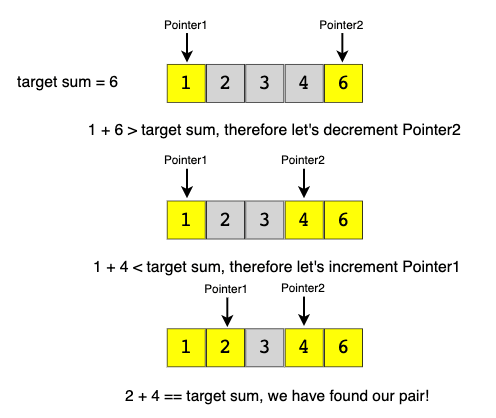
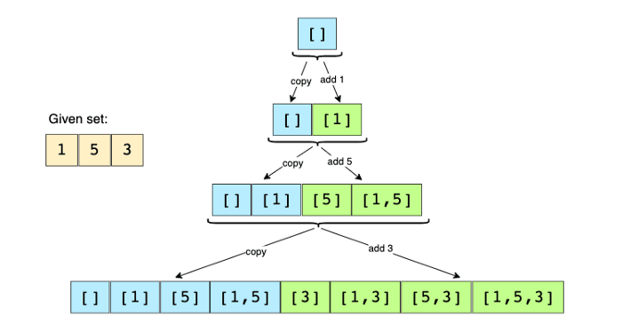
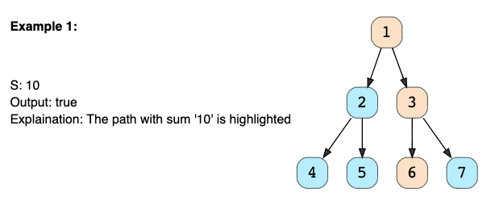

# How to prepare more quickly for coding interviews
https://dev.to/arslan_ah/the-ultimate-strategy-to-preparing-for-the-coding-interview-3ace

Coding interviews are getting harder every day. A few years back, brushing up on key data structures and going through 50--75 practice coding interview questions was more than enough prep for an interview. Today, everyone has access to massive sets of coding problems, and they've gotten more difficult as well. The overall interview process has gotten more competitive.\
In this post, I'd like to share a strategy I follow to prepare for coding interviews. My software engineering career spans around 15 years, in which I've switched jobs five times. I've given around 30 interview loops containing 120+ interviews. I have some experience sitting on the other side of the table too. I've taken 200+ coding interviews and 100+ system design interviews.

I consider myself a reasonably smart engineer, but I had my challenges solving coding problems on a whiteboard, especially in an interview setting with someone evaluating me. To tackle this, I'd spend a reasonable time for preparation and practice. One thing I didn't realize was that while doing my preparation, I was following a systematic approach. I would go through 12--15 questions, practicing two hours every day. This meant that I could solve 350+ questions within one month. Using this routine, I was able to crack my interviews for FAANGs (Facebook, Apple, Amazon, Netflix, Google).

How was I able to practice 12+ coding questions every day with a fulltime job? Well, I wasn't solving coding problems but practicing to map problems onto problems that I'd already solved. I used to read a problem and spend a few minutes to map it to a similar problem I'd seen before. If I could map it, I'd focus only on the different constraints this problem had compared to the parent problem. If it was a new problem, then I'd try to solve it and also read around to find smart ways other people used to devise its algorithm. Over time, I developed a set of problem-patterns that helped me quickly map a problem to an already-known one. Here are some examples of these patterns:

1. If the given input is sorted (array, list, or matrix), then we will use a variation of Binary Search or a Two Pointers strategy.
2. If we're dealing with top/maximum/minimum/closest `k` elements among `n` elements, we will use a Heap.
3. If we need to try all combinations (or permutations) of the input, we can either use recursive Backtracking or iterative Breadth-First Search.

Following this pattern-based approach helped me save a lot of preparation time. Once you're familiar with a pattern, you'll be able to solve dozens of problems with it. In addition, this strategy made me confident to tackle unknown problems, as I've been practicing mapping unknown problems to known ones.

In the remaining post, I will share all the patterns I've collected and present sample problems for a few. For a detailed discussion of these and related problems with solutions take a look at [Grokking the Coding Interview](https://www.educative.io/courses/grokking-the-coding-interview?aff=VOY6).

---

## Sample Problem for Binary Search

### Bitonic array maximum

Problem statement\
Find the maximum value in a given Bitonic array. An array is considered bitonic if it is monotonically increasing and then monotonically decreasing. Monotonically increasing or decreasing means that for any index `i` in the array, `arr[i] != arr[i+1]`.

`Example: Input: [1, 3, 8, 12, 4, 2], Output: 12`

Solution\
A bitonic array is a sorted array; the only difference is that its first part is sorted in ascending order, and the second part is sorted in descending order. We can use a variation of Binary Search to solve this problem. Remember that in Binary Search we have `start`, `end`, and `middle` indices and in each step we reduce our search space by moving start or end. Since no two consecutive numbers are the same (as the array is monotonically increasing or decreasing), whenever we calculate the `middle` index for Binary Search, we can compare the numbers pointed out by the index `middle` and `middle+1` to find if we are in the ascending or the descending part. So:

1. If `arr[middle] > arr[middle + 1]`, we are in the second (descending) part of the bitonic array. Therefore, our required number could either be pointed out by middle or will be before `middle`. This means we will do `end = middle`.
2. If `arr[middle] <= arr[middle + 1]`, we are in the first (ascending) part of the bitonic array. Therefore, the required number will be after `middle`. This means we do `start = middle + 1`.

We can break when `start == end`. Due to the above two points, both `start` and `end` will point at the maximum number of the Bitonic array.

Code\
Here is the Java code to solve this problem:

| | class MaxInBitonicArray { |
| | |
| | public static int findMax(int[] arr) { |
| | int start = 0, end = arr.length - 1; |
| | while (start < end) { |
| | int mid = start + (end - start) / 2; |
| | if (arr[mid] > arr[mid + 1]) { |
| | end = mid; |
| | } else { |
| | start = mid + 1; |
| | } |
| | } |
| | |
| | // at the end of the while loop, 'start == end' |
| | return arr[start]; |
| | } |
| | |
| | public static void main(String[] args) { |
| | System.out.println(MaxInBitonicArray.findMax(new int[] { 1, 3, 8, 12, 4, 2 })); |
| | System.out.println(MaxInBitonicArray.findMax(new int[] { 3, 8, 3, 1 })); |
| | System.out.println(MaxInBitonicArray.findMax(new int[] { 1, 3, 8, 12 })); |
| | System.out.println(MaxInBitonicArray.findMax(new int[] { 10, 9, 8 })); |
| | } |
| | } |

[view raw](https://gist.github.com/a947/dde7049bee56752a3e605b5005bb4ee9/raw/80a41bcd0b63d9e290be04449f47846cf6cf14e5/BAM.java)[BAM.java](https://gist.github.com/a947/dde7049bee56752a3e605b5005bb4ee9#file-bam-java) hosted with ❤ by [GitHub](https://github.com/)

---

## Sample Problem for Two Pointers

### Pair with target sum

Problem statement\
Given an array of sorted numbers and a target sum, find a pair in the array whose sum is equal to the given target.

Write a function to return the indices of the two numbers (i.e., the pair) such that they add up to the given target.

`Example: Input: [1, 2, 3, 4, 6], target = 6, Output: [1, 3] (The numbers at index 1 and 3 add up to 6: 2+4=6)`

Solution\
Since the given array is sorted, a brute-force solution could be to iterate through the array, taking one number at a time and searching for the second number through Binary Search. The time complexity of this algorithm will be O(N*logN). Can we do better than this?

We can follow the Two Pointers approach. We will start with one pointer pointing to the beginning of the array and another pointing at the end. At every step, we will see if the numbers pointed by the two pointers add up to the target sum. If they do, we've found our pair. Otherwise, we'll do one of two things:

1. If the sum of the two numbers pointed by the two pointers is greater than the target sum, we need a pair with a smaller sum. So, to try more pairs, we can decrement the end-pointer.
2. If the sum of the two numbers pointed by the two pointers is smaller than the target sum, this means that we need a pair with a larger sum. So, to try more pairs, we can increment the start-pointer.

Here is the visual representation of this algorithm for the example mentioned above:\

Code\
Here is what our algorithm will look like:

| | class PairWithTargetSum { |
| | |
| | public static int[] search(int[] arr, int targetSum) { |
| | int left = 0, right = arr.length - 1; |
| | while (left < right) { |
| | // comparing the sum of two numbers to the 'targetSum' can cause integer overflow |
| | // so, we will try to find a target difference instead |
| | int targetDiff = targetSum - arr[left]; |
| | if (targetDiff == arr[right]) |
| | return new int[] { left, right }; // found the pair |
| | |
| | if (targetDiff > arr[right]) |
| | left++; // we need a pair with a bigger sum |
| | else |
| | right--; // we need a pair with a smaller sum |
| | } |
| | return new int[] { -1, -1 }; |
| | } |
| | |
| | public static void main(String[] args) { |
| | int[] result = PairWithTargetSum.search(new int[] { 1, 2, 3, 4, 6 }, 6); |
| | System.out.println("Pair with target sum: [" + result[0] + ", " + result[1] + "]"); |
| | result = PairWithTargetSum.search(new int[] { 2, 5, 9, 11 }, 11); |
| | System.out.println("Pair with target sum: [" + result[0] + ", " + result[1] + "]"); |
| | } |
| | } |

[view raw](https://gist.github.com/a947/8b355a1fb7ea4338e93a38f75264b856/raw/8e5c31a56cb21d0d6053096a8a32de476a3586f7/PairWithTargetSum.java)[PairWithTargetSum.java](https://gist.github.com/a947/8b355a1fb7ea4338e93a38f75264b856#file-pairwithtargetsum-java) hosted with ❤ by [GitHub](https://github.com/)

---

## Sample Problem

### K closest points to the origin

Given an array of points in a 2D plane, find `K` closest points to the origin.\
`Example: Input: points = [[1,2],[1,3]], K = 1, Output: [[1,2]]`

Solution\
The Euclidean distance of a point P(x,y) from the origin can be calculated through the following formula:\

We can use a Max Heap to find K points closest to the origin. We can start by pushing K points in the heap. While iterating through the remaining points, if a point (say P) is closer to the origin than the top point of the max-heap, we will remove that top point from the heap and add P to always keep the closest points in the heap.

Code\
Here is what our algorithm will look like:

| | import java.util.*; |
| | |
| | class Point { |
| | int x; |
| | int y; |
| | |
| | public Point(int x, int y) { |
| | this.x = x; |
| | this.y = y; |
| | } |
| | |
| | public int distFromOrigin() { |
| | // ignoring sqrt |
| | return (x*  x) + (y * y); |
| | } |
| | } |
| | |
| | class KClosestPointsToOrigin { |
| | |
| | public static List findClosestPoints(Point[] points, int k) { |
| | PriorityQueue maxHeap = new PriorityQueue<>( |
| | (p1, p2) -> p2.distFromOrigin() - p1.distFromOrigin()); |
| | // put first 'k' points in the max heap |
| | for (int i = 0; i < k; i++) |
| | maxHeap.add(points[i]); |
| | |
| | // go through the remaining points of the input array, if a point is closer to |
| | // the origin than the top point of the max-heap, remove the top point from |
| | // heap and add the point from the input array |
| | for (int i = k; i < points.length; i++) { |
| | if (points[i].distFromOrigin() < maxHeap.peek().distFromOrigin()) { |
| | maxHeap.poll(); |
| | maxHeap.add(points[i]); |
| | } |
| | } |
| | |
| | // the heap has 'k' points closest to the origin, return them in a list |
| | return new ArrayList<>(maxHeap); |
| | } |
| | |
| | public static void main(String[] args) { |
| | Point[] points = new Point[] { new Point(1, 3), new Point(3, 4), new Point(2, -1) }; |
| | List result = KClosestPointsToOrigin.findClosestPoints(points, 2); |
| | System.out.print("Here are the k points closest the origin: "); |
| | for (Point p : result) |
| | System.out.print("[" + p.x + " , " + p.y + "] "); |
| | } |
| | } |

[view raw](https://gist.github.com/a947/3fd1b3cde4e0236579271b172c68b948/raw/1f33012aa87dd273a85cfa3a4d895367b8e2dfb9/KClosestPointsToOrigin.java)[KClosestPointsToOrigin.java](https://gist.github.com/a947/3fd1b3cde4e0236579271b172c68b948#file-kclosestpointstoorigin-java) hosted with ❤ by [GitHub](https://github.com/)

---

## Sample Problem

### Subsets

Problem statement\
Given a set with distinct elements, find all of its distinct subsets.

`Example: Input: [1, 5, 3]\
Output: [], [1], [5], [3], [1,5], [1,3], [5,3], [1,5,3]`

Solution\
To generate all subsets of the given set, we can use the Breadth-First Search (BFS) approach. We can start with an empty set, iterate through all numbers one-by-one, and add them to existing sets to create new subsets.

Let's take the aforementioned example to go through each step of our algorithm:

Given set: [1, 5, 3]

1. Start with an empty set: [[]]
2. Add the first number (1) to all the existing subsets to create new subsets: [[], [1]];
3. Add the second number (5) to all the existing subsets: [[], [1], [5], [1,5]];
4. Add the third number (3) to all the existing subsets: [[], [1], [5], [1,5], [3], [1,3], [5,3], [1,5,3]].

Here is the visual representation of the above steps:\

Code\
Here is what our algorithm will look like:

| | import java.util.*; |
| | |
| | class Subsets { |
| | |
| | public static List<List> findSubsets(int[] nums) { |
| | List<List> subsets = new ArrayList<>(); |
| | // start by adding the empty subset |
| | subsets.add(new ArrayList<>()); |
| | for (int currentNumber : nums) { |
| | // we will take all existing subsets and insert the current number in them to |
| | // create new subsets |
| | int n = subsets.size(); |
| | for (int i = 0; i < n; i++) { |
| | // create a new subset from the existing subset and |
| | // insert the current element to it |
| | List set = new ArrayList<>(subsets.get(i)); |
| | set.add(currentNumber); |
| | subsets.add(set); |
| | } |
| | } |
| | return subsets; |
| | } |
| | |
| | public static void main(String[] args) { |
| | List<List> result = Subsets.findSubsets(new int[] { 1, 3 }); |
| | System.out.println("Here is the list of subsets: " + result); |
| | |
| | result = Subsets.findSubsets(new int[] { 1, 5, 3 }); |
| | System.out.println("Here is the list of subsets: " + result); |
| | } |
| | } |

[view raw](https://gist.github.com/a947/c970ef2d9648c5bb4d67da24dab20f8a/raw/67b755a1a250daeb6e6d0449352690797ce86ad1/Subsets.java)[Subsets.java](https://gist.github.com/a947/c970ef2d9648c5bb4d67da24dab20f8a#file-subsets-java) hosted with ❤ by [GitHub](https://github.com/)

---

## Sample Problem

## Binary Tree Path Sum

Problem Statement\
Given a binary tree and a number S, find if the tree has a path from root-to-leaf such that the sum of all the node values of that path equals S.\

Solution\
As we are trying to search for a root-to-leaf path, we can use the Depth First Search (DFS) technique to solve this problem.

To recursively traverse a binary tree in a DFS fashion, we can start from the root and, at every step, make two recursive calls, one for the left and one for the right child.

Here are the steps for our Binary Tree Path Sum problem:

1. Start DFS with the root of the tree.
2. If the current node is not a leaf node, do two things: a) Subtract the value of the current node from the given number to get a new sum => `S = S - node.value`, b) Make two recursive calls for both the children of the current node with the new number calculated in the previous step.
3. At every step, see if the current node being visited is a leaf node and if its value is equal to the given number S. If both are true, we have found the required root-to-leaf path, therefore return true.
4. If the current node is a leaf, but its value is not equal to the given number S, return false.

Code\
Here is what our algorithm will look like:

| | class TreeNode { |
| | int val; |
| | TreeNode left; |
| | TreeNode right; |
| | |
| | TreeNode(int x) { |
| | val = x; |
| | } |
| | }; |
| | |
| | class TreePathSum { |
| | public static boolean hasPath(TreeNode root, int sum) { |
| | if (root == null) |
| | return false; |
| | |
| | // if current node is a leaf and its value is equal to the sum, we've found a path |
| | if (root.val == sum && root.left == null && root.right == null) |
| | return true; |
| | |
| | // recursively call to traverse the left and right sub-tree |
| | // return true if any of the two recursive call return true |
| | return hasPath(root.left, sum - root.val) || hasPath(root.right, sum - root.val); |
| | } |
| | |
| | public static void main(String[] args) { |
| | TreeNode root = new TreeNode(12); |
| | root.left = new TreeNode(7); |
| | root.right = new TreeNode(1); |
| | root.left.left = new TreeNode(9); |
| | root.right.left = new TreeNode(10); |
| | root.right.right = new TreeNode(5); |
| | System.out.println("Tree has path: " + TreePathSum.hasPath(root, 23)); |
| | System.out.println("Tree has path: " + TreePathSum.hasPath(root, 16)); |
| | } |
| | } |

[view raw](https://gist.github.com/a947/8164543f8c4b1972594bd0543f13fc42/raw/53dadb90894f8d79302f93dfa1ef7901a02f8f14/TreePathSum.java)[TreePathSum.java](https://gist.github.com/a947/8164543f8c4b1972594bd0543f13fc42#file-treepathsum-java) hosted with ❤ by [GitHub](https://github.com/)

---

## Conclusion

Following these patterns helped me tremendously to save time for my coding interview prep. Take a look at [Grokking the Coding Interview](https://www.educative.io/courses/grokking-the-coding-interview?aff=VOY6) and [Grokking Dynamic Programming Patterns for Coding Interviews](https://www.educative.io/courses/grokking-dynamic-programming-patterns-for-coding-interviews?aff=VOY6) to find more of such patterns and their sample problems.

Check [Design Gurus](https://www.designgurus.org/) for some good courses on Programming Interviews and System Design interviews.

