System design questions have become a standard part of the software engineering interview process. Performance in these interviews reflects\
upon your ability to work with complex systems and translates into the position and salary the interviewing company offers you. Most\
engineers struggle with system design interview (SDI), partly because of their lack of experience in developing large-scale systems, and partly\
because of the unstructured nature of SDIs. Even engineers, who've some experience building such systems, aren't comfortable with these\
interviews, mainly due to the open-ended nature of design problems that don't have a standard answer. This course is a complete guide to\
master the SDIs. It is created by hiring managers who've been working at Google, Facebook, Microsoft, and Amazon. We've carefully chosen a\
set of questions, that haven't only been repeatedly asked at top companies but also provide a thorough experience to handle any system\
design problem. Let's get started!


System Design Interviews: A step by step guide


Lots of people struggle with system design interviews (SDIs) primarily because of 1) Unstructured nature of SDIs, where you're asked to work on an open-ended design problem that doesn't have a standard answer, 2) Your lack of experience in developing large scale systems and, 3) You did not spend enough time to prepare for SDIs.


Just like coding interviews, candidates who haven't put a conscious effort to prepare for SDIs, mostly perform poorly. This gets aggravated when you're interviewing at the top companies like Google, Facebook, Uber, etc. In these companies, if a candidate doesn't perform above average, they have a limited chance to get an offer. On the other hand, a good performance always results in a better offer (higher position and salary), since it reflects upon your ability to handle large complex systems - a skill that all such companies require.


In this course, we'll follow a step by step approach to solve multiple design problems. Here are those seven steps:


Step 1: Requirements clarifications


Always ask questions to find the exact scope of the problem you're solving. Design questions are mostly open-ended, and they don't have ONE correct answer, that's why clarifying ambiguities early in the interview becomes critical. Candidates who spend enough time to define the end goals of the system, always have a better chance to be successful in the interview. Also, since you only have 35-40 minutes to design a (supposedly) large system, you should clarify what parts of the system you would be focusing on.


Under each step, we'll try to give examples of different design considerations for developing a Twitter-like service.


Here are some questions for designing Twitter that should be answered before moving on to the next steps:


* Will users of our service be able to post tweets and follow other people?
* Should we also design to create and display user's timeline?
* Will tweets contain photos and videos?
* Are we focusing on backend only or are we developing front-end too?
* Will users be able to search tweets?
* Do we need to display hot trending topics?
* Would there be any push notification for new (or important) tweets?


All such question will determine how our end design will look like.


Step 2: System interface definition


Define what APIs are expected from the system. This would not only establish the exact contract expected from the system but would also ensure if you haven't gotten any requirements wrong. Some examples for our Twitter-like service would be:


postTweet(user\_id, tweet\_data, tweet\_location, user\_location, timestamp, ...)


generateTimeline(user\_id, current\_time, user\_location, ...)


markTweetFavorite(user\_id, tweet\_id, timestamp, ...)


Step 3: Back-of-the-envelope estimation


It's always a good idea to estimate the scale of the system you're going to design. This would also help later when you'll be focusing on scaling, partitioning, load balancing and caching.


* What scale is expected from the system (e.g., number of new tweets, number of tweet views, how many timeline generations per sec., etc.)?
* How much storage will we need? We will have different numbers if users can have photos and videos in their tweets.
* What is the network bandwidth usage we expect? This would be crucial in deciding how would we manage traffic and balance load between servers.


Step 4: Defining data model


Defining the data model early will clarify how data will flow among different components of the system. Later, it will guide towards data partitioning and management. Candidate should be able to identify various entities of the system, how they will interact with each other and different aspect of data management like storage, transportation, encryption, etc. Here are some entities for our Twitter-like service:


User: UserID, Name, Email, DoB, CreationData, LastLogin, etc.\
Tweet: TweetID, Content, TweetLocation, NumberOfLikes, TimeStamp, etc.\
UserFollowos: UserdID1, UserID2\
FavoriteTweets: UserID, TweetID, TimeStamp


Which database system should we use? Would NoSQL like [Cassandra 126](https://en.wikipedia.org/wiki/Apache_Cassandra) best fits our needs, or we should use a MySQL-like solution. What kind of block storage should we use to store photos and videos?


Step 5: High-level design


Draw a block diagram with 5-6 boxes representing the core components of your system. You should identify enough components that are needed to solve the actual problem from end-to-end.


For Twitter, at a high level, we would need multiple application servers to serve all the read/write requests with load balancers in front of them for traffic distributions. If we're assuming that we'll have a lot more read traffic (as compared to write), we can decide to have separate servers for handling these scenarios. On the backend, we need an efficient database that can store all the tweets and can support a huge number of reads. We would also need a distributed file storage system for storing photos and videos.


[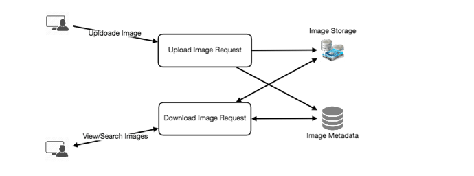


5759778777202688.png975×363 41.9 KB


](<https://coursehunters.online/uploads/default/original/1X/9f05aba6ce6f0c19ca07a89487f0cd8aa2fe3d65.png> "5759778777202688.png")


Step 6: Detailed design


Dig deeper into 2-3 components; interviewers feedback should always guide you towards which parts of the system she wants you to explain further. You should be able to provide different approaches, their pros and cons, and why would you choose one? Remember there is no single answer, the only important thing is to consider tradeoffs between different options while keeping system constraints in mind.


* Since we will be storing a massive amount of data, how should we partition our data to distribute it to multiple databases? Should we try to store all the data of a user on the same database? What issue can it cause?
* How would we handle hot users, who tweet a lot or follow lots of people?
* Since user's timeline will contain most recent (and relevant) tweets, should we try to store our data in such a way that is optimized to scan latest tweets?
* How much and at which layer should we introduce cache to speed things up?
* What components need better load balancing?


Step 7: Identifying and resolving bottlenecks


Try to discuss as many bottlenecks as possible and different approaches to mitigate them.


* Is there any single point of failure in our system? What are we doing to mitigate it?
* Do we've enough replicas of the data so that if we lose a few servers, we can still serve our users?
* Similarly, do we've enough copies of different services running, such that a few failures will not cause total system shutdown?
* How are we monitoring the performance of our service? Do we get alerts whenever critical components fail or their performance degrade?


In summary, preparation and being organized during the interview are the keys to be successful in system design interviews.


Designing a URL Shortening service like TinyURL


Let's design a URL shortening service like TinyURL. This service will provide short aliases redirecting to long URLs. Similar services: bit.ly, goo.gl, [qlink.me 38](http://qlink.me/), etc. Difficulty Level: Easy


1. Why do we need URL shortening?


URL shortening is used to create shorter aliases for long URLs. We call these shortened aliases "short links." Users are redirected to the original URL when they hit these short links. Short links save a lot of space when displayed, printed, messaged or tweeted. Additionally, users are less likely to mistype shorter URLs.


For example, if we shorten this page through TinyURL:


> [https://www.educative.io/collection/page/5668639101419520/5649050225344512/5668600916475904/ 172](https://www.educative.io/collection/page/5668639101419520/5649050225344512/5668600916475904/)
> 
> 
> 


We would get:


> [http://tinyurl.com/jlg8zpc 83](http://tinyurl.com/jlg8zpc)
> 
> 
> 


The shortened URL is nearly one-third of the size of the actual URL.


URL shortening is used for optimizing links across devices, tracking individual links to analyze audience and campaign performance, and hiding affiliated original URLs.


If you haven't used [tinyurl.com 155](http://tinyurl.com/) before, please try creating a new shortened URL and spend some time going through the various options their service offers. This will help you a lot in understanding this chapter better.


1. Requirements and Goals of the System


 You should always clarify requirements at the beginning of the interview. Be sure to ask questions to find the exact scope of the system that the interviewer has in mind.


Our URL shortening system should meet the following requirements:


Functional Requirements:


1. Given a URL, our service should generate a shorter and unique alias of it. This is called a short link.
2. When users access a short link, our service should redirect them to the original link.
3. Users should optionally be able to pick a custom short link for their URL.
4. Links will expire after a standard default timespan. Users should also be able to specify the expiration time.


Non-Functional Requirements:


1. The system should be highly available. This is required because, if our service is down, all the URL redirections will start failing.
2. URL redirection should happen in real-time with minimal latency.
3. Shortened links should not be guessable (not predictable).


Extended Requirements:


1. Analytics; e.g., how many times a redirection happened?
2. Our service should also be accessible through REST APIs by other services.


3. Capacity Estimation and Constraints


Our system will be read-heavy. There will be lots of redirection requests compared to new URL shortenings. Let's assume 100:1 ratio between read and write.


Traffic estimates: If we assume we will have 500M new URL shortenings per month, we can expect (100 * 500M => 50B) redirections during that same period. What would be Queries Per Second (QPS) for our system?


New URLs shortenings per second:


500 million / (30 days  *24 hours*  3600 seconds) = ~200 URLs/s


URLs redirections per second, considering 100:1 read/write ratio:


50 billion / (30 days  *24 hours*  3600 sec) = ~19K/s


Storage estimates: Let's assume we store every URL shortening request (and associated shortened link) for 5 years. Since we expect to have 500M new URLs every month, the total number of objects we expect to store will be 30 billion:


500 million  *5 years*  12 months = 30 billion


Let's assume that each stored object will be approximately 500 bytes (just a ballpark estimate--we will dig into it later). We will need 15TB of total storage:


Bandwidth estimates: For write requests, since we expect 200 new URLs every second, total incoming data for our service will be 100KB per second:


200 * 500 bytes = 100 KB/s


For read requests, since every second we expect ~19K URLs redirections, total outgoing data for our service would be 9MB per second.


19K * 500 bytes = ~9 MB/s


Memory estimates: If we want to cache some of the hot URLs that are frequently accessed, how much memory will we need to store them? If we follow the 80-20 rule, meaning 20% of URLs generate 80% of traffic, we would like to cache these 20% hot URLs.


Since we have 19K requests per second, we will be getting 1.7 billion requests per day:


19K  *3600 seconds*  24 hours = ~1.7 billion


To cache 20% of these requests, we will need 170GB of memory.


0.2  *1.7 billion*  500 bytes = ~170GB


High level estimates: Assuming 500 million new URLs per month and 100:1 read:write ratio, following is the summary of the high level estimates for our service:


| New URLs | 200/s |
| --- | --- |
| URL redirections | 19K/s |
| Incoming data | 100KB/s |
| Outgoing data | 9MB/s |
| Storage for 5 years | 15TB |
| Memory for cache | 170GB |


1. System APIs


 Once we've finalized the requirements, it's always a good idea to define the system APIs. This should explicitly state what is expected from the system.


We can have SOAP or REST APIs to expose the functionality of our service. Following could be the definitions of the APIs for creating and deleting URLs:


creatURL(api\_dev\_key, original\_url, custom\_alias=None, user\_name=None, expire\_date=None)


Parameters:\
api\_dev\_key (string): The API developer key of a registered account. This will be used to, among other things, throttle users based on their allocated quota.\
original\_url (string): Original URL to be shortened.\
custom\_alias (string): Optional custom key for the URL.\
user\_name (string): Optional user name to be used in encoding.\
expire\_date (string): Optional expiration date for the shortened URL.


Returns: (string)\
A successful insertion returns the shortened URL; otherwise, it returns an error code.


deleteURL(api\_dev\_key, url\_key)


Where "url\_key" is a string representing the shortened URL to be retrieved. A successful deletion returns 'URL Removed'.


How do we detect and prevent abuse? A malicious user can put us out of business by consuming all URL keys in the current design. To prevent abuse, we can limit users via their api\_dev\_key. Each api\_dev\_key can be limited to a certain number of URL creations and redirections per some time period (which may be set to a different duration per developer key).


1. Database Design


 Defining the DB schema in the early stages of the interview would help to understand the data flow among various components and later would guide towards the data partitioning.A few observations about the nature of the data we will store:


1. We need to store billions of records.
2. Each object we store is small (less than 1K).
3. There are no relationships between records---other than storing which user created a URL.
4. Our service is read-heavy.


#### Database Schema:


We would need two tables: one for storing information about the URL mappings, and one for the user's data who created the short link.


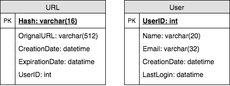


What kind of database should we use? Since we anticipate storing billions of rows, and we don't need to use relationships between objects -- a NoSQL key-value store like Dynamo or Cassandra is a better choice. A NoSQL choice would also be easier to scale. Please see [SQL vs NoSQL 335](https://www.educative.io/collection/page/5668639101419520/5649050225344512/5728116278296576/) for more details.


1. Basic System Design and Algorithm


The problem we are solving here is: how to generate a short and unique key for a given URL?


In the TinyURL example in Section 1, the shortened URL is "[http://tinyurl.com/jlg8zpc" 19](http://tinyurl.com/jlg8zpc%E2%80%9D). The last six characters of this URL is the short key we want to generate. We'll explore two solutions here:


### a. Encoding actual URL


We can compute a unique hash (e.g., [MD5 63](https://en.wikipedia.org/wiki/MD5) or [SHA256 40](https://en.wikipedia.org/wiki/SHA-2), etc.) of the given URL. The hash can then be encoded for displaying. This encoding could be base36 ([a-z ,0-9]) or base62 ([A-Z, a-z, 0-9]) and if we add '-' and '.', we can use base64 encoding. A reasonable question would be: what should be the length of the short key? 6, 8 or 10 characters?


Using base64 encoding, a 6 letter long key would result in 64^6 = ~68.7 billion possible strings\
Using base64 encoding, an 8 letter long key would result in 64^8 = ~281 trillion possible strings


With 68.7B unique strings, let's assume for our system six letter keys would suffice.


If we use the MD5 algorithm as our hash function, it'll produce a 128-bit hash value. After base64 encoding, we'll get a string having more than 21 characters (since each base64 character encodes 6 bits of the hash value). Since we only have space for 8 characters per short key, how will we choose our key then? We can take the first 6 (or 8) letters for the key. This could result in key duplication though, upon which we can choose some other characters out of the encoding string or swap some characters.


What are different issues with our solution? We have the following couple of problems with our encoding scheme:


1. If multiple users enter the same URL, they can get the same shortened URL, which is not acceptable.
2. What if parts of the URL are URL-encoded? e.g., [http://www.educative.io/distributed.php?id=design 28](http://www.educative.io/distributed.php?id=design), and [http://www.educative.io/distributed.php%3Fid%3Ddesign 19](http://www.educative.io/distributed.php%3Fid%3Ddesign) are identical except for the URL encoding.


Workaround for the issues: We can append an increasing sequence number to each input URL to make it unique, and then generate a hash of it. We don't need to store this sequence number in the databases, though. Possible problems with this approach could be an ever-increasing sequence number. Can it overflow? Appending an increasing sequence number will also impact the performance of the service.


Another solution could be to append user id (which should be unique) to the input URL. However, if the user has not signed in, we would have to ask the user to choose a uniqueness key. Even after this, if we have a conflict, we have to keep generating a key until we get a unique one.


[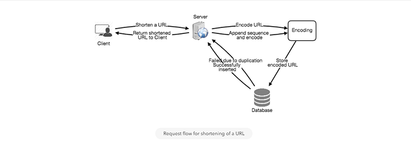


1.png1006×361 38.1 KB


](<https://coursehunters.online/uploads/default/original/1X/e7d3ce09ceeb3a5dd3c8ed5ed8fca01c5984f35f.png> "1.png")


[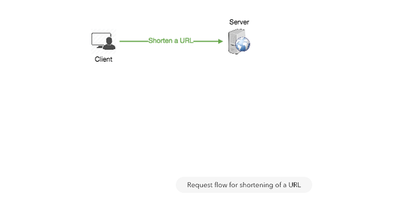


2.png707×354 11 KB


](<https://coursehunters.online/uploads/default/original/1X/035279c758eff8abb91aea1007bfd439489faacf.png> "2.png")


 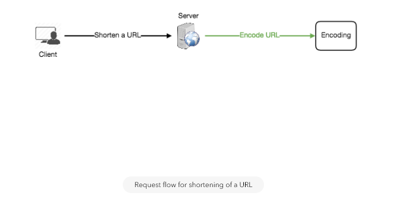 


[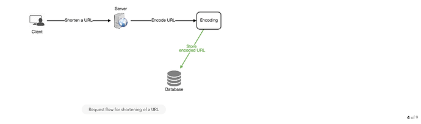


4.png1190×353 21.5 KB


](<https://coursehunters.online/uploads/default/original/1X/a86c5bb92765821bc14a551ab3fe85f802172024.png> "4.png")


[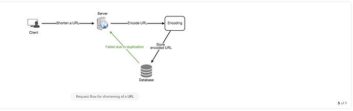


5.png1214×382 26.5 KB


](<https://coursehunters.online/uploads/default/original/1X/f99c0f43474d6750acb447a9fee03343cfa6d858.png> "5.png")


[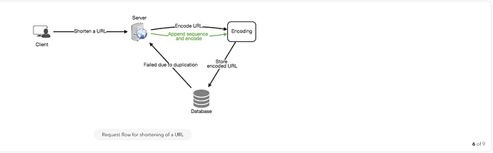


6.png1198×374 31.5 KB


](<https://coursehunters.online/uploads/default/original/1X/d9e66ba36bd542ad56e523911904821147e94f34.png> "6.png")


[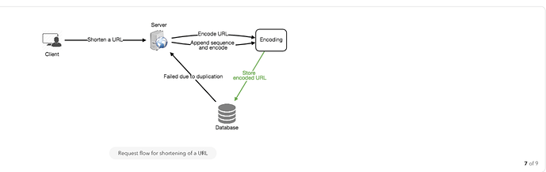


7.png1212×383 31.5 KB


](<https://coursehunters.online/uploads/default/original/1X/4278bc99645323e3506a4fd309854d0f239c2230.png> "7.png")


[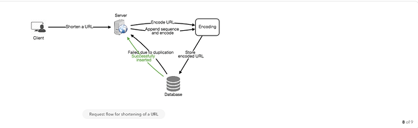


8.png1202×370 35.2 KB


](<https://coursehunters.online/uploads/default/original/1X/ecbe01b84d4440716eab1ea410ac5a6344449424.png> "8.png")


[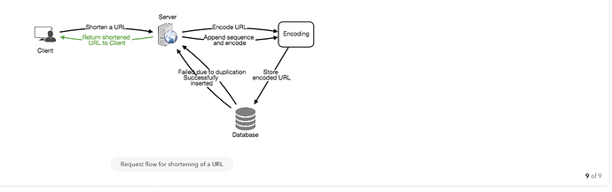


9.png1185×374 39.6 KB


](<https://coursehunters.online/uploads/default/original/1X/a04769d1e94881225777a3e12e4b4b0bee4908f4.png> "9.png")


### b. Generating keys offline


We can have a standalone Key Generation Service (KGS) that generates random six letter strings beforehand and stores them in a database (let's call it key-DB). Whenever we want to shorten a URL, we will just take one of the already-generated keys and use it. This approach will make things quite simple and fast. Not only are we not encoding the URL, but we won't have to worry about duplications or collisions. KGS will make sure all the keys inserted into key-DB are unique


Can concurrency cause problems? As soon as a key is used, it should be marked in the database to ensure it doesn't get used again. If there are multiple servers reading keys concurrently, we might get a scenario where two or more servers try to read the same key from the database. How can we solve this concurrency problem?


Servers can use KGS to read/mark keys in the database. KGS can use two tables to store keys: one for keys that are not used yet, and one for all the used keys. As soon as KGS gives keys to one of the servers, it can move them to the used keys table. KGS can always keep some keys in memory so that it can quickly provide them whenever a server needs them.


For simplicity, as soon as KGS loads some keys in memory, it can move them to the used keys table. This ensures each server gets unique keys. If KGS dies before assigning all the loaded keys to some server, we will be wasting those keys--which is acceptable, given the huge number of keys we have.


KGS also has to make sure not to give the same key to multiple servers. For that, it must synchronize (or get a lock to) the data structure holding the keys before removing keys from it and giving them to a server


What would be the key-DB size? With base64 encoding, we can generate 68.7B unique six letters keys. If we need one byte to store one alpha-numeric character, we can store all these keys in:


6 (characters per key) * 68.7B (unique keys) = 412 GB.


Isn't KGS the single point of failure? Yes, it is. To solve this, we can have a standby replica of KGS. Whenever the primary server dies, the standby server can take over to generate and provide keys.


Can each app server cache some keys from key-DB? Yes, this can surely speed things up. Although in this case, if the application server dies before consuming all the keys, we will end up losing those keys. This could be acceptable since we have 68B unique six letter keys.


How would we perform a key lookup? We can look up the key in our database or key-value store to get the full URL. If it's present, issue an "HTTP 302 Redirect" status back to the browser, passing the stored URL in the "Location" field of the request. If that key is not present in our system, issue an "HTTP 404 Not Found" status, or redirect the user back to the homepage.


Should we impose size limits on custom aliases? Our service supports custom aliases. Users can pick any 'key' they like, but providing a custom alias is not mandatory. However, it is reasonable (and often desirable) to impose a size limit on a custom alias to ensure we have a consistent URL database. Let's assume users can specify a maximum of 16 characters per customer key (as reflected in the above database schema).


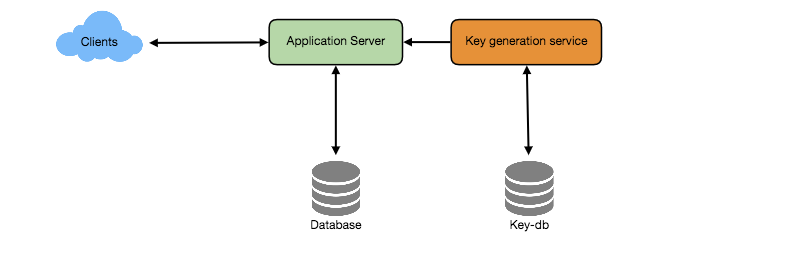


High level system design for URL shortening


1. Data Partitioning and Replication


To scale out our DB, we need to partition it so that it can store information about billions of URLs. We need to come up with a partitioning scheme that would divide and store our data to different DB servers.


a. Range Based Partitioning: We can store URLs in separate partitions based on the first letter of the URL or the hash key. Hence we save all the URLs starting with letter 'A' in one partition, save those that start with letter 'B' in another partition and so on. This approach is called range-based partitioning. We can even combine certain less frequently occurring letters into one database partition. We should come up with a static partitioning scheme so that we can always store/find a file in a predictable manner.


The main problem with this approach is that it can lead to unbalanced servers. For example: we decide to put all URLs starting with letter 'E' into a DB partition, but later we realize that we have too many URLs that start with letter 'E'.


b. Hash-Based Partitioning: In this scheme, we take a hash of the object we are storing. We then calculate which partition to use based upon the hash. In our case, we can take the hash of the 'key' or the actual URL to determine the partition in which we store the data object.


Our hashing function will randomly distribute URLs into different partitions (e.g., our hashing function can always map any key to a number between [1...256]), and this number would represent the partition in which we store our object.


This approach can still lead to overloaded partitions, which can be solved by using [Consistent Hashing 139](https://www.educative.io/collection/page/5668639101419520/5649050225344512/5709068098338816/).


1. Cache


We can cache URLs that are frequently accessed. We can use some off-the-shelf solution like Memcache, which can store full URLs with their respective hashes. The application servers, before hitting backend storage, can quickly check if the cache has the desired URL.


How much cache should we have? We can start with 20% of daily traffic and, based on clients' usage pattern, we can adjust how many cache servers we need. As estimated above, we need 170GB memory to cache 20% of daily traffic. Since a modern day server can have 256GB memory, we can easily fit all the cache into one machine. Alternatively, we can use a couple of smaller servers to store all these hot URLs.


Which cache eviction policy would best fit our needs? When the cache is full, and we want to replace a link with a newer/hotter URL, how would we choose? Least Recently Used (LRU) can be a reasonable policy for our system. Under this policy, we discard the least recently used URL first. We can use a [Linked Hash Map 56](https://docs.oracle.com/javase/7/docs/api/java/util/LinkedHashMap.html) or a similar data structure to store our URLs and Hashes, which will also keep track of which URLs are accessed recently.


To further increase the efficiency, we can replicate our caching servers to distribute load between them.


How can each cache replica be updated? Whenever there is a cache miss, our servers would be hitting a backend database. Whenever this happens, we can update the cache and pass the new entry to all the cache replicas. Each replica can update their cache by adding the new entry. If a replica already has that entry, it can simply ignore it.


[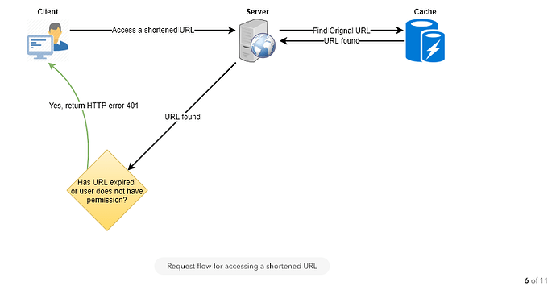


6.png883×461 29.1 KB


](<https://coursehunters.online/uploads/default/original/1X/e40cf740e7b1ba6d00cd72d257729cc639c06655.png> "6.png")


1. Load Balancer (LB)


We can add a Load balancing layer at three places in our system:


1. Between Clients and Application servers
2. Between Application Servers and database servers
3. Between Application Servers and Cache servers


Initially, we could use a simple Round Robin approach that distributes incoming requests equally among backend servers. This LB is simple to implement and does not introduce any overhead. Another benefit of this approach is, if a server is dead, LB will take it out of the rotation and will stop sending any traffic to it.


A problem with Round Robin LB is that server load is not taken into consideration. If a server is overloaded or slow, the LB will not stop sending new requests to that server. To handle this, a more intelligent LB solution can be placed that periodically queries the backend server about its load and adjusts traffic based on that.


1. Purging or DB cleanup


Should entries stick around forever or should they be purged? If a user-specified expiration time is reached, what should happen to the link?


If we chose to actively search for expired links to remove them, it would put a lot of pressure on our database. Instead, we can slowly remove expired links and do a lazy cleanup. Our service will make sure that only expired links will be deleted, although some expired links can live longer but will never be returned to users.


* Whenever a user tries to access an expired link, we can delete the link and return an error to the user.
* A separate Cleanup service can run periodically to remove expired links from our storage and cache. This service should be very lightweight and can be scheduled to run only when the user traffic is expected to be low.
* We can have a default expiration time for each link (e.g., two years).
* After removing an expired link, we can put the key back in the key-DB to be reused.
* Should we remove links that haven't been visited in some length of time, say six months? This could be tricky. Since storage is getting cheap, we can decide to keep links forever.


[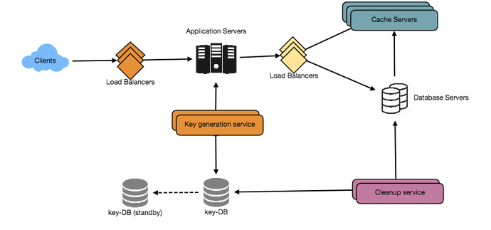


завантаження (1).png849×398 29.4 KB


](<https://coursehunters.online/uploads/default/original/1X/5f04cbfc6ae09fa15e32cf02a4307d8bf08ef7ce.png> "завантаження (1).png")


1. Telemetry


How many times a short URL has been used, what were user locations, etc.? How would we store these statistics? If it is part of a DB row that gets updated on each view, what will happen when a popular URL is slammed with a large number of concurrent requests?


Some statistics worth tracking: country of the visitor, date and time of access, web page that refers the click, browser or platform from where the page was accessed.


1. Security and Permissions


Can users create private URLs or allow a particular set of users to access a URL?


We can store permission level (public/private) with each URL in the database. We can also create a separate table to store UserIDs that have permission to see a specific URL. If a user does not have permission and tries to access a URL, we can send an error (HTTP 401) back. Given that we are storing our data in a NoSQL wide-column database like Cassandra, the key for the table storing permissions would be the 'Hash' (or the KGS generated 'key'). The columns will store the UserIDs of those users that have permissions to see the URL.


Designing Pastebin


Let's design a Pastebin like web service, where users can store plain text. Users of the service will enter a piece of text and get a randomly generated URL to access it. Similar Services: [pastebin.com 102](http://pastebin.com/), [pasted.co 6](http://pasted.co/), [chopapp.com 10](http://chopapp.com/) Difficulty Level: Easy


1. What is Pastebin?


Pastebin like services enable users to store plain text or images over the network (typically the Internet) and generate unique URLs to access the uploaded data. Such services are also used to share data over the network quickly, as users would just need to pass the URL to let other users see it.


If you haven't used [pastebin.com 98](http://pastebin.com/) before, please try creating a new 'Paste' there and spend some time going through different options their service offers. This will help you a lot in understanding this chapter better.


1. Requirements and Goals of the System


Our Pastebin service should meet the following requirements:


Functional Requirements:


1. Users should be able to upload or "paste" their data and get a unique URL to access it.
2. Users will only be able to upload text.
3. Data and links will expire after a specific timespan automatically; users should also be able to specify expiration time.
4. Users should optionally be able to pick a custom alias for their paste.


Non-Functional Requirements:


1. The system should be highly reliable, any data uploaded should not be lost.
2. The system should be highly available. This is required because if our service is down, users will not be able to access their Pastes.
3. Users should be able to access their Pastes in real-time with minimum latency.
4. Paste links should not be guessable (not predictable).


Extended Requirements:


1. Analytics, e.g., how many times a paste was accessed?
2. Our service should also be accessible through REST APIs by other services.


3. Some Design Considerations


Pastebin shares some requirements with [URL Shortening service 422](https://www.educative.io/collection/page/5668639101419520/5649050225344512/5668600916475904), but there are some additional design considerations we should keep in mind.


What should be the limit on the amount of text user can paste at a time? We can limit users not to have Pastes bigger than 10MB to stop the abuse of the service.


Should we impose size limits on custom URLs? Since our service supports custom URLs, users can pick any URL that they like, but providing a custom URL is not mandatory. However, it is reasonable (and often desirable) to impose a size limit on custom URLs, so that we have a consistent URL database.


1. Capacity Estimation and Constraints


Our services will be read-heavy; there will be more read requests compared to new Pastes creation. We can assume a 5:1 ratio between read and write.


Traffic estimates: Pastebin services are not expected to have traffic similar to Twitter or Facebook, let's assume here that we get one million new pastes added to our system every day. This leaves us with five million reads per day.


New Pastes per second:


1M / (24 hours * 3600 seconds) ~= 12 pastes/sec


Paste reads per second:


5M / (24 hours * 3600 seconds) ~= 58 reads/sec


Storage estimates: Users can upload maximum 10MB of data; commonly Pastebin like services are used to share source code, configs or logs. Such texts are not huge, so let's assume that each paste on average contains 10KB.


At this rate, we will be storing 10GB of data per day.


1M * 10KB => 10 GB/day


If we want to store this data for ten years, we would need the total storage capacity of 36TB.


With 1M pastes every day we will have 3.6 billion Pastes in 10 years. We need to generate and store keys to uniquely identify these pastes. If we use base64 encoding ([A-Z, a-z, 0-9, ., -]) we would need six letters strings:


64^6 ~= 68.7 billion unique strings


If it takes one byte to store one character, total size required to store 3.6B keys would be:


3.6B * 6 => 22 GB


22GB is negligible compared to 36TB. To keep some margin, we will assume a 70% capacity model (meaning we don't want to use more than 70% of our total storage capacity at any point), which raises our storage needs to 51.4TB.


Bandwidth estimates: For write requests, we expect 12 new pastes per second, resulting in 120KB of ingress per second.


12 * 10KB => 120 KB/s


As for the read request, we expect 58 requests per second. Therefore, total data egress (sent to users) will be 0.6 MB/s.


58 * 10KB => 0.6 MB/s


Although total ingress and egress are not big, we should keep these numbers in mind while designing our service.


Memory estimates: We can cache some of the hot pastes that are frequently accessed. Following the 80-20 rule, meaning 20% of hot pastes generate 80% of traffic, we would like to cache these 20% pastes


Since we have 5M read requests per day, to cache 20% of these requests, we would need:


0.2  *5M*  10KB ~= 10 GB


1. System APIs


We can have SOAP or REST APIs to expose the functionality of our service. Following could be the definitions of the APIs to create/retrieve/delete Pastes:


addPaste(api\_dev\_key, paste\_data, custom\_url=None user\_name=None, paste\_name=None, expire\_date=None)


Parameters:\
api\_dev\_key (string): The API developer key of a registered account. This will be used to, among other things, throttle users based on their allocated quota.\
paste\_data (string): Textual data of the paste.\
custom\_url (string): Optional custom URL.\
user\_name (string): Optional user name to be used to generate URL.\
paste\_name (string): Optional name of the paste expire\_date (string): Optional expiration date for the paste.


Returns: (string)\
A successful insertion returns the URL through which the paste can be accessed, otherwise, returns an error code.


Similarly, we can have retrieve and delete Paste APIs:


getPaste(api\_dev\_key, api\_paste\_key)


Where "api\_paste\_key" is a string representing the Paste Key of the paste to be retrieved. This API will return the textual data of the paste.


deletePaste(api\_dev\_key, api\_paste\_key)


A successful deletion returns 'true', otherwise returns 'false'.


1. Database Design


A few observations about the nature of the data we are going to store:


1. We need to store billions of records.
2. Each metadata object we are going to store would be small (less than 100 bytes).
3. Each paste object we are storing can be of medium size (it can be a few MB).
4. There are no relationships between records, except if we want to store which user created what Paste.
5. Our service is read-heavy.


#### Database Schema:


We would need two tables, one for storing information about the Pastes and the other for users' data.


Here, 'URlHash' is the URL equivalent of the TinyURL and 'ContentKey' is the object key storing the contents of the paste.


1. High Level Design


At a high level, we need an application layer that will serve all the read and write requests. Application layer will talk to a storage layer to store and retrieve data. We can segregate our storage layer with one database storing metadata related to each paste, users, etc., while the other storing the paste contents in some object storage (like [Amazon S3 40](https://en.wikipedia.org/wiki/Amazon_S3)). This division of data will also allow us to scale them individually.


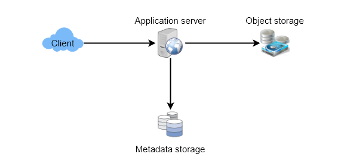


1. Component Design


### a. Application layer


Our application layer will process all incoming and outgoing requests. The application servers will be talking to the backend data store components to serve the requests.


How to handle a write request? Upon receiving a write request, our application server will generate a six-letter random string, which would serve as the key of the paste (if the user has not provided a custom key). The application server will then store the contents of the paste and the generated key in the database. After the successful insertion, the server can return the key to the user. One possible problem here could be that the insertion fails because of a duplicate key. Since we are generating a random key, there is a possibility that the newly generated key could match an existing one. In that case, we should regenerate a new key and try again. We should keep retrying until we don't see failure due to the duplicate key. We should return an error to the user if the custom key they have provided is already present in our database.


Another solution of the above problem could be to run a standalone Key Generation Service (KGS) that generates random six letters strings beforehand and stores them in a database (let's call it key-DB). Whenever we want to store a new paste, we will just take one of the already generated keys and use it. This approach will make things quite simple and fast since we will not be worrying about duplications or collisions. KGS will make sure all the keys inserted in key-DB are unique. KGS can use two tables to store keys, one for keys that are not used yet and one for all the used keys. As soon as KGS give some keys to an application server, it can move these to the used keys table. KGS can always keep some keys in memory so that whenever a server needs them, it can quickly provide them. As soon as KGS loads some keys in memory, it can move them to the used keys table, this way we can make sure each server gets unique keys. If KGS dies before using all the keys loaded in memory, we will be wasting those keys. We can ignore these keys given that we have a huge number of them.


Isn't KGS single point of failure? Yes, it is. To solve this, we can have a standby replica of KGS, and whenever the primary server dies, it can take over to generate and provide keys.


Can each app server cache some keys from key-DB? Yes, this can surely speed things up. Although in this case, if the application server dies before consuming all the keys, we will end up losing those keys. This could be acceptable since we have 68B unique six letters keys, which are a lot more than we require.


How to handle a paste read request? Upon receiving a read paste request, the application service layer contacts the datastore. The datastore searches for the key, and if it is found, returns the paste's contents. Otherwise, an error code is returned.


### b. Datastore layer


We can divide our datastore layer into two:


1. Metadata database: We can use a relational database like MySQL or a Distributed Key-Value store like Dynamo or Cassandra.
2. Object storage: We can store our contents in an Object storage like Amazon's S3. Whenever we feel like hitting our full capacity on content storage, we can easily increase it by adding more servers.


[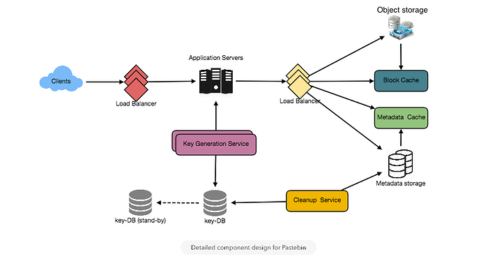


завантаження (3).png924×501 42.1 KB


](<https://coursehunters.online/uploads/default/original/1X/2cfbaf7ef4fb1260c987e02511501572b1c60b0c.png> "завантаження (3).png")


Detailed component design for Pastebin


1. Purging or DB Cleanup


Please see [Designing a URL Shortening service 422](https://www.educative.io/collection/page/5668639101419520/5649050225344512/5668600916475904).


1. Data Partitioning and Replication


Please see [Designing a URL Shortening service 422](https://www.educative.io/collection/page/5668639101419520/5649050225344512/5668600916475904).


1. Cache and Load Balancer


Please see [Designing a URL Shortening service 422](https://www.educative.io/collection/page/5668639101419520/5649050225344512/5668600916475904).


1. Security and Permissions


Please see [Designing a URL Shortening service 422](https://www.educative.io/collection/page/5668639101419520/5649050225344512/5668600916475904).


Designing Instagram


Let's design a photo-sharing service like Instagram, where users can upload photos to share them with other users. Similar Services: Flickr, Picasa Difficulty Level: Medium


1. What is Instagram?


Instagram is a social networking service which enables its users to upload and share their photos and videos with other users. Instagram users can choose to share either publicly or privately. Anything shared publically can be seen by any other user, whereas privately shared contents can only be accessible by a specified set of people. Instagram also enables its users to share through many other social networking platforms, such as Facebook, Twitter, Flickr, and Tumblr.


For the sake of this exercise, we plan to design a simpler version of Instagram, where a user can share photos and can also follow other users. The 'News Feed' for each user will consist of top photos of all the people the user follows.


1. Requirements and Goals of the System


We'll focus on the following set of requirements while designing the Instagram:


Functional Requirements


1. Users should be able to upload/download/view photos.
2. Users can perform searches based on photo/video titles.
3. Users can follow other users.
4. The system should be able to generate and display a user's News Feed consisting of top photos from all the people the user follows.


Non-functional Requirements


1. Our service needs to be highly available.
2. The acceptable latency of the system is 200ms for News Feed generation.
3. Consistency can take a hit (in the interest of availability), if a user doesn't see a photo for a while, it should be fine.
4. The system should be highly reliable, any uploaded photo or video should never be lost.


Not in scope: Adding tags to photos, searching photos on tags, commenting on photos, tagging users to photos, who to follow, suggestions, etc.


1. Some Design Considerations


The system would be read-heavy, so we will focus on building a system that can retrieve photos quickly.


1. Practically users can upload as many photos as they like. Efficient management of storage should be a crucial factor while designing this system.
2. Low latency is expected while viewing photos.
3. Data should be 100% reliable. If a user uploads a photo, the system will guarantee that it will never be lost.


4. Capacity Estimation and Constraints


* Let's assume we have 500M total users, with 1M daily active users.
* 2M new photos every day, 23 new photos every second.
* Average photo file size => 200KB
* Total space required for 1 day of photos


2M * 200KB => 400 GB


* Total space required for 10 years:


400GB  *365 (days a year)*  10 (years) ~= 1425TB


1. High Level System Design


At a high-level, we need to support two scenarios, one to upload photos and the other to view/search photos. Our service would need some [object storage 36](https://en.wikipedia.org/wiki/Object_storage) servers to store photos and also some database servers to store metadata information about the photos.


[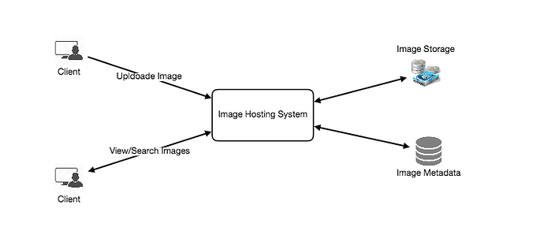


завантаження (4).png743×311 18.8 KB


](<https://coursehunters.online/uploads/default/original/1X/5dd5a5257a38b9c11e8388a8ae933cceee61e9f6.png> "завантаження (4).png")


1. Database Schema


 Defining the DB schema in the early stages of the interview would help to understand the data flow among various components and later would guide towards the data partitioning.


We need to store data about users, their uploaded photos, and people they follow. Photo table will store all data related to a photo, we need to have an index on (PhotoID, CreationDate) since we need to fetch recent photos first.


[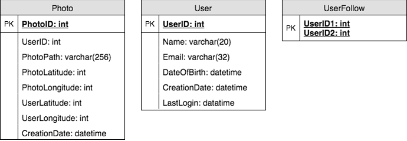


5752142325350400.png693×241 36.6 KB


](<https://coursehunters.online/uploads/default/original/1X/417c504be0ed7bb732124d9488ad9af12b6d0ce1.png> "5752142325350400.png")


A straightforward approach for storing the above schema would be to use an RDBMS like MySQL since we require joins. But relational databases come with their challenges, especially when we need to scale them. For details, please take a look at [SQL vs. NoSQL 335](https://www.educative.io/collection/page/5668639101419520/5649050225344512/5728116278296576/).


We can store photos in a distributed file storage like [HDFS 36](https://en.wikipedia.org/wiki/Apache_Hadoop) or [S3 40](https://en.wikipedia.org/wiki/Amazon_S3).


We can store the above schema in a distributed key-value store to enjoy the benefits offered by NoSQL. All the metadata related to photos can go to a table, where the 'key' would be the 'PhotoID' and the 'value' would be an object containing PhotoLocation, UserLocation, CreationTimestamp, etc.


We need to store relationships between users and photos, to know who owns which photo. We also need to store the list of people a user follows. For both of these tables, we can use a wide-column datastore like [Cassandra 126](https://en.wikipedia.org/wiki/Apache_Cassandra). For the 'UserPhoto' table, the 'key' would be 'UserID' and the 'value' would be the list of 'PhotoIDs' the user owns, stored in different columns. We will have a similar scheme for the 'UserFollow' table.


Cassandra or key-value stores in general, always maintain a certain number of replicas to offer reliability. Also, in such data stores, deletes don't get applied instantly, data is retained for certain days (to support undeleting) before getting removed from the system permanently.


1. Data Size Estimation


Let's estimate how much data will be going into each table and how much total storage we will need for 10 years.


User: Assuming each "int" and "dateTime" is four bytes, each row in the User's table will be of 68 bytes:


UserID (4 bytes) + Name (20 bytes) + Email (32 bytes) + DateOfBirth (4 bytes) + CreationDate (4 bytes) + LastLogin (4 bytes) = 68 bytes


If we have 500 million users, we will need 32GB of total storage.


500 million * 68 ~= 32GB


Photo: Each row in Photo's table will be of 284 bytes:


PhotoID (4 bytes) + UserID (4 bytes) + PhotoPath (256 bytes) + PhotoLatitude (4 bytes) + PhotLongitude(4 bytes) + UserLatitude (4 bytes) + UserLongitude (4 bytes) + CreationDate (4 bytes) = 284 bytes


If 2M new photos get uploaded every day, we will need 0.5GB of storage for one day:


2M * 284 bytes ~= 0.5GB per dayFor 10 years we will need 1.88TB of storage.


UserFollow: Each row in the UserFollow table will be of 8 bytes. If we have 500 million users and on average each user follows 500 users. We would need 895GB of storage for the UserFollow table.


500 million users  *500 followers*  8 bytes ~= 1.82TB


Total space required for all tables for 10 years will be 3.7TB:


32GB + 1.88TB + 1.82TB ~= 3.7TB


1. Component Design


Photo uploads (or writes) can be slow as they have to go to the disk, whereas reads will be faster, especially if they are being served from cache.


Uploading users can consume all the available connections, as uploading is a slow process. This means that 'reads' cannot be served if the system gets busy with all the write requests. As we know that web servers have a connection limit, so we should keep this thing in mind before designing our system. If we assume that a web server can have a maximum of 500 connections at any time, this would mean it can't have more than 500 concurrent uploads or reads. To handle this bottleneck we can split reads and writes into separate services. We will have dedicated servers for reads and different servers for writes to ensure that uploads don't hog the system.


Separating photos' read and write requests will also allow us to scale and optimize each of these operations independently.


[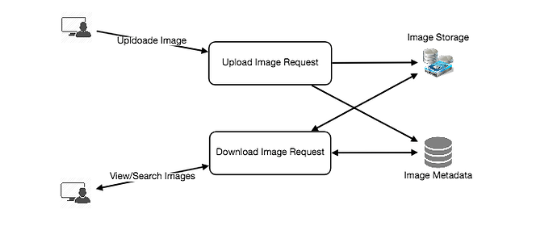


завантаження (5).png715×291 20.2 KB


](<https://coursehunters.online/uploads/default/original/1X/18fcd7674fa94d5116c7859de18c533f535f6047.png> "завантаження (5).png")


1. Reliability and Redundancy


Losing files is not an option for our service. Therefore, we will store multiple copies of each file, such that if one storage server dies, we can retrieve the photo from the other copy present on a different storage server.


This same principle also applies to other components of the system too. If we want to have high availability of the system, we need to have multiple replicas of services running in the system. So that if a few services die down, the system still remains available and serving. Redundancy removes the single point of failures in the system.


If only one instance of a service is required to be running at any point, we can run a redundant secondary copy of the service that is not serving any traffic but whenever primary has any problem it can take control after the failover.


Creating redundancy in a system can remove single points of failure and provide a backup or spare functionality if needed in a crisis. For example, if there are two instances of the same service running in production, and one fails or degrades, the system can failover to the healthy copy. Failover can happen automatically or require manual intervention.


[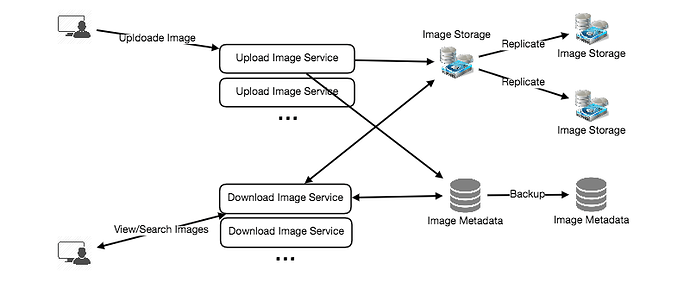


завантаження (6).png800×342 36.8 KB


](<https://coursehunters.online/uploads/default/original/1X/82aac5ad10ed5b5c5b96821000d0a094abb93ff0.png> "завантаження (6).png")


1. Data Sharding


Let's discuss different schemes for metadata sharding:


a. Partitioning based on UserID Let's assume we shard based on the 'UserID' so that we can keep all photos of a user on the same shard. If one DB shard is 1TB, we will need four shards to store 3.7TB of data. Let's assume for better performance and scalability we keep 10 shards.


So we'll find the shard number by UserID % 10 and then store the data there. To uniquely identify any photo in our system, we can append shard number with each PhotoID.


How can we generate PhotoIDs? Each DB shard can have its own auto-increment sequence for PhotoIDs, and since we will append ShardID with each PhotoID, it will make it unique throughout our system.


What are the different issues with this partitioning scheme?


1. How would we handle hot users? Several people follow such hot users, and a lot of other people sees any photo they upload.
2. Some users will have a lot of photos compared to others, thus making a non-uniform distribution of storage.
3. What if we cannot store all pictures of a user on one shard? If we distribute photos of a user onto multiple shards, will it cause higher latencies?
4. Storing all photos of a user on one shard can cause issues like unavailability of all of the user's data if that shard is down or higher latency if it is serving high load etc.


b. Partitioning based on PhotoID If we can generate unique PhotoIDs first and then find shard number through "PhotoID % 10", this can solve the above problems. We would not need to append ShardID with PhotoID in this case as PhotoID will itself be unique throughout the system.


How can we generate PhotoIDs? Here we cannot have an auto-incrementing sequence in each shard to define PhotoID because we need to know PhotoID first to find the shard where it will be stored. One solution could be that we dedicate a separate database instance to generate auto-incrementing IDs. If our PhotoID can fit into 64 bits, we can define a table containing only a 64 bit ID field. So whenever we would like to add a photo in our system, we can insert a new row in this table and take that ID to be our PhotoID of the new photo.


Wouldn't this key generating DB be a single point of failure? Yes, it will be. A workaround for that could be, we can define two such databases, with one generating even numbered IDs and the other odd numbered. For MySQL following script can define such sequences:


```
KeyGeneratingServer1:
auto-increment-increment = 2
auto-increment-offset = 1

KeyGeneratingServer2:
auto-increment-increment = 2
auto-increment-offset = 2

```

We can put a load balancer in front of both of these databases to round robin between them and to deal with downtime. Both these servers could be out of sync with one generating more keys than the other, but this will not cause any issue in our system. We can extend this design by defining separate ID tables for Users, Photo-Comments or other objects present in our system.


Alternately, we can implement a 'key' generation scheme similar to what we have discussed in [Designing a URL Shortening service like TinyURL 422](https://www.educative.io/collection/page/5668639101419520/5649050225344512/5668600916475904).


How can we plan for future growth of our system? We can have a large number of logical partitions to accommodate future data growth, such that, in the beginning, multiple logical partitions reside on a single physical database server. Since each database server can have multiple database instances on it, we can have separate databases for each logical partition on any server. So whenever we feel that a particular database server has a lot of data, we can migrate some logical partitions from it to another server. We can maintain a config file (or a separate database) that can map our logical partitions to database servers; this will enable us to move partitions around easily. Whenever we want to move a partition, we only have to update the config file to announce the change.


1. Ranking and News Feed Generation


To create the News Feed for any given user, we need to fetch the latest, most popular and relevant photos of other people the user follows.


For simplicity, let's assume we need to fetch top 100 photos for a user's News Feed. Our application server will first get a list of people the user follows and then fetches metadata info of latest 100 photos from each user. In the final step, the server will submit all these photos to our ranking algorithm which will determine the top 100 photos (based on recency, likeness, etc.) and return them to the user. A possible problem with this approach would be higher latency, as we have to query multiple tables and perform sorting/merging/ranking on the results. To improve the efficiency, we can pre-generate the News Feed and store it in a separate table.


Pre-generating the News Feed: We can have dedicated servers that are continuously generating users' News Feeds and storing them in a 'UserNewsFeed' table. So whenever any user needs the latest photos for their News Feed, we will simply query this table and return the results to the user.


Whenever these servers need to generate the News Feed of a user, they will first query the UserNewsFeed table to find the last time the News Feed was generated for that user. Then, new News Feed data will be generated from that time onwards (following the abovementioned steps).


What are the different approaches for sending News Feed contents to the users?


1. Pull: Clients can pull the News Feed contents from the server on a regular basis or manually whenever they need it. Possible problems with this approach are a) New data might not be shown to the users until clients issue a pull request b) Most of the time pull requests will result in an empty response if there is no new data.


2. Push: Servers can push new data to the users as soon as it is available. To efficiently manage this, users have to maintain a [Long Poll 31](https://en.wikipedia.org/wiki/Push_technology#Long_polling) request with the server for receiving the updates. A possible problem with this approach is when a user has a lot of follows or a celebrity user who has millions of followers; in this case, the server has to push updates quite frequently.


3. Hybrid: We can adopt a hybrid approach. We can move all the users with high followings to pull based model and only push data to those users who have a few hundred (or thousand) follows. Another approach could be that the server pushes updates to all the users not more than a certain frequency, letting users with a lot of follows/updates to regularly pull data.


For a detailed discussion about News Feed generation, take a look at [Designing Facebook's Newsfeed 98](https://www.educative.io/collection/page/5668639101419520/5649050225344512/5641332169113600).


1. News Feed Creation with Sharded Data


One of the most important requirement to create the News Feed for any given user is to fetch the latest photos from all people the user follows. For this, we need to have a mechanism to sort photos on their time of creation. To efficiently do this, we can make photo creation time part of the PhotoID. As we will have a primary index on PhotoID, it will be quite quick to find latest PhotoIDs.


We can use epoch time for this. Let's say our PhotoID will have two parts; the first part will be representing epoch time and the second part will be an auto-incrementing sequence. So to make a new PhotoID, we can take the current epoch time and append an auto-incrementing ID from our key-generating DB. We can figure out shard number from this PhotoID ( PhotoID % 10) and store the photo there.


What could be the size of our PhotoID ? Let's say our epoch time starts today, how many bits we would need to store the number of seconds for next 50 years?


86400 sec/day  *365 (days a year)*  50 (years) => 1.6 billion seconds


We would need 31 bits to store this number. Since on the average, we are expecting 23 new photos per second; we can allocate 9 bits to store auto incremented sequence. So every second we can store (2^9 => 512) new photos. We can reset our auto incrementing sequence every second.


We will discuss more details about this technique under 'Data Sharding' in [Designing Twitter 128](https://www.educative.io/collection/page/5668639101419520/5649050225344512/5741031244955648).


1. Cache and Load balancing


Our service would need a massive-scale photo delivery system to serve the globally distributed users. Our service should push its content closer to the user using a large number of geographically distributed photo cache servers and use CDNs (for details see [Caching 58](https://www.educative.io/collection/page/5668639101419520/5649050225344512/5643440998055936/)).


We can introduce a cache for metadata servers to cache hot database rows. We can use Memcache to cache the data and Application servers before hitting database can quickly check if the cache has desired rows. Least Recently Used (LRU) can be a reasonable cache eviction policy for our system. Under this policy, we discard the least recently viewed row first.


How can we build more intelligent cache? If we go with 80-20 rule, i.e., 20% of daily read volume for photos is generating 80% of traffic which means that certain photos are so popular that the majority of people reads them. This dictates we can try caching 20% of daily read volume of photos and metadata.


