Designing Dropbox


Let's design a file hosting service like Dropbox or Google Drive. Cloud file storage enables users to store their data on remote servers. Usually, these servers are maintained by cloud storage providers and made available to users over a network (typically through the Internet). Users pay for their cloud data storage on a monthly basis. Similar Services: OneDrive, Google Drive Difficulty Level: Medium


1. Why Cloud Storage?


Cloud file storage services have become very popular recently as they simplify the storage and exchange of digital resources among multiple devices. The shift from using single personal computers to using multiple devices with different platforms and operating systems such as smartphones and tablets and their portable access from various geographical locations at any time is believed to be accountable for the huge popularity of cloud storage services. Some of the top benefits of such services are:


Availability: The motto of cloud storage services is to have data availability anywhere anytime. Users can access their files/photos from any device whenever and wherever they like.


Reliability and Durability: Another benefit of cloud storage is that it offers 100% reliability and durability of data. Cloud storage ensures that users will never lose their data, by keeping multiple copies of the data stored on different geographically located servers.


Scalability: Users will never have to worry about getting out of storage space. With cloud storage, you have unlimited storage as long as you are ready to pay for it.


If you haven't used [dropbox.com 21](http://dropbox.com/) before, we would highly recommend creating an account there and uploading/editing a file and also going through different options their service offers. This will help you a lot in understanding this chapter better.


1. Requirements and Goals of the System


 You should always clarify requirements at the beginning of the interview. Be sure to ask questions to find the exact scope of the system that the interviewer has in mind.


What do we wish to achieve from a Cloud Storage system? Here are the top-level requirements for our system:


1. Users should be able to upload and download their files/photos from any device.
2. Users should be able to share files or folders with other users.
3. Our service should support automatic synchronization between devices, i.e., after updating a file on one device, it should get synchronized on all devices.
4. The system should support storing large files up to a GB.
5. ACID-ity is required. Atomicity, Consistency, Isolation and Durability of all file operations should be guaranteed.
6. Our system should support offline editing. Users should be able to add/delete/modify files while offline, and as soon as they come online, all their changes should be synced to the remote servers and other online devices.


Extended Requirements


* The system should support snapshotting of the data, so that users can go back to any version of the files.


1. Some Design Considerations


* We should expect huge read and write volumes.
* Read to write ratio is expected to be nearly the same.
* Internally, files can be stored in small parts or chunks (say 4MB), this can provide a lot of benefits e.g. all failed operations shall only be retried for smaller parts of a file. If a user fails to upload a file, then only the failing chunk will be retried.
* We can reduce the amount of data exchange by transferring updated chunks only.
* By removing duplicate chunks, we can save storage space and bandwidth usage.
* Keeping a local copy of the metadata (file name, size, etc.) with the client can save us a lot of round trips to the server.
* For small changes, clients can intelligently upload the diffs instead of the whole chunk.


1. Capacity Estimation and Constraints


* Let's assume that we have 500M total users, and 100M daily active users (DAU).
* Let's assume that on average each user connects from three different devices.
* On average if a user has 200 files/photos, we will have 100 billion total files.
* Let's assume that average file size is 100KB, this would give us ten petabytes of total storage.


100B * 100KB => 10PB


* Let's also assume that we will have one million active connections per minute.


1. High Level Design


The user will specify a folder as the workspace on their device. Any file/photo/folder placed in this folder will be uploaded to the cloud, and whenever a file is modified or deleted, it will be reflected in the same way in the cloud storage. The user can specify similar workspaces on all their devices and any modification done on one device will be propagated to all other devices to have the same view of the workspace everywhere.


At a high level, we need to store files and their metadata information like File Name, File Size, Directory, etc., and who this file is shared with. So, we need some servers that can help the clients to upload/download files to Cloud Storage and some servers that can facilitate updating metadata about files and users. We also need some mechanism to notify all clients whenever an update happens so they can synchronize their files.


As shown in the diagram below, Block servers will work with the clients to upload/download files from cloud storage, and Metadata servers will keep metadata of files updated in a SQL or NoSQL database. Synchronization servers will handle the workflow of notifying all clients about different changes for synchronization.


[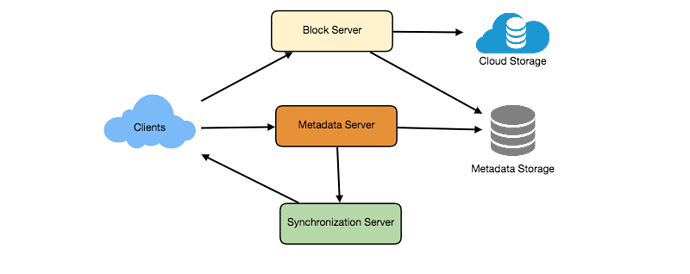


завантаження (7).png800×318 20.3 KB


](<https://coursehunters.online/uploads/default/original/1X/0588426982927141f324d42f5d88b9b01f98f377.png> "завантаження (7).png")


1. Component Design


Let's go through the major components of our system one by one:


### a. Client


The Client Application monitors the workspace folder on user's machine and syncs all files/folders in it with the remote Cloud Storage. The client application will work with the storage servers to upload, download and modify actual files to backend Cloud Storage. The client also interacts with the remote Synchronization Service to handle any file metadata updates e.g. change in the file name, size, modification date, etc.


Here are some of the essential operations of the client:


1. Upload and download files.
2. Detect file changes in the workspace folder.
3. Handle conflict due to offline or concurrent updates.


How do we handle file transfer efficiently? As mentioned above, we can break each file into smaller chunks so that we transfer only those chunks that are modified and not the whole file. Let's say we divide each file into fixed size of 4MB chunks. We can statically calculate what could be an optimal chunk size based on 1) Storage devices we use in the cloud to optimize space utilization and Input/output operations per second (IOPS) 2) Network bandwidth 3) Average file size in the storage etc. In our metadata, we should also keep a record of each file and the chunks that constitute it.


Should we keep a copy of metadata with Client? Keeping a local copy of metadata not only enable us to do offline updates but also saves a lot of round trips to update remote metadata.


How can clients efficiently listen to changes happening on other clients? One solution could be that the clients periodically check with the server if there are any changes. The problem with this approach is that we will have a delay in reflecting changes locally as clients will be checking for changes periodically compared to server notifying whenever there is some change. If the client frequently checks the server for changes, it will not only be wasting bandwidth, as the server has to return empty response most of the time but will also be keeping the server busy. Pulling information in this manner is not scalable too.


A solution to above problem could be to use HTTP long polling. With long polling, the client requests information from the server with the expectation that the server may not respond immediately. If the server has no new data for the client when the poll is received, instead of sending an empty response, the server holds the request open and waits for response information to become available. Once it does have new information, the server immediately sends an HTTP/S response to the client, completing the open HTTP/S Request. Upon receipt of the server response, the client can immediately issue another server request for future updates.


Based on the above considerations we can divide our client into following four parts:


I. Internal Metadata Database will keep track of all the files, chunks, their versions, and their location in the file system.


II. Chunker will split the files into smaller pieces called chunks. It will also be responsible for reconstructing a file from its chunks. Our chunking algorithm will detect the parts of the files that have been modified by the user and only transfer those parts to the Cloud Storage; this will save us bandwidth and synchronization time.


III. Watcher will monitor the local workspace folders and notify the Indexer (discussed below) of any action performed by the users, e.g., when users create, delete, or update files or folders. Watcher also listens to any changes happening on other clients that are broadcasted by Synchronization service.


IV. Indexer will process the events received from the Watcher and update the internal metadata database with information about the chunks of the modified files. Once the chunks are successfully submitted/downloaded to the Cloud Storage, the Indexer will communicate with the remote Synchronization Service to broadcast changes to other clients and update remote metadata database.


[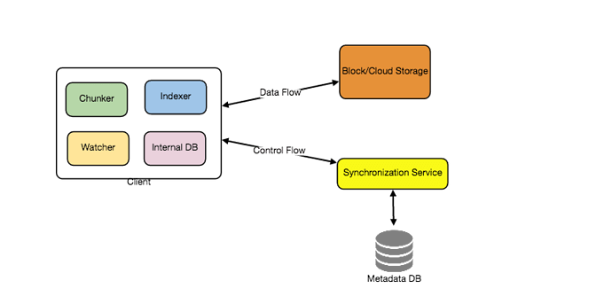


завантаження (8).png800×398 17.2 KB


](<https://coursehunters.online/uploads/default/original/1X/1f0fe567f61441c5a29f9f8724acf35eb67c4fc4.png> "завантаження (8).png")


How should clients handle slow servers? Clients should exponentially back-off if the server is busy/not-responding. Meaning, if a server is too slow to respond, clients should delay their retries, and this delay should increase exponentially.


Should mobile clients sync remote changes immediately? Unlike desktop or web clients, that check for file changes on a regular basis, mobile clients usually sync on demand to save user's bandwidth and space.


### b. Metadata Database


The Metadata Database is responsible for maintaining the versioning and metadata information about files/chunks, users, and workspaces. The Metadata Database can be a relational database such as MySQL, or a NoSQL database service such as DynamoDB. Regardless of the type of the database, the Synchronization Service should be able to provide a consistent view of the files using a database, especially if more than one user work with the same file simultaneously. Since NoSQL data stores do not support ACID properties in favor of scalability and performance, we need to incorporate the support for ACID properties programmatically in the logic of our Synchronization Service in case we opt for this kind of databases. However, using a relational database can simplify the implementation of the Synchronization Service as they natively support ACID properties.


Metadata Database should be storing information about following objects:


1. Chunks
2. Files
3. User
4. Devices
5. Workspace (sync folders)


### c. Synchronization Service


The Synchronization Service is the component that processes file updates made by a client and applies these changes to other subscribed clients. It also synchronizes clients' local databases with the information stored in the remote Metadata DB. The Synchronization Service is the most important part of the system architecture due to its critical role in managing the metadata and synchronizing users' files. Desktop clients communicate with the Synchronization Service to either obtain updates from the Cloud Storage or send files and updates to the Cloud Storage and potentially other users. If a client was offline for a period, it polls the system for new updates as soon as it becomes online. When the Synchronization Service receives an update request, it checks with the Metadata Database for consistency and then proceeds with the update. Subsequently, a notification is sent to all subscribed users or devices to report the file update.


The Synchronization Service should be designed in such a way to transmit less data between clients and the Cloud Storage to achieve better response time. To meet this design goal, the Synchronization Service can employ a differencing algorithm to reduce the amount of the data that needs to be synchronized. Instead of transmitting entire files from clients to the server or vice versa, we can just transmit the difference between two versions of a file. Therefore, only the part of the file that has been changed is transmitted. This also decreases bandwidth consumption and cloud data storage for the end user. As described above we will be dividing our files into 4MB chunks and will be transferring modified chunks only. Server and clients can calculate a hash (e.g., SHA-256) to see whether to update the local copy of a chunk or not. On server if we already have a chunk with a similar hash (even from another user) we don't need to create another copy, we can use the same chunk. This is discussed in detail later under Data Deduplication.


To be able to provide an efficient and scalable synchronization protocol we can consider using a communication middleware between clients and the Synchronization Service. The messaging middleware should provide scalable message queuing and change notification to support a high number of clients using pull or push strategies. This way, multiple Synchronization Service instances can receive requests from a global request [Queue 26](https://www.educative.io/collection/page/5668639101419520/5649050225344512/5080491044634624), and the communication middleware will be able to balance their load.


### d. Message Queuing Service


An important part of our architecture is a messaging middleware that should be able to handle a substantial number of requests. A scalable Message Queuing Service that supports asynchronous message-based communication between clients and the Synchronization Service instances best fits the requirements of our application. The Message Queuing Service supports asynchronous and loosely coupled message-based communication between distributed components of the system. The Message Queuing Service should be able to efficiently store any number of messages in a highly available, reliable and scalable queue.


Message Queuing Service will implement two types of queues in our system. The Request Queue is a global queue, and all client will share it. Clients' requests to update the Metadata Database will be sent to the Request Queue first, from there Synchronization Service will take it to update metadata. The Response Queues that correspond to individual subscribed clients are responsible for delivering the update messages to each client. Since a message will be deleted from the queue once received by a client, we need to create separate Response Queues for each subscribed client to share update messages.


[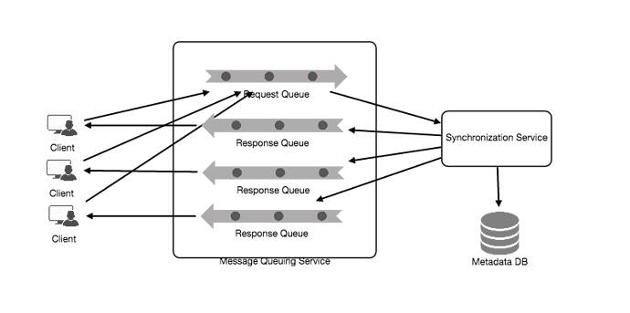


завантаження (9).png800×398 20.9 KB


](<https://coursehunters.online/uploads/default/original/1X/c41d0cecd1cdd8795daf06d6d1da39bd95f7fee7.png> "завантаження (9).png")


### e. Cloud/Block Storage


Cloud/Block Storage stores chunks of files uploaded by the users. Clients directly interact with the storage to send and receive objects from it. Separation of the metadata from storage enables us to use any storage either in cloud or in-house.


[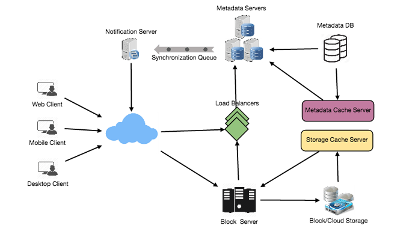


завантаження (10).png800×469 42.7 KB


](<https://coursehunters.online/uploads/default/original/1X/ed57f02e403047630d1e964689f827560206746f.png> "завантаження (10).png")


1. File Processing Workflow


The sequence below shows the interaction between the components of the application in a scenario when Client A updates a file that is shared with Client B and C, so they should receive the update too. If the other clients were not online at the time of the update, the Message Queuing Service keeps the update notifications in separate response queues for them until they become online later.


1. Client A uploads chunks to cloud storage.
2. Client A updates metadata and commits changes.
3. Client A gets confirmation, and notifications are sent to Clients B and C about the changes.
4. Client B and C receive metadata changes and download updated chunks.


5. Data Deduplication


Data deduplication is a technique used for eliminating duplicate copies of data to improve storage utilization. It can also be applied to network data transfers to reduce the number of bytes that must be sent. For each new incoming chunk, we can calculate a hash of it and compare that hash with all the hashes of the existing chunks to see if we already have same chunk present in our storage.


We can implement deduplication in two ways in our system:


a. Post-process deduplication\
With post-process deduplication, new chunks are first stored on the storage device, and later some process analyzes the data looking for duplication. The benefit is that clients will not need to wait for the hash calculation or lookup to complete before storing the data, thereby ensuring that there is no degradation in storage performance. Drawbacks of this approach are 1) We will unnecessarily be storing duplicate data, though for a short time, 2) Duplicate data will be transferred consuming bandwidth.


b. In-line deduplication\
Alternatively, deduplication hash calculations can be done in real-time as the clients are entering data on their device. If our system identifies a chunk which it has already stored, only a reference to the existing chunk will be added in the metadata, rather than the full copy of the chunk. This approach will give us optimal network and storage usage.


1. Metadata Partitioning


To scale out metadata DB, we need to partition it so that it can store information about millions of users and billions of files/chunks. We need to come up with a partitioning scheme that would divide and store our data to different DB servers.


1. Vertical Partitioning: We can partition our database in such a way that we store tables related to one particular feature on one server. For example, we can store all the user related tables in one database and all files/chunks related tables in another database. Although this approach is straightforward to implement it has some issues:


1. Will we still have scale issues? What if we have trillions of chunks to be stored and our database cannot support to store such huge number of records? How would we further partition such tables?
2. Joining two tables in two separate databases can cause performance and consistency issues. How frequently do we have to join user and file tables?


2. Range Based Partitioning: What if we store files/chunks in separate partitions based on the first letter of the File Path. So, we save all the files starting with letter 'A' in one partition and those that start with letter 'B' into another partition and so on. This approach is called range based partitioning. We can even combine certain less frequently occurring letters into one database partition. We should come up with this partitioning scheme statically so that we can always store/find a file in a predictable manner.


The main problem with this approach is that it can lead to unbalanced servers. For example, if we decide to put all files starting with letter 'E' into a DB partition, and later we realize that we have too many files that start with letter 'E', to such an extent that we cannot fit them into one DB partition.


3. Hash-Based Partitioning: In this scheme we take a hash of the object we are storing and based on this hash we figure out the DB partition to which this object should go. In our case, we can take the hash of the 'FileID' of the File object we are storing to determine the partition the file will be stored. Our hashing function will randomly distribute objects into different partitions, e.g., our hashing function can always map any ID to a number between [1...256], and this number would be the partition we will store our object.


This approach can still lead to overloaded partitions, which can be solved by using [Consistent Hashing 29](https://www.educative.io/collection/page/5668639101419520/5649050225344512/5709068098338816).


1. Caching


We can have two kinds of caches in our system. To deal with hot files/chunks, we can introduce a cache for Block storage. We can use an off-the-shelf solution like Memcache, that can store whole chunks with their respective IDs/Hashes, and Block servers before hitting Block storage can quickly check if the cache has desired chunk. Based on clients' usage pattern we can determine how many cache servers we need. A high-end commercial server can have up to 144GB of memory; So, one such server can cache 36K chunks.


Which cache replacement policy would best fit our needs? When the cache is full, and we want to replace a chunk with a newer/hotter chunk, how would we choose? Least Recently Used (LRU) can be a reasonable policy for our system. Under this policy, we discard the least recently used chunk first.


Similarly, we can have a cache for Metadata DB.


1. Load Balancer (LB)


We can add Load balancing layer at two places in our system 1) Between Clients and Block servers and 2) Between Clients and Metadata servers. Initially, a simple Round Robin approach can be adopted; that distributes incoming requests equally among backend servers. This LB is simple to implement and does not introduce any overhead. Another benefit of this approach is if a server is dead, LB will take it out of the rotation and will stop sending any traffic to it. A problem with Round Robin LB is, it won't take server load into consideration. If a server is overloaded or slow, the LB will not stop sending new requests to that server. To handle this, a more intelligent LB solution can be placed that periodically queries backend server about their load and adjusts traffic based on that.


1. Security, Permissions and File Sharing


One of the primary concerns users will have while storing their files in the cloud is the privacy and security of their data. Especially since in our system users can share their files with other users or even make them public to share it with everyone. To handle this, we will be storing permissions of each file in our metadata DB to reflect what files are visible or modifiable by any user.


Designing Facebook Messenger


Let's design an instant messaging service like Facebook Messenger, where users can send text messages to each other through web and mobile interfaces.


1. What is Facebook Messenger?


Facebook Messenger is a software application which provides text-based instant messaging service to its users. Messenger users can chat with their Facebook friends both from cell-phones and their website.


1. Requirements and Goals of the System


Our Messenger should meet the following requirements:


Functional Requirements:


1. Messenger should support one-on-one conversations between users.
2. Messenger should keep track of online/offline statuses of its users.
3. Messenger should support persistent storage of chat history.


Non-functional Requirements:


1. Users should have real-time chat experience with minimum latency.
2. Our system should be highly consistent; users should be able to see the same chat history on all their devices.
3. Messenger's high availability is desirable; we can tolerate lower availability in the interest of consistency.


Extended Requirements:


* Group Chats: Messenger should support multiple people talking to each other in a group.
* Push notifications: Messenger should be able to notify users of new messages when they are offline.


1. Capacity Estimation and Constraints


Let's assume that we have 500 million daily active users and on average each user sends 40 messages daily; this gives us 20 billion messages per day.


Storage Estimation: Let's assume that on average a message is 100 bytes, so to store all the messages for one day we would need 2TB of storage.


20 billion messages * 100 bytes => 2 TB/day


Although Facebook Messenger stores all previous chat history, but just for estimation to save five years of chat history, we would need 3.6 petabytes of storage.


2 TB  *365 days*  5 years ~= 3.6 PB


Other than the chat messages, we would also need to store users' information, messages' metadata (ID, Timestamp, etc.). Also, the above calculations didn't keep data compression and replication in consideration.


Bandwidth Estimation: If our service is getting 2TB of data every day, this will give us 25MB of incoming data for each second.


2 TB / 86400 sec ~= 25 MB/s


Since each incoming message needs to go out to another user, we will need the same amount of bandwidth 25MB/s for both upload and download.


High level estimates:


| Total messages | 20 billion per day |
| --- | --- |
| Storage for each day | 2TB |
| Storage for 5 years | 3.6PB |
| Incomming data | 25MB/s |
| Outgoing data | 25MB/s |


1. High Level Design


At a high level, we will need a chat server that would be the central piece orchestrating all the communications between users. When a user wants to send a message to another user, they will connect to the chat server and send the message to the server; the server then passes that message to the other user and also stores it in the database.


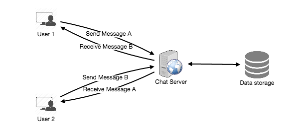


The detailed workflow would look like this:


1. User-A sends a message to User-B through the chat server.
2. The server receives the message and sends an acknowledgment to User-A.
3. The server stores the message in its database and sends the message to User-B.
4. User-B receives the message and sends the acknowledgment to the server.
5. The server notifies User-A that the message has been delivered successfully to User-B.


[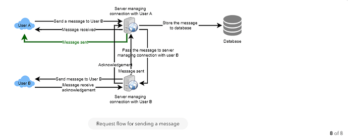


8.png826×335 20.5 KB


](<https://coursehunters.online/uploads/default/original/1X/e569be10434e5987e6a3708703c596bbe6c7065e.png> "8.png")


[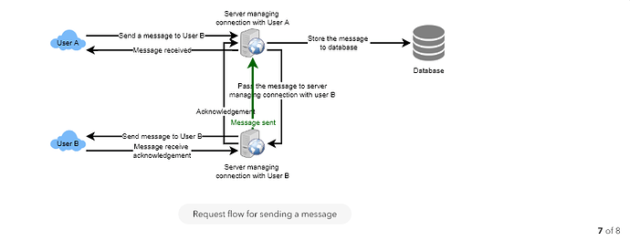


7.png862×330 20 KB


](<https://coursehunters.online/uploads/default/original/1X/2989a2b83ca571172535e8b42a2485155d4dc732.png> "7.png")


[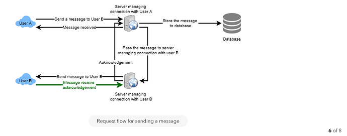


6.png830×326 19.4 KB


](<https://coursehunters.online/uploads/default/original/1X/e1ad0af2df80274b81b363d9ca0b0871f61e9a4d.png> "6.png")


[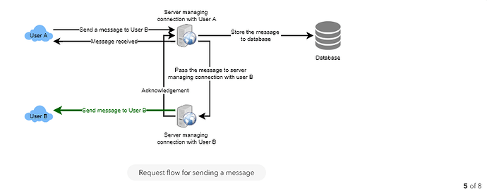


5.png831×330 18.5 KB


](<https://coursehunters.online/uploads/default/original/1X/924df3776fe28aa761b4eba656863f0b5e90dde1.png> "5.png")


[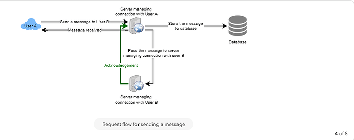


4.png844×334 17.1 KB


](<https://coursehunters.online/uploads/default/original/1X/b558848fd7f0c9a1e259dbb2218820ae9aa5ea82.png> "4.png")


[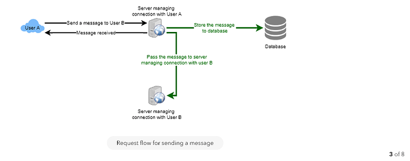


3.png833×329 16.5 KB


](<https://coursehunters.online/uploads/default/original/1X/45a690bc1cd09673ad78f1c1d58a5d17e46abfe5.png> "3.png")


[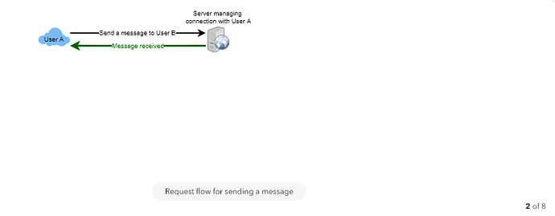


2.png853×333 8.97 KB


](<https://coursehunters.online/uploads/default/original/1X/f05f592103d45d85d988e28d2e69469e0af193e7.png> "2.png")


[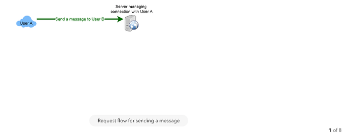


1.png832×327 8.21 KB


](<https://coursehunters.online/uploads/default/original/1X/ed876036e509b153475aebc9e227b16f939e6a7f.png> "1.png")


1. Detailed Component Design


Let's try to build a simple solution first where everything runs on one server. At the high level our system needs to handle the following use cases:


1. Receive incoming messages and deliver outgoing messages.
2. Store and retrieve messages from the database.
3. Keep a record of which user is online or has gone offline, and notify all the relevant users about these status changes.


Let's talk about these scenarios one by one:


### a. Messages Handling


How would we efficiently send/receive messages? To send messages, a user needs to connect to the server and post messages for the other users. To get a message from the server, the user has two options:


1. Pull model: Users can periodically ask the server if there are any new messages for them.
2. Push model: Users can keep a connection open with the server and can depend upon the server to notify them whenever there are new messages.


If we go with our first approach, then the server needs to keep track of messages that are still waiting to be delivered, and as soon as the receiving user connects to the server to ask for any new message, the server can return all the pending messages. To minimize latency for the user, they have to check the server quite frequently, and most of the time they will be getting an empty response if there are no pending message. This will waste a lot of resources and does not look like an efficient solution.


If we go with our second approach, where all the active users keep a connection open with the server, then as soon as the server receives a message it can immediately pass the message to the intended user. This way, the server does not need to keep track of the pending messages, and we will have minimum latency, as the messages are delivered instantly on the opened connection.


How will clients maintain an open connection with the server? We can use HTTP [Long Polling 49](https://www.educative.io/collection/page/5668639101419520/5649050225344512/5715426797420544) or [WebSockets 49](https://www.educative.io/collection/page/5668639101419520/5649050225344512/5715426797420544). In long polling, clients can request information from the server with the expectation that the server may not respond immediately. If the server has no new data for the client when the poll is received, instead of sending an empty response, the server holds the request open and waits for response information to become available. Once it does have new information, the server immediately sends the response to the client, completing the open request. Upon receipt of the server response, the client can immediately issue another server request for future updates. This gives a lot of improvements in latencies, throughputs, and performance. The long polling request can timeout or can receive a disconnect from the server, in that case, the client has to open a new request.


How can the server keep track of all the opened connection to redirect messages to the users efficiently? The server can maintain a hash table, where "key" would be the UserID and "value" would be the connection object. So whenever the server receives a message for a user, it looks up that user in the hash table to find the connection object and sends the message on the open request.


What will happen when the server receives a message for a user who has gone offline? If the receiver has disconnected, the server can notify the sender about the delivery failure. If it is a temporary disconnect, e.g., the receiver's long-poll request just timed out, then we should expect a reconnect from the user. In that case, we can ask the sender to retry sending the message. This retry could be embedded in the client's logic so that users don't have to retype the message. The server can also store the message for a while and retry sending it once the receiver reconnects.


How many chat servers we need? Let's plan for 500 million connections at any time. Assuming a modern server can handle 50K concurrent connections at any time, we would need 10K such servers.


How to know which server holds the connection to which user? We can introduce a software load balancer in front of our chat servers; that can map each UserID to a server to redirect the request.


How should the server process a 'deliver message' request? The server needs to do following things upon receiving a new message 1) Store the message in the database 2) Send the message to the receiver 3) Send an acknowledgment to the sender.


The chat server will first find the server that holds the connection for the receiver and pass the message to that server to send it to the receiver. The chat server can then send the acknowledgment to the sender; we don't need to wait for storing the message in the database; this can happen in the background. Storing the message is discussed in the next section.


How does the messenger maintain the sequencing of the messages? We can store a timestamp with each message, which would be the time when the message is received at the server. But this will still not ensure correct ordering of messages for clients. The scenario where the server timestamp cannot determine the exact order of messages would look like this:


1. User-1 sends a message M1 to the server for User-2.
2. The server receives M1 at T1.
3. Meanwhile, User-2 sends a message M2 to the server for User-1.
4. The server receives the message M2 at T2, such that T2 > T1.
5. The server sends message M1 to User-2 and M2 to User-1.


So User-1 will see M1 first and then M2, whereas User-2 will see M2 first and then M1.


To resolve this, we need to keep a sequence number with every message for each client. This sequence number will determine the exact ordering of messages for EACH user. With this solution, both clients will see a different view of the message sequence, but this view will be consistent for them on all devices.


### b. Storing and retrieving the messages from the database


Whenever the chat server receives a new message, it needs to store it in the database. To do so, we have two options:


1. Start a separate thread, which will work with the database to store the message.
2. Send an asynchronous request to the database to store the message.


We have to keep certain things in mind while designing our database:


1. How to efficiently work with the database connection pool.
2. How to retry failed requests?
3. Where to log those requests that failed even after some retries?
4. How to retry these logged requests (that failed after the retry) when all the issues have resolved?


Which storage system we should use? We need to have a database that can support a very high rate of small updates, and also that can fetch a range of records quickly. This is required because we have a huge number of small messages that need to be inserted in the database and while querying, a user is mostly interested in sequentially accessing the messages.


We cannot use RDBMS like MySQL or NoSQL like MongoDB because we cannot afford to read/write a row from the database every time a user receives/sends a message. This will not only make the basic operations of our service to run with high latency but also create a huge load on databases.


Both of our requirements can be easily met with a wide-column database solution like [HBase 25](https://en.wikipedia.org/wiki/Apache_HBase). HBase is a column-oriented key-value NoSQL database that can store multiple values against one key into multiple columns. HBase is modeled after Google's [BigTable 6](https://en.wikipedia.org/wiki/Bigtable) and runs on top of Hadoop Distributed File System ([HDFS](https://en.wikipedia.org/wiki/Apache_Hadoop)). HBase groups data together to store new data in a memory buffer and once the buffer is full, it dumps the data to the disk This way of storage not only helps storing a lot of small data quickly but also fetching rows by the key or scanning ranges of rows. HBase is also an efficient database to store variable size data, which is also required by our service.


How should clients efficiently fetch data from the server? Clients should paginate while fetching data from the server. Page size could be different for different clients, e.g., cell phones have smaller screens, so we need a lesser number of message/conversations in the viewport.


### c. Managing user's status


We need to keep track of user's online/offline status and notify all the relevant users whenever a status change happens. Since we are maintaining a connection object on the server for all active users, we can easily figure out the user's current status from this. With 500M active users at any time, if we have to broadcast each status change to all the relevant active users, it will consume a lot of resources. We can do the following optimization around this:


1. Whenever a client starts the app, it can pull current status of all users in their friends' list.
2. Whenever a user sends a message to another user that has gone offline, we can send a failure to the sender and update the status on the client.
3. Whenever a user comes online, the server can always broadcast that status with a delay of a few seconds to see if the user does not go offline immediately.
4. Client's can pull the status from the server about those users that are being shown on the user's viewport. This should not be a frequent operation, as the server is broadcasting the online status of users and we can live with the stale offline status of users for a while.
5. Whenever the client starts a new chat with another user, we can pull the status at that time.


[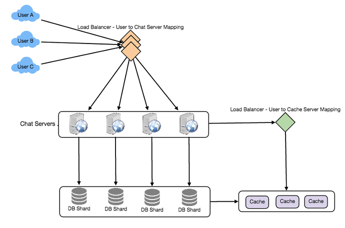


завантаження (12).png800×529 38.2 KB


](<https://coursehunters.online/uploads/default/original/1X/b17fa3b8e82b5079c608644981ae1696459d6f55.png> "завантаження (12).png")


Design Summary: Clients will open a connection to the chat server to send a message; the server will then pass it to the requested user. All the active users will keep a connection open with the server to receive messages. Whenever a new message arrives, the chat server will push it to the receiving user on the long poll request. Messages can be stored in HBase, which supports quick small updates, and range based searches. The servers can broadcast the online status of a user to other relevant users. Clients can pull status updates for users who are visible in the client's viewport on a less frequent basis.


1. Data partitioning


Since we will be storing a lot of data (3.6PB for five years), we need to distribute it onto multiple database servers. What would be our partitioning scheme?


Partitioning based on UserID: Let's assume we partition based on the hash of the UserID so that we can keep all messages of a user on the same database. If one DB shard is 4TB, we will have "3.6PB/4TB ~= 900" shards for five years. For simplicity, let's assume we keep 1K shards. So we will find the shard number by "hash(UserID) % 1000", and then store/retrieve the data from there. This partitioning scheme will also be very quick to fetch chat history for any user.


In the beginning, we can start with fewer database servers with multiple shards residing on one physical server. Since we can have multiple database instances on a server, we can easily store multiple partitions on a single server. Our hash function needs to understand this logical partitioning scheme so that it can map multiple logical partitions on one physical server.


Since we will store an unlimited history of messages, we can start with a big number of logical partitions, which would be mapped to fewer physical servers, and as our storage demand increases, we can add more physical servers to distribute our logical partitions.


Partitioning based on MessageID: If we store different messages of a user on separate database shard, fetching a range of messages of a chat would be very slow, so we should not adopt this scheme.


1. Cache


We can cache a few recent messages (say last 15) in a few recent conversations that are visible in user's viewport (say last 5). Since we decided to store all of the user's messages on one shard, cache for a user should entirely reside on one machine too.


1. Load balancing


We will need a load balancer in front of our chat servers; that can map each UserID to a server that holds the connection for the user and then direct the request to that server. Similarly, we would need a load balancer for our cache servers.


1. Fault tolerance and Replication


What will happen when a chat server fails? Our chat servers are holding connections with the users. If a server goes down, should we devise a mechanism to transfer those connections to some other server? It's extremely hard to failover TCP connections to other servers; an easier approach can be to have clients automatically reconnect if the connection is lost.


Should we store multiple copies of user messages? We cannot have only one copy of the user's data, because if the server holding the data crashes or is down permanently, we don't have any mechanism to recover that data. For this, either we have to store multiple copies of the data on different servers or use techniques like Reed-Solomon encoding to distribute and replicate it.


1. Extended Requirements


### a. Group chat


We can have separate group-chat objects in our system that can be stored on the chat servers. A group-chat object is identified by GroupChatID and will also maintain a list of people who are part of that chat. Our load balancer can direct each group chat message based on GroupChatID and the server handling that group chat can iterate through all the users of the chat to find the server handling the connection of each user to deliver the message.


In databases, we can store all the group chats in a separate table partitioned based on GroupChatID.


### b. Push notifications


In our current design user's can only send messages to active users, and if the receiving user is offline, we send a failure to the sending user. Push notifications will enable our system to send messages to offline users.


For Push notifications, each user can opt-in from their device (or a web browser) to get notifications whenever there is a new message or event. Each manufacturer maintains a set of servers that handles pushing these notifications to the user.


To have push notifications in our system, we would need to set up a Notification server, which will take the messages for offline users and send them to manufacture's push notification server, which will then send them to the user's device.


Designing Twitter


Let's design a Twitter like social networking service. Users of the service will be able to post tweets, follow other people and favorite tweets. Difficulty Level: Medium


1. What is Twitter?


Twitter is an online social networking service where users post and read short 140-character messages called "tweets". Registered users can post and read tweets, but those who are not registered can only read them. Users access Twitter through their website interface, SMS or mobile app.


1. Requirements and Goals of the System


We will be designing a simpler version of Twitter with following requirements:


Functional Requirements


1. Users should be able to post new tweets.
2. A user should be able to follow other users.
3. Users should be able to mark tweets favorite.
4. The service should be able to create and display user's timeline consisting of top tweets from all the people the user follows.
5. Tweets can contain photos and videos.


Non-functional Requirements


1. Our service needs to be highly available.
2. Acceptable latency of the system is 200ms for timeline generation.
3. Consistency can take a hit (in the interest of availability), if a user doesn't see a tweet for a while, it should be fine.


Extended Requirements


1. Searching tweets.
2. Reply to a tweet.
3. Trending topics -- current hot topics/searches.
4. Tagging other users.
5. Tweet Notification.
6. Who to follow? Suggestions?
7. Moments.


8. Capacity Estimation and Constraints


Let's assume we have one billion total users, with 200 million daily active users (DAU). Also, we have 100 million new tweets every day, and on average each user follows 200 people.


How many favorites per day? If on average each user favorites five tweets per day, we will have:


200M users * 5 favorites => 1B favorites


How many total tweet-views our system will generate? Let's assume on average a user visits their timeline two times a day and visits five other people's pages. One each page if a user sees 20 tweets, total tweet-views our system will generate:


200M DAU  *((2 + 5)*  20 tweets) => 28B/day


Storage Estimates Let's say each tweet has 140 characters and we need two bytes to store a character without compression. Let's assume we need 30 bytes to store metadata with each tweet (like ID, timestamp, user ID, etc.). Total storage we would need:


100M * (280 + 30) bytes => 30GB/day


What would be our storage needs for five years? How much storage we would need for users' data, follows, favorites? We will leave this for exercise.


Not all tweets will have media, let's assume that on average every fifth tweet has a photo and every tenth has a video. Let's also assume on average a photo is 200KB and a video is 2MB. This will lead us to have 24TB of new media every day.


(100M/5 photos  *200KB) + (100M/10 videos*  2MB) ~= 24TB/day


Bandwidth Estimates Since total ingress is 24TB per day, this would translate into 290MB/sec.


Remember that we have 28B tweet views per day. We must show the photo of every tweet (if it has a photo), but let's assume that the users watch every 3rd video they see in their timeline. So, total egress will be:


(28B * 280 bytes) / 86400s of text => 93MB/s


* (28B/5 * 200KB ) / 86400s of photos => 13GB/S
* (28B/10/3 * 2MB ) / 86400s of Videos => 22GB/s


Total ~= 35GB/s


1. System APIs


 Once we've finalized the requirements, it's always a good idea to define the system APIs. This should explicitly state what is expected from the system.


We can have SOAP or REST APIs to expose the functionality of our service. Following could be the definition of the API for posting a new tweet:


```
tweet(api\_dev\_key, tweet\_data, tweet\_location, user\_location, media\_ids, maximum\_results\_to\_return)

```

Parameters:\
api\_dev\_key (string): The API developer key of a registered account. This will be used to, among other things, throttle users based on their allocated quota.\
tweet\_data (string): The text of the tweet, typically up to 140 characters.\
tweet\_location (string): Optional location (longitude, latitude) this Tweet refers to. user\_location (string): Optional location (longitude, latitude) of the user adding the tweet.\
media\_ids (number[]): Optional list of media\_ids to be associated with the Tweet. (All the media photo, video, etc.) need to be uploaded separately.


Returns: (string)\
A successful post will return the URL to access that tweet. Otherwise, an appropriate HTTP error is returned.


1. High Level System Design


We need a system that can efficiently store all the new tweets, 100M/86400s => 1150 tweets per second and read 28B/86400s => 325K tweets per second. It is clear from the requirements that this will be a read-heavy system.


At a high level, we need multiple application servers to serve all these requests with load balancers in front of them for traffic distributions. On the backend, we need an efficient database that can store all the new tweets and can support a huge number of reads. We would also need some file storage to store photos and videos.


[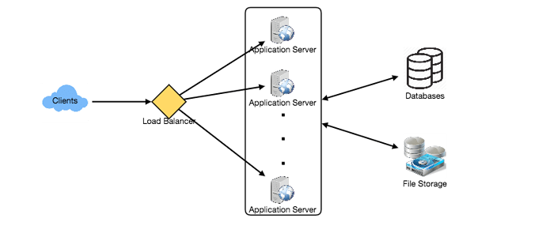


завантаження (13).png800×348 31.3 KB


](<https://coursehunters.online/uploads/default/original/1X/7ca687f7ee146c909ee380d5bc3ccd8adad41d70.png> "завантаження (13).png")


Although our expected daily write load is 100 million and read load is 28 billion tweets. This means, on average our system will receive around 1160 new tweets and 325K read requests per second. This traffic will be distributed unevenly throughout the day, though, at peak time we should expect at least a few thousand write requests and around 1M read requests per second. We should keep this thing in mind while designing the architecture of our system.


1. Database Schema


We need to store data about users, their tweets, their favorite tweets, and people they follow.


[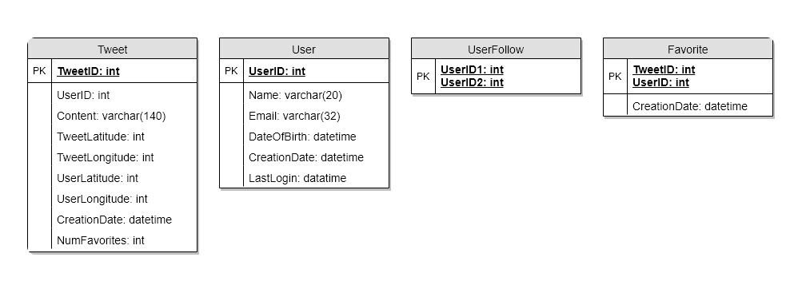


завантаження (14).png998×362 7.67 KB


](<https://coursehunters.online/uploads/default/original/1X/ae5d5769223c263c731b348b13cbe3f652e7c9ba.png> "завантаження (14).png")


For choosing between SQL and NoSQL databases to store the above schema, please see 'Database schema' under [Designing Instagram 135](https://www.educative.io/collection/page/5668639101419520/5649050225344512/5673385510043648).


1. Data Sharding


Since we have a huge number of new tweets every day and our read load is extremely high too, we need to distribute our data onto multiple machines such that we can read/write it efficiently. We have many options to shard our data; let's go through them one by one:


Sharding based on UserID: We can try storing all the data of a user on one server. While storing, we can pass the UserID to our hash function that will map the user to a database server where we will store all of the user's tweets, favorites, follows, etc. While querying for tweets/follows/favorites of a user, we can ask our hash function where can we find the data of a user and then read it from there. This approach has a couple of issues:


1. What if a user becomes hot? There could be a lot of queries on the server holding the user. This high load will affect the performance of our service.
2. Over time some users can end up storing a lot of tweets or have a lot of follows compared to others. Maintaining a uniform distribution of growing user's data is quite difficult.


To recover from these situations either we have to repartition/redistribute our data or use consistent hashing.


Sharding based on TweetID: Our hash function will map each TweetID to a random server where we will store that Tweet. To search tweets, we have to query all servers, and each server will return a set of tweets. A centralized server will aggregate these results to return them to the user. Let's look into timeline generation example, here are the number of steps our system has to perform to generate a user's timeline:


1. Our application (app) server will find all the people the user follows.
2. App server will send the query to all database servers to find tweets from these people.
3. Each database server will find the tweets for each user, sort them by recency and return the top tweets.
4. App server will merge all the results and sort them again to return the top results to the user.


This approach solves the problem of hot users, but in contrast to sharding by UserID, we have to query all database partitions to find tweets of a user, which can result in higher latencies.


We can further improve our performance by introducing cache to store hot tweets in front of the database servers.


Sharding based on Tweet creation time: Storing tweets based on recency will give us the advantage of fetching all the top tweets quickly, and we only have to query a very small set of servers. But the problem here is that the traffic load will not be distributed, e.g., while writing, all new tweets will be going to one server, and the remaining servers will be sitting idle. Similarly while reading, the server holding latest data will have a very high load as compared to servers holding old data.


What if we can combine sharding by TweedID and Tweet creation time? If we don't store tweet creation time separately and use TweetID to reflect that, we can get benefits of both the approaches. This way it will be quite quick to find latest Tweets. For this, we must make each TweetID universally unique in our system, and each TweetID should contain timestamp too.


We can use epoch time for this. Let's say our TweetID will have two parts; the first part will be representing epoch seconds and the second part will be an auto-incrementing sequence. So, to make a new TweetID, we can take the current epoch time and append an auto-incrementing number to it. We can figure out shard number from this TweetID and store it there.


What could be the size of our TweetID? Let's say our epoch time starts today, how many bits we would need to store the number of seconds for next 50 years?


86400 sec/day  *365 (days a year)*  50 (years) => 1.6B


We would need 31 bits to store this number. Since on average we are expecting 1150 new tweets per second, we can allocate 17 bits to store auto incremented sequence; this will make our TweetID 48 bits long. So, every second we can store (2^17 => 130K) new tweets. We can reset our auto incrementing sequence every second. For fault tolerance and better performance, we can have two database servers to generate auto-incrementing keys for us, one generating even numbered keys and the other generating odd numbered keys.


[


завантаження (15).png750×148 13.6 KB


](<https://coursehunters.online/uploads/default/original/1X/35684082a5eeac0d72699462e962cb8680d8224a.png> "завантаження (15).png")


If we assume our current epoch seconds are "1483228800", our TweetID will look like this:


1483228800 000001\
1483228800 000002\
1483228800 000003\
1483228800 000004\
...


If we make our TweetID 64bits (8 bytes) long, we can easily store tweets for next 100 years and also store them for mili-seconds granularity.


1. Cache


We can introduce a cache for database servers to cache hot tweets and users. We can use an off-the-shelf solution like Memcache that can store the whole tweet objects. Application servers before hitting database can quickly check if the cache has desired tweets. Based on clients' usage pattern we can determine how many cache servers we need.


Which cache replacement policy would best fit our needs? When the cache is full, and we want to replace a tweet with a newer/hotter tweet, how would we choose? Least Recently Used (LRU) can be a reasonable policy for our system. Under this policy, we discard the least recently viewed tweet first.


How can we have more intelligent cache? If we go with 80-20 rule, that is 20% of tweets are generating 80% of read traffic which means that certain tweets are so popular that majority of people read them. This dictates that we can try to cache 20% of daily read volume from each shard.


What if we cache the latest data? Our service can benefit from this approach. Let's say if 80% of our users see tweets from past three days only; we can try to cache all the tweets from past three days. Let's say we have dedicated cache servers that cache all the tweets from all users from past three days. As estimated above, we are getting 100 million new tweets or 30GB of new data every day (without photos and videos). If we want to store all the tweets from last three days, we would need less than 100GB of memory. This data can easily fit into one server, but we should replicate it onto multiple servers to distribute all the read traffic to reduce the load on cache servers. So whenever we are generating a user's timeline, we can ask the cache servers if they have all the recent tweets for that user, if yes, we can simply return all the data from the cache. If we don't have enough tweets in the cache, we have to query backend to fetch that data. On a similar design, we can try caching photos and videos from last three days.


Our cache would be like a hash table, where 'key' would be 'OwnerID' and 'value' would be a doubly linked list containing all the tweets from that user in past three days. Since we want to retrieve most recent data first, we can always insert new tweets at the head of the linked list, which means all the older tweets will be near the tail of the linked list. Therefore, we can remove tweets from the tail to make space for newer tweets.


[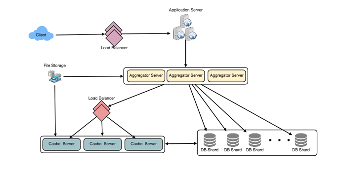


завантаження (16).png999×498 44.9 KB


](<https://coursehunters.online/uploads/default/original/1X/aa847acadcf93f04d939086c668aa819ed6cb376.png> "завантаження (16).png")


1. Timeline Generation


For a detailed discussion about timeline generation, take a look at [Designing Facebook's Newsfeed 44](https://www.educative.io/collection/page/5668639101419520/5649050225344512/5641332169113600).


1. Replication and Fault Tolerance


Since our system is read-heavy, we can have multiple secondary database servers for each DB partition. Secondary servers will be used for read traffic only. All writes will first go to the primary server and then will be replicated to secondary servers. This scheme will also give us fault tolerance, as whenever the primary server goes down, we can failover to a secondary server.


1. Load Balancing


We can add Load balancing layer at three places in our system 1) Between Clients and Application servers 2) Between Application servers and database replication servers and 3) Between Aggregation servers and Cache server. Initially, a simple Round Robin approach can be adopted; that distributes incoming requests equally among servers. This LB is simple to implement and does not introduce any overhead. Another benefit of this approach is if a server is dead, LB will take it out of the rotation and will stop sending any traffic to it. A problem with Round Robin LB is, it won't take server load into consideration. If a server is overloaded or slow, the LB will not stop sending new requests to that server. To handle this, a more intelligent LB solution can be placed that periodically queries backend server about their load and adjusts traffic based on that.


1. Monitoring


Having the ability to monitor our systems is crucial. We should constantly collect data to get an instant insight into how our system is doing. We can collect following metrics/counters to get an understanding of the performance of our service:


1. New tweets per day/second, what is the daily peak?
2. Timeline delivery stats, how many tweets per day/second our service is delivering.
3. Average latency that is seen by the user to refresh timeline.


By monitoring these counters, we will realize if we need more replication or load balancing or caching, etc.


1. Extended Requirements


How to serve feeds? Get all the latest tweets from the people someone follows and merge/sort them by time. Use pagination to fetch/show tweets. Only fetch top N tweets from all the people someone follows. This N will depend on the client's Viewport, as on mobile we show fewer tweets compared to a Web client. We can also cache next top tweets to speed things up.


Alternately, we can pre-generate the feed to improve efficiency, for details please see 'Ranking and timeline generation' under [Designing Instagram 135](https://www.educative.io/collection/page/5668639101419520/5649050225344512/5673385510043648).


Retweet: With each Tweet object in the database, we can store the ID of original Tweet and not store any contents on this retweet object.


Trending Topics: We can cache most frequently occurring hashtags or searched queries in the last N seconds and keep updating them after every M seconds. We can rank trending topics based on the frequency of tweets or search queries or retweets or likes. We can give more weight to topics which are shown to more people.


Who to follow? How to give suggestions? This feature will improve user engagement. We can suggest friends of people someone follows. We can go two or three level down to find famous people for the suggestions. We can give preference to people with more followers.


As only a few suggestions can be made at any time, use Machine Learning (ML) to shuffle and re-prioritize. ML signals could include people with recently increased follow-ship, common followers if the other person is following this user, common location or interests, etc.


Moments: Get top news for different websites for past 1 or 2 hours, figure out related tweets, prioritize them, categorize them (news, support, financials, entertainment, etc.) using ML -- supervised learning or Clustering. Then we can show these articles as trending topics in Moments.


Search: Search involves Indexing, Ranking, and Retrieval of tweets. A similar solution is discussed in our next problem [Design Twitter Search 88](https://www.educative.io/collection/page/5668639101419520/5649050225344512/5738600293466112).


