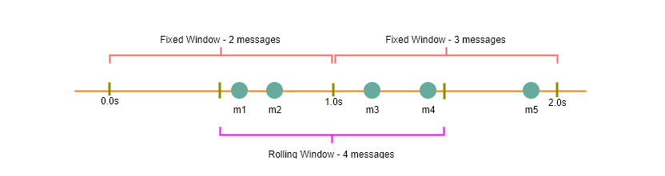

Designing Youtube or Netflix


Let's design a video sharing service like Youtube, where users will be able to upload/view/search videos. Similar Services: [netflix.com 16](http://netflix.com/), [vimeo.com 6](http://vimeo.com/), [dailymotion.com 8](http://dailymotion.com/), [veoh.com 6](http://veoh.com/) Difficulty Level: Medium


1. Why Youtube?


Youtube is one of the most popular video sharing websites in the world. Users of the service can upload, view, share, rate, and report videos as well as add comments on videos.


1. Requirements and Goals of the System


For the sake of this exercise, we plan to design a simpler version of Youtube with following requirements:


Functional Requirements:


1. Users should be able to upload videos.
2. Users should be able to share and view videos.
3. Users can perform searches based on video titles.
4. Our services should be able to record stats of videos, e.g., likes/dislikes, total number of views, etc.
5. Users should be able to add and view comments on videos.


Non-Functional Requirements:


1. The system should be highly reliable, any video uploaded should not be lost.
2. The system should be highly available. Consistency can take a hit (in the interest of availability), if a user doesn't see a video for a while, it should be fine.
3. Users should have real time experience while watching videos and should not feel any lag.


Not in scope: Video recommendation, most popular videos, channels, and subscriptions, watch later, favorites, etc.


1. Capacity Estimation and Constraints


Let's assume we have 1.5 billion total users, 800 million of whom are daily active users. If, on the average, a user views five videos per day, total video-views per second would be:


800M * 5 / 86400 sec => 46K videos/sec


Let's assume our upload:view ratio is 1:200 i.e., for every video upload we have 200 video viewed, giving us 230 videos uploaded per second.


46K / 200 => 230 videos/sec


Storage Estimates: Let's assume that every minute 500 hours worth of videos are uploaded to Youtube. If on average, one minute of video needs 50MB of storage (videos need to be stored in multiple formats), total storage needed for videos uploaded in a minute would be:


500 hours  *60 min*  50MB => 1500 GB/min (25 GB/sec)


These numbers are estimated, ignoring video compression and replication, which would change our estimates.


Bandwidth estimates: With 500 hours of video uploads per minute, assuming each video upload takes a bandwidth of 10MB/min, we would be getting 300GB of uploads every minute.


500 hours  *60 mins*  10MB => 300GB/min (5GB/sec)


Assuming an upload:view ratio of 1:200, we would need 1TB/s outgoing bandwidth.


1. System APIs


We can have SOAP or REST APIs to expose the functionality of our service. Following could be the definitions of the APIs for uploading and searching videos:


```
uploadVideo(api\_dev\_key, video\_title, vide\_description, tags[], category\_id, default\_language,
                        recording\_details, video\_contents)

```

Parameters:\
api\_dev\_key (string): The API developer key of a registered account. This will be used to, among other things, throttle users based on their allocated quota.\
video\_title (string): Title of the video.\
vide\_description (string): Optional description of the video.\
tags (string[]): Optional tags for the video.\
category\_id (string): Category of the video, e.g., Film, Song, People, etc.\
default\_language (string): For example English, Mandarin, Hindi, etc.\
recording\_details (string): Location where the video was recorded.\
video\_contents (stream): Video to be uploaded.


Returns: (string)\
A successful upload will return HTTP 202 (request accepted), and once the video encoding is completed, the user is notified through email with a link to access the video. We can also expose a queryable API to let users know the current status of their uploaded video.


```
searchVideo(api\_dev\_key, search\_query, user\_location, maximum\_videos\_to\_return, page\_token)

```

Parameters:\
api\_dev\_key (string): The API developer key of a registered account of our service.\
search\_query (string): A string containing the search terms.\
user\_location (string): Optional location of the user performing the search.\
maximum\_videos\_to\_return (number): Maximum number of results returned in one request.\
page\_token (string): This token will specify a page in the result set that should be returned.


Returns: (JSON)\
A JSON containing information about the list of video resources matching the search query. Each video resource will have a video title, a thumbnail, a video creation date and how many views it has.


```
streamVideo(api\_dev\_key, video\_id, offset, codec, resolution)

```

Parameters:\
api\_dev\_key (string): The API developer key of a registered account of our service.\
video\_id (string): A string to identify the video.\
offset (number): We should be able to stream video from any offset, this offset would be a time in seconds from the beginning of the video. If we support to play/pause a video from multiple devices, we will need to store the offset on the server. This will enable the users to start watching a video on any device from the same point where the left.\
codec (string) & resolution(string): We should send the codec and resolution info in the API from the client to support play/pause from multiple devices. Imagine if you are watching a video on your TV's Netflix app, paused it there and start watching it on your phone's Netflix app. In this case, you would need codec and resolution, as both these devices have a different resolution and using a different codec.


Returns: (STREAM)\
A media stream (a video chunk) from the given offset.


1. High Level Design


At a high-level we would need the following components:


1. Processing Queue: Each uploaded video will be pushed to a processing queue, to be de-queued later for encoding, thumbnail generation, and storage.
2. Encoder: To encode each uploaded video into multiple formats.
3. Thumbnails generator: We need to have a few thumbnails for each video.
4. Video and Thumbnail storage: We need to store video and thumbnail files in some distributed file storage.
5. User Database: We would need some database to store user's information, e.g., name, email, address, etc.
6. Video metadata storage: Metadata database will store all the information about videos like title, file path in the system, uploading user, total views, likes, dislikes, etc. Also, it will be used to store all the video comments.


[


завантаження (17).png999×348 37.4 KB


](<https://coursehunters.online/uploads/default/original/1X/3b5e0fd0f5c8168d425ae8c99d19f8b401226ca0.png> "завантаження (17).png")


1. Database Schema


Video metadata storage - MySql\
Videos metadata can be stored in a SQL database. Following information should be stored with each video:


* VideoID
* Title
* Description
* Size
* Thumbnail
* Uploader/User
* Total number of likes
* Total number of dislikes
* Total number of views


For each video comment, we need to store following information:


* CommentID
* VideoID
* UserID
* Comment
* TimeOfCreation


User data storage - MySql


* UserID, Name, email, address, age, registration details etc.


1. Detailed Component Design


The service would be read-heavy, so we will focus on building a system that can retrieve videos quickly. We can expect our read:write ratio as 200:1, which means for every video upload there are 200 video views.


Where would videos be stored? Videos can be stored in a distributed file storage system like [HDFS 54](https://en.wikipedia.org/wiki/Apache_Hadoop#HDFS) or [GlusterFS 23](https://en.wikipedia.org/wiki/GlusterFS).


How should we efficiently manage read traffic? We should segregate our read traffic from write. Since we will be having multiple copies of each video, we can distribute our read traffic on different servers. For metadata, we can have master-slave configurations, where writes will go to master first and then replayed at all the slaves. Such configurations can cause some staleness in data, e.g., when a new video is added, its metadata would be inserted in the master first, and before it gets replayed at the slave, our slaves would not be able to see it and therefore will be returning stale results to the user. This staleness might be acceptable in our system, as it would be very short-lived and the user will be able to see the new videos after a few milliseconds.


Where would thumbnails be stored? There will be a lot more thumbnails than videos. If we assume that every video will have five thumbnails, we need to have a very efficient storage system that can serve a huge read traffic. There will be two consideration before deciding which storage system will be used for thumbnails:


1. Thumbnails are small files, say maximum 5KB each.
2. Read traffic for thumbnails will be huge compared to videos. Users will be watching one video at a time, but they might be looking at a page that has 20 thumbnails of other videos.


Let's evaluate storing all the thumbnails on disk. Given that we have a huge number of files; to read these files we have to perform a lot of seeks to different locations on the disk. This is quite inefficient and will result in higher latencies.


[Bigtable 66](https://en.wikipedia.org/wiki/Bigtable) can be a reasonable choice here, as it combines multiple files into one block to store on the disk and is very efficient in reading a small amount of data. Both of these are the two most significant requirements of our service. Keeping hot thumbnails in the cache will also help in improving the latencies, and given that thumbnails files are small in size, we can easily cache a large number of such files in memory.


Video Uploads: Since videos could be huge, if while uploading, the connection drops, we should support resuming from the same point.


Video Encoding: Newly uploaded videos are stored on the server, and a new task is added to the processing queue to encode the video into multiple formats. Once all the encoding is completed; uploader is notified, and video is made available for view/sharing.


[


завантаження (18).png849×449 39.7 KB


](<https://coursehunters.online/uploads/default/original/1X/b35e8204b14a9cc2b9d3bbeda60cda1a9ba120fc.png> "завантаження (18).png")


1. Metadata Sharding


Since we have a huge number of new videos every day and our read load is extremely high too, we need to distribute our data onto multiple machines so that we can perform read/write operations efficiently. We have many options to shard our data. Let's go through different strategies of sharding this data one by one:


Sharding based on UserID: We can try storing all the data for a particular user on one server. While storing, we can pass the UserID to our hash function which will map the user to a database server where we will store all the metadata for that user's videos. While querying for videos of a user, we can ask our hash function to find the server holding user's data and then read it from there. To search videos by titles, we will have to query all servers, and each server will return a set of videos. A centralized server will then aggregate and rank these results before returning them to the user.


This approach has a couple of issues:


1. What if a user becomes popular? There could be a lot of queries on the server holding that user, creating a performance bottleneck. This will affect the overall performance of our service.
2. Over time, some users can end up storing a lot of videos compared to others. Maintaining a uniform distribution of growing user's data is quite tricky.


To recover from these situations either we have to repartition/redistribute our data or used consistent hashing to balance the load between servers.


Sharding based on VideoID: Our hash function will map each VideoID to a random server where we will store that Video's metadata. To find videos of a user we will query all servers, and each server will return a set of videos. A centralized server will aggregate and rank these results before returning them to the user. This approach solves our problem of popular users but shifts it to popular videos.


We can further improve our performance by introducing cache to store hot videos in front of the database servers.


1. Video Deduplication


With a huge number of users, uploading a massive amount of video data, our service will have to deal with widespread video duplication. Duplicate videos often differ in aspect ratios or encodings, can contain overlays or additional borders, or can be excerpts from a longer, original video. The proliferation of duplicate videos can have an impact on many levels:


1. Data Storage: We could be wasting storage space by keeping multiple copies of the same video.
2. Caching: Duplicate videos would result in degraded cache efficiency by taking up space that could be used for unique content.
3. Network usage: Increasing the amount of data that must be sent over the network to in-network caching systems.
4. Energy consumption: Higher storage, inefficient cache, and network usage will result in energy wastage.


For the end user, these inefficiencies will be realized in the form of duplicate search results, longer video startup times, and interrupted streaming.


For our service, deduplication makes most sense early, when a user is uploading a video; as compared to post-processing it to find duplicate videos later. Inline deduplication will save us a lot of resources that can be used to encode, transfer and store the duplicate copy of the video. As soon as any user starts uploading a video, our service can run video matching algorithms (e.g., [Block Matching 38](https://en.wikipedia.org/wiki/Block-matching_algorithm), [Phase Correlation 25](https://en.wikipedia.org/wiki/Phase_correlation), etc.) to find duplications. If we already have a copy of the video being uploaded, we can either stop the upload and use the existing copy or use the newly uploaded video if it is of higher quality. If the newly uploaded video is a subpart of an existing video or vice versa, we can intelligently divide the video into smaller chunks, so that we only upload those parts that are missing.


1. Load Balancing


We should use [Consistent Hashing 71](https://www.educative.io/collection/page/5668639101419520/5649050225344512/5709068098338816/) among our cache servers, which will also help in balancing the load between cache servers. Since we will be using a static hash-based scheme to map videos to hostnames, it can lead to an uneven load on the logical replicas due to the different popularity of each video. For instance, if a video becomes popular, the logical replica corresponding to that video will experience more traffic than other servers. These uneven loads for logical replicas can then translate into uneven load distribution on corresponding physical servers. To resolve this issue, any busy server in one location can redirect a client to a less busy server in the same cache location. We can use dynamic HTTP redirections for this scenario.


However, the use of redirections also has its drawbacks. First, since our service tries to load balance locally, it leads to multiple redirections if the host that receives the redirection can't serve the video. Also, each redirection requires a client to make an additional HTTP request; it also leads to higher delays before the video starts playing back. Moreover, inter-tier (or cross data-center) redirections lead a client to a distant cache location because the higher tier caches are only present at a small number of locations.


1. Cache


To serve globally distributed users, our service needs a massive-scale video delivery system. Our service should push its content closer to the user using a large number of geographically distributed video cache servers. We need to have a strategy that would maximize user performance and also evenly distributes the load on its cache servers.


We can introduce a cache for metadata servers to cache hot database rows. Using Memcache to cache the data and Application servers before hitting database can quickly check if the cache has the desired rows. Least Recently Used (LRU) can be a reasonable cache eviction policy for our system. Under this policy, we discard the least recently viewed row first.


How can we build more intelligent cache? If we go with 80-20 rule, i.e., 20% of daily read volume for videos is generating 80% of traffic, meaning that certain videos are so popular that the majority of people view them; It follows that we can try caching 20% of daily read volume of videos and metadata.


1. Content Delivery Network (CDN)


A CDN is a system of distributed servers that deliver web content to a user based on the geographic locations of the user, the origin of the web page and a content delivery server. Take a look at 'CDN' section in our [Caching 23](https://www.educative.io/collection/page/5668639101419520/5649050225344512/(https://www.educative.io/collection/page/5668639101419520/5649050225344512/5643440998055936)) chapter.


Our service can move most popular videos to CDNs:


* CDNs replicate content in multiple places. There's a better chance of videos being closer to the user, and with fewer hops, videos will stream from a friendlier network.
* CDN machines make heavy use of caching and can mostly serve videos out of memory.


Less popular videos (1-20 views per day) that are not cached by CDNs can be served by our servers in various data centers.


1. Fault Tolerance


We should use [Consistent Hashing 71](https://www.educative.io/collection/page/5668639101419520/5649050225344512/5709068098338816/) for distribution among database servers. Consistent hashing will not only help in replacing a dead server but also help in distributing load among servers.


Designing Typeahead Suggestion


Let's design a real-time suggestion service, which will recommend terms to users as they enter text for searching. Similar Services: Auto-suggestions, Typeahead search Difficulty: Medium


1. What is Typeahead Suggestion?


Typeahead suggestions enable users to search for known and frequently searched terms. As the user types into the search box, it tries to predict the query based on the characters the user has entered and gives a list of suggestions to complete the query. Typeahead suggestions help the user to articulate their search queries better. It's not about speeding up the search process but rather about guiding the users and lending them a helping hand in constructing their search query.


1. Requirements and Goals of the System


Functional Requirements: As the user types in their query, our service should suggest top 10 terms starting with whatever user has typed.


Non-function Requirements: The suggestions should appear in real-time. The user should be able to see the suggestions within 200ms.


1. Basic System Design and Algorithm


The problem we are solving is that we have a lot of 'strings' that we need to store in such a way that users can search on any prefix. Our service will suggest next terms that will match the given prefix. For example, if our database contains following terms: cap, cat, captain, capital; and the user has typed in 'cap', our system should suggest 'cap', 'captain' and 'capital'.


Since we've to serve a lot of queries with minimum latency, we need to come up with a scheme that can efficiently store our data such that it can be queried quickly. We can't depend upon some database for this; we need to store our index in memory in a highly efficient data structure.


One of the most appropriate data structure that can serve our purpose would be the Trie (pronounced "try"). A trie is a tree-like data structure used to store phrases where each node stores a character of the phrase in a sequential manner. For example, if we need to store 'cap, cat, caption, captain, capital' in the trie, it would look like:


[


завантаження (19).png599×650 31.4 KB


](<https://coursehunters.online/uploads/default/original/1X/53a14e0394416d743c3a334d4b089732fc5205c0.png> "завантаження (19).png")


Now if the user has typed 'cap', our service can traverse the trie to go to the node 'P' to find all the terms that start with this prefix (e.g., cap-tion, cap-ital etc).


We can merge nodes that have only one branch to save storage space. The above trie can be stored like this:


Should we have case insensitive trie? For simplicity and search use case let's assume our data is case insensitive.


How to find top suggestion? Now that we can find all the terms given a prefix, how can we know what're the top 10 terms that we should suggest? One simple solution could be to store the count of searches that terminated at each node, e.g., if users have searched about 'CAPTAIN' 100 times and 'CAPTION' 500 times, we can store this number with the last character of the phrase. So now if the user has typed 'CAP' we know the top most searched word under the prefix 'CAP' is 'CAPTION'. So given a prefix, we can traverse the sub-tree under it, to find the top suggestions.


Given a prefix, how much time will it take to traverse its sub-tree? Given the amount of data we need to index, we should expect a huge tree. Even, traversing a sub-tree would take really long, e.g., the phrase 'system design interview questions' is 30 levels deep. Since we have very strict latency requirements, we do need to improve the efficiency of our solution.


Can we store top suggestions with each node? This can surely speed up our searches but will require a lot of extra storage. We can store top 10 suggestions at each node that we can return to the user. We have to bear the big increase in our storage capacity to achieve the required efficiency.


We can optimize our storage by storing only references of the terminal nodes rather than storing the entire phrase. To find the suggested term we've to traverse back using the parent reference from the terminal node. We will also need to store the frequency with each reference to keep track of top suggestions.


How would we build this trie? We can efficiently build our trie bottom up. Each parent node will recursively call all the child nodes to calculate their top suggestions and their counts. Parent nodes will combine top suggestions from all of their children to determine their top suggestions.


How to update the trie? Assuming five billion searches every day, which would give us approximately 60K queries per second. If we try to update our trie for every query it'll be extremely resource intensive and this can hamper our read requests too. One solution to handle this could be to update our trie offline after a certain interval.


As the new queries come in, we can log them and also track their frequencies. Either we can log every query or do sampling and log every 1000th query. For example, if we don't want to show a term which is searched for less than 1000 times, it's safe to log every 1000th searched term.


We can have a [Map-Reduce (MR) 26](https://en.wikipedia.org/wiki/MapReduce) setup to process all the logging data periodically, say every hour. These MR jobs will calculate frequencies of all searched terms in the past hour. We can then update our trie with this new data. We can take the current snapshot of the trie and update it with all the new terms and their frequencies. We should do this offline, as we don't want our read queries to be blocked by update trie requests. We can have two options:


1. We can make a copy of the trie on each server to update it offline. Once done we can switch to start using it and discard the old one.
2. Another option is we can have a master-slave configuration for each trie server. We can update slave while the master is serving traffic. Once the update is complete, we can make the slave our new master. We can later update our old master, which can then start serving traffic too.


How can we update the frequencies of typeahead suggestions? Since we are storing frequencies of our typeahead suggestions with each node, we need to update them too. We can update only difference in frequencies rather than recounting all search terms from scratch. If we're keeping count of all the terms searched in last 10 days, we'll need to subtract the counts from the time period no longer included and add the counts for the new time period being included. We can add and subtract frequencies based on [Exponential Moving Average (EMA) 29](https://en.wikipedia.org/wiki/Moving_average#Exponential_moving_average) of each term. In EMA, we give more weight to the latest data. It's also known as the exponentially weighted moving average.


After inserting a new term in the trie, we'll go to the terminal node of the phrase and increase its frequency. Since we're storing the top 10 queries in each node, it is possible that this particular search term jumped into the top 10 queries of a few other nodes. So, we need to update the top 10 queries of those nodes then. We've to traverse back from the node to all the way up to the root. For every parent, we check if the current query is part of the top 10. If so, we update the corresponding frequency. If not, we check if the current query's frequency is high enough to be a part of the top 10. If so, we insert this new term and remove the term with the lowest frequency.


How can we remove a term from the trie? Let's say we've to remove a term from the trie, because of some legal issue or hate or piracy etc. We can completely remove such terms from the trie when the regular update happens, meanwhile, we can add a filtering layer on each server, which will remove any such term before sending them to users.


What could be different ranking criteria for suggestions? In addition to a simple count, for terms ranking, we have to consider other factors too, e.g., freshness, user location, language, demographics, personal history etc.


1. Permanent Storage of the Trie


How to store trie in a file so that we can rebuild our trie easily - this will be needed when a machine restarts? We can take snapshot of our trie periodically and store it in a file. This will enable us to rebuild a trie if the server goes down. To store, we can start with the root node and save the trie level-by-level. With each node we can store what character it contains and how many children it has. Right after each node we should put all of its children. Let's assume we have following trie:


If we store this trie in a file with the above-mentioned scheme, we will have: "C2,A2,R1,T,P,O1,D". From this, we can easily rebuild our trie.


If you've noticed we are not storing top suggestions and their counts with each node, it is hard to store this information, as our trie is being stored top down, we don't have child nodes created before the parent, so there is no easy way to store their references. For this, we have to recalculate all the top terms with counts. This can be done while we are building the trie. Each node will calculate its top suggestions and pass it to its parent. Each parent node will merge results from all of its children to figure out its top suggestions.


1. Scale Estimation


If we are building a service, which has the same scale as that of Google, we can expect 5 billion searches every day, which would give us approximately 60K queries per second.


Since there will be a lot of duplicates in 5 billion queries, we can assume that only 20% of these will be unique. If we only want to index top 50% of the search terms, we can get rid of a lot of less frequently searched queries. Let's assume we will have 100 million unique terms for which we want to build an index.


Storage Estimation: If on the average each query consists of 3 words, and if the average length of a word is 5 characters, this will give us 15 characters of average query size. Assuming we need 2 bytes to store a character, we will need 30 bytes to store an average query. So total storage we will need:


100 million * 30 bytes => 3 GB


We can expect some growth in this data every day, but we should also be removing some terms that are not searched anymore. If we assume we have 2% new queries every day and if we are maintaining our index for last one year, total storage we should expect:


3GB + (0.02  *3 GB*  365 days) => 25 GB


1. Data Partition


Although our index can easily fit on one server, we can still partition it in order to meet our requirements of higher efficiency and lower latencies. How can we efficiently partition our data to distribute it onto multiple servers?


a. Range Based Partitioning: What if we store our phrases in separate partitions based on their first letter. So we save all the terms starting with letter 'A' in one partition and those that start with letter 'B' into another partition and so on. We can even combine certain less frequently occurring letters into one database partition. We should come up with this partitioning scheme statically so that we can always store and search terms in a predictable manner.


The main problem with this approach is that it can lead to unbalanced servers, for instance; if we decide to put all terms starting with letter 'E' into a DB partition, but later we realize that we have too many terms that start with letter 'E', which we can't fit into one DB partition.


We can see that the above problem will happen with every statically defined scheme. It is not possible to calculate if each of our partitions will fit on one server statically.


b. Partition based on the maximum capacity of the server: Let's say we partition our trie based on the maximum memory capacity of the servers. We can keep storing data on a server as long as it has memory available. Whenever a sub-tree cannot fit into a server, we break our partition there to assign that range to this server and move on the next server to repeat this process. Let's say, if our first trie server can store all terms from 'A' to 'AABC', which mean our next server will store from 'AABD' onwards. If our second server could store up to 'BXA', next serve will start from 'BXB' and so on. We can keep a hash table to quickly access this partitioning scheme:


Server 1, A-AABC\
Server 2, AABD-BXA\
Server 3, BXB-CDA


For querying, if the user has typed 'A' we have to query both server 1 and 2 to find the top suggestions. When the user has typed 'AA', still we have to query server 1 and 2, but when the user has typed 'AAA' we only need to query server 1.


We can have a load balancer in front of our trie servers, which can store this mapping and redirect traffic. Also if we are querying from multiple servers, either we need to merge the results at the server side to calculate overall top results, or make our clients do that. If we prefer to do this on the server side, we need to introduce another layer of servers between load balancers and trie servers, let's call them aggregator. These servers will aggregate results from multiple trie servers and return the top results to the client.


Partitioning based on the maximum capacity can still lead us to hotspots e.g., if there are a lot of queries for terms starting with 'cap', the server holding it will have a high load compared to others.


c. Partition based on the hash of the term: Each term will be passed to a hash function, which will generate a server number and we will store the term on that server. This will make our term distribution random and hence minimizing hotspots. To find typeahead suggestions for a term, we have to ask all servers and then aggregate the results. We have to use consistent hashing for fault tolerance and load distribution.


1. Cache


We should realize that caching the top searched terms will be extremely helpful in our service. There will be a small percentage of queries that will be responsible for most of the traffic. We can have separate cache servers in front of the trie servers, holding most frequently searched terms and their typeahead suggestions. Application servers should check these cache servers before hitting the trie servers to see if they have the desired searched terms.


We can also build a simple Machine Learning (ML) model that can try to predict the engagement on each suggestion based on simple counting, personalization, or trending data etc., and cache these terms.


1. Replication and Load Balancer


We should have replicas for our trie servers both for load balancing and also for fault tolerance. We also need a load balancer that keeps track of our data partitioning scheme and redirects traffic based on the prefixes.


1. Fault Tolerance


What will happen when a trie server goes down? As discussed above we can have a master-slave configuration, if the master dies slave can take over after failover. Any server that comes back up, can rebuild the trie based on the last snapshot.


1. Typeahead Client


We can perform the following optimizations on the client to improve user's experience:


1. The client should only try hitting the server if the user has not pressed any key for 50ms.
2. If the user is constantly typing, the client can cancel the in-progress requests.
3. Initially, the client can wait until the user enters a couple of characters.
4. Clients can pre-fetch some data from the server to save future requests.
5. Clients can store the recent history of suggestions locally. Recent history has a very high rate of being reused.
6. Establishing an early connection with server turns out to be one of the most important factors. As soon as the user opens the search engine website, the client can open a connection with the server. So when user types in the first character, client doesn't waste time in establishing the connection.
7. The server can push some part of their cache to CDNs and Internet Service Providers (ISPs) for efficiency.


8. Personalization


Users will receive some typeahead suggestions based on their historical searches, location, language, etc. We can store the personal history of each user separately on the server and cache them on the client too. The server can add these personalized terms in the final set, before sending it to the user. Personalized searches should always come before others.


Designing an API Rate Limiter


Let's design an API Rate Limiter which will throttle users based upon the number of the requests they are sending. Difficulty Level: Medium


1. What is a Rate Limiter?


Imagine we've a service which is receiving a huge number of requests, but it can only serve a limited number of requests per second. To handle this problem, we would need some kind of throttling or rate limiting mechanism that will allow only a certain number of requests which our service can respond to. A rate limiter, at a high-level, limits the number of events an entity (user, device, IP, etc.) can perform in a particular time window. For example:


* A user can send only one message per second.
* A user is allowed only three failed credit card transactions per day.
* A single IP can only create twenty accounts per day.


In general, a rate limiter caps how many requests a sender can issue in a specific time window. It then blocks requests once the cap is reached.


1. Why do we need API rate limiting?


Rate Limiting helps to protect services against abusive behaviors targeting the application layer like [Denial-of-service (DOS) 3](https://en.wikipedia.org/wiki/Denial-of-service_attack)attacks, brute-force password attempts, brute-force credit card transactions, etc. These attacks are usually a barrage of HTTP/S requests which may look like they are coming from real users, but are typically generated by machines (or bots). As a result, these attacks are often harder to detect and can more easily bring down a service, application, or an API.


Rate limiting is also used to prevent revenue loss, to reduce infrastructure costs, to stop spam and online harassment. Following is a list of scenarios that can benefit from Rate limiting by making a service (or API) more reliable:


* Misbehaving clients/scripts: Either intentionally or unintentionally, some entities can overwhelm a service by sending a large number of requests. Another scenario could be when a user is sending a lot of lower-priority requests, and we want to make sure that it doesn't affect the high-priority traffic. For example, users sending a high volume of requests for analytics data should not be allowed to hamper critical transactions for other users.
* Security: By limiting the number of the second-factor attempts (in 2-factor auth) that the users are allowed to perform, for example, the number of times they're allowed to try with a wrong password.
* To prevent abusive behavior and bad design practices: Without API limits, developers of client applications would use sloppy development tactics, for example requesting the same information over and over again.
* To keep costs and resource usage under control: Services are generally designed for normal input behavior, for example, a user writing a single post in a minute. Computers could easily push thousands/second through an API. Rate limiter enables controls on service APIs.
* Revenue: Certain services might want to limit operations based on the tier of their customer's service, and thus create a revenue model based on rate limiting. There could be default limits for all the APIs a service offers. To go beyond that, the user has to buy higher limits
* To eliminate spikiness in traffic: So that a service stays up for everyone else.


1. Requirements and Goals of the System


Our Rate Limiter should meet the following requirements:


Functional Requirements:


1. Limit the number of requests an entity can send to an API within a time window, e.g., 15 requests per second.
2. The APIs are accessible through a cluster, so the rate limit should be considered across different servers. The user should get an error message whenever the defined threshold is crossed within a single server or across a combination of servers.


Non-Functional Requirements:


1. The system should be highly available. The rate limiter should always work since it protects our service from external attacks.
2. Our rate limiter should not introduce substantial latencies affecting the user experience.


3. How to do Rate Limiting?


Rate Limiting is a process that is used to define the rate and speed at which consumers can access APIs. Throttling is the process of controlling the usage of the APIs by customers during a given period. Throttling can be defined at the application level and/or API level. When a throttle limit is crossed, the server returns "429" as HTTP status to the user with message content as "Too many requests".


1. What are different types of throttling?


Here are the three famous throttling types that are used by different services:


Hard Throttling: The number of API requests cannot exceed the throttle limit.


Soft Throttling: In this type, we can set the API request limit to exceed a certain percentage. For example, if we have rate-limit of 100 messages a minute and 10% exceed limit. Our rate limiter will allow up to 110 messages per minute.


Elastic or Dynamic Throttling : Under Elastic throttling, the number of requests can go beyond the threshold if the system has some resources available. For example, if a user is allowed only 100 messages a minute, we can let the user send more than 100 messages a minute if there are free resources available in the system.


1. What are different types of algorithms used for Rate Limiting?


Following are the two types of algorithms used for Rate Limiting:


Fixed Window Algorithm: In this algorithm, the time window is considered from the start of the time-unit to the end of the time-unit. For example, a period would be considered as 0-60 seconds for a minute irrespective of the time frame at which the API request has been made. In the diagram below, there are two messages between 0-1 second and three messages between 1-2 second. If we've a rate limiting of two messages a second, this algorithm will throttle only 'm5'.


[


завантаження (22).png832×221 2.64 KB


](<https://coursehunters.online/uploads/default/original/1X/240e006d545a1d1fb5318cebd79b251dceeb1cf4.png> "завантаження (22).png")


Rolling Window Algorithm: In this algorithm, the time window is considered from the fraction of the time at which the request is made plus the time window length. For example, if there are two messages sent at 300th millisecond and 400th millisecond of a second, we'll count them as two messages from 300th millisecond of that second up to the 300th millisecond of next second. In the above diagram, keeping two messages a second, we'll throttle 'm3' and 'm4'.


1. High level design for Rate Limiter


Rate Limiter will be responsible for deciding which request will be served by the API servers and which request will be declined. Once a new request arrives, Web Server first asks the Rate Limiter to decide if it will be served or throttled. If the request is not throttled, then it'll be passed to the API servers.


[


завантаження (23).png800×479 19.2 KB


](<https://coursehunters.online/uploads/default/original/1X/1e4b4a16f29afbc19593ec75a568c35ce6bbef6f.png> "завантаження (23).png")


### 8. Basic System Design and Algorithm


Let's take the example where we want to limit the number of requests per user. Under this scenario, for each unique user, we would keep a count representing how many requests the user has made and a timestamp when we started counting the requests. We can keep it in a hashtable, where the 'key' would be the 'UserID' and 'value' would be a structure containing an integer for the 'Count' and an integer for the Epoch time:


Let's assume our rate limiter is allowing three requests per minute per user, so whenever a new request comes in, our rate limiter will perform following steps:


1. If the 'UserID' is not present in the hash-table, insert it and set the 'Count' to 1 and 'StartTime' to the current time (normalized to a minute) , and allow the request.
2. Otherwise, find the record of the 'UserID' and if 'CurrentTime -- StartTime >= 1 min', set the 'StartTime' to the current time and 'Count' to 1, and allow the request.
3. If 'CurrentTime - StartTime <= 1 min' and


* If 'Count < 3', increment the Count and allow the request.
* If 'Count >= 3', reject the request.


[


завантаження (25).png677×764 18.9 KB


](<https://coursehunters.online/uploads/default/original/1X/3fcf5d0891c1c744dac45380c1882c460a03963d.png> "завантаження (25).png")


What are the some problems with our algorithm?


1. This is a Fixed Window algorithm, as we're resetting the 'StartTime' at the end of every minute, which means it can potentially allow twice the number of requests per minute. Imagine if Kristie sends three requests at the last second of a minute, then she can immediately send three more requests at the very first second of the next minute, resulting in 6 requests in the span of two seconds. The solution to this problem would be a sliding window algorithm which we'll discuss later.


[


завантаження (26).png739×204 2.32 KB


](<https://coursehunters.online/uploads/default/original/1X/303104c1be3737832d096bb74f4ddaff89967238.png> "завантаження (26).png")


1. Atomicity: In a distributed environment, the "read-and-then-write" behavior can create a race condition. Imagine if Kristie's current 'Count' is "2" and that she issues two more requests. If two separate processes served each of these requests and concurrently read the Count before either of them updated it, each process would think the Kristie can have one more request and that she had not hit the rate limit.


If we are using [Redis 6](https://en.wikipedia.org/wiki/Redis) to store our key-value, one solution to resolve the atomicity problem is to use [Redis lock 13](https://redis.io/topics/distlock) for the duration of the read-update operation. This, however, would come at the expense of slowing down concurrent requests from the same user and introducing another layer of complexity. We can use [Memcached 8](https://en.wikipedia.org/wiki/Memcached), but it would have comparable complications.


If we are using a simple hash-table, we can have a custom implementation for 'locking' each record to solve our atomicity problems.


How much memory would we need to store all of the user data? Let's assume the simple solution where we are keeping all of the data in a hash-table.


Let's assume 'UserID' takes 8 bytes. Let's also assume a 2 byte 'Count', which can count up to 65k, is sufficient for our use case. Although epoch time will need 4 bytes, we can choose to store only the minute and second part, which can fit into 2 bytes. Hence, we need total 12 bytes to store a user's data:


8 + 2 + 2 = 12 bytes


Let's assume our hash-table has an overhead of 20 bytes for each record. If we need to track one million users at any time, the total memory we would need would be 32MB:


(12 + 20) bytes * 1 million => 32MB


If we assume that we would need a 4-byte number to lock each user's record to resolve our atomicity problems, we would require a total 36MB memory.


This can easily fit on a single server, however we would not like to route all of our traffic through a single machine. Also, if we assume a rate limit of 10 requests per second, this would translate into 10 million QPS for our rate limiter! This would be too much for a single server. Practically we can assume we would use Redis or Memcached kind of a solution in a distributed setup. We'll be storing all the data in the remote Redis servers, and all the Rate Limiter servers will read (and update) these servers before serving or throttling any request.


1. Sliding Window algorithm


We can maintain a sliding window if we can keep track of each request per user. We can store the timestamp of each request in a Redis [Sorted Set 19](https://redis.io/topics/data-types) in our 'value' field of hash-table.


Let's assume our rate limiter is allowing three requests per minute per user, so whenever a new request comes in the Rate Limiter will perform following steps:


1. Remove all the timestamps from the Sorted Set that are older than "CurrentTime - 1 minute".
2. Count the total number of elements in the sorted set. Reject the request if this count is greater than our throttling limit of "3".
3. Insert the current time in the sorted set, and accept the request.


[


завантаження (29).png712×769 19.7 KB


](<https://coursehunters.online/uploads/default/original/1X/c8bec92fc5cff2bc8edd08d4a0fe7df94098fe3e.png> "завантаження (29).png")


How much memory would we need to store all of the user data for sliding window? Let's assume 'UserID' takes 8 bytes. Each epoch time will require 4 bytes. Let's suppose we need a rate limiting of 500 requests per hour. Let's assume 20 bytes overhead for hash-table and 20 bytes overhead for the Sorted Set. At max, we would need a total of 12KB to store one user's data:


8 + (4 + 20 (sorted set overhead)) * 500 + 20 (hash-table overhead) = 12KB


Here are reserving 20 bytes overhead per element. In a sorted set, we can assume that we need at least two pointers to maintain order among elements. One pointer to the previous element and one to the next element. On a 64bit machine, each pointer will cost 8 bytes. So we will need 16 bytes for pointers. We added an extra word (4 bytes) for storing other overhead.


If we need to track one million users at any time, total memory we would need would be 12GB:


12KB * 1 million ~= 12GB


Sliding Window Algorithm is taking a lot of memory compared to the Fixed Window; this would be a scalability issue. What if we can combine the above two algorithms to optimize our memory usage?


1. Sliding Window with Counters


What if we keep track of request counts for each user using multiple fixed time windows, e.g., 1/60th the size of our rate limit's time window. For example, if we've an hourly rate limit, we can keep a count for each minute and calculate the sum of all counters in the past hour when we receive a new request to calculate the throttling limit. This would reduce our memory footprint. Let's take an example where we rate limit at 500 requests per hour with an additional limit of 10 requests per minute. This means that when the sum of the counters with timestamps in the past hour exceeds the request threshold (500), Kristie has exceeded the rate limit. In addition to that, she can't send more than ten requests per minute. This would be a reasonable and a practical consideration, as none of the real users would send frequent requests. Even if they do, they will see success with retries since their limits get reset every minute.


We can store our counters in a [Redis Hash 19](https://redis.io/topics/data-types) - as it offers extremely efficient storage for fewer than 100 keys. When each request increments a counter in the hash, it also sets the hash to [expire 7](https://redis.io/commands/ttl) an hour later. We'll normailze each 'time' to a minute.


[


завантаження (30).png679×773 19.5 KB


](<https://coursehunters.online/uploads/default/original/1X/6ce90efb2db91f882d8471d8f4d7f38ffe2700a0.png> "завантаження (30).png")


How much memory we would need to store all the user data for sliding window with counters? Let's assume 'UserID' takes 8 bytes. Each epoch time will need 4 bytes and the Counter would need 2 bytes. Let's suppose we need a rate limiting of 500 requests per hour. Assume 20 bytes overhead for hash-table and 20 bytes for Redis hash. Since we'll keep a count for each minute, at max, we would need 60 entries for each user. We would need a total of 1.6KB to store one user's data:


8 + (4 + 2 + 20 (Redis hash overhead)) * 60 + 20 (hash-table overhead) = 1.6KB


If we need to track one million users at any time, total memory we would need would be 1.6GB:


1.6KB * 1 million ~= 1.6GB


So, our 'Sliding Window with Counters' algorithm uses 86% less memory than simple sliding window algorithm


1. Data Sharding and Caching


We can shard based on the 'UserID' to distribute user's data. For fault tolerance and replication we should use [Consistent Hashing 71](https://www.educative.io/collection/page/5668639101419520/5649050225344512/5709068098338816/). If we want to have different throttling limits for different APIs, we can choose to shard per user per API. Take the example of [URL Shortner 5](https://www.educative.io/collection/page/5668639101419520/5649050225344512/5668600916475904), we can have different rate limiter for creatURL() and deleteUR() APIs for each user or IP.


If our APIs are partitioned, a practical consideration could be to have a separate (somewhat smaller) rate limiter for each API shard as well. Let's take the example of our URL Shortener, where we want to limit each user to not create more than 100 short URLs per hour. Assuming, we are using Hash-Based Partitioning for our creatURL() API, we can rate limit each partition to allow a user to create not more than three short URLs per minute, in addition to 100 short URLs per hour.


Our system can get huge benefits from caching recent active users. Application servers before hitting backend servers can quickly check if the cache has the desired record. Our rate limiter can greatly benefit from the Write-back cache , by updating all counters and timestamps in cache only. The write to the permanent storage can be done at fixed intervals. This way we can ensure minimum latency added to the user's requests by the rate limiter. The reads can always hit the cache first, this will be extremely useful once the user has hit their maximum limit and the rate limiter will only be reading data without any updates.


Least Recently Used (LRU) can be a reasonable cache eviction policy for our system.


1. Should we rate limit by IP or by user?


Let's discuss pros and cons of using each one of these schemes:


IP: In this scheme, we throttle request per-IP, although it's not really optimal in terms of differentiating between 'good' and 'bad' actors, it's still better than not have rate limiting at all. The biggest problem with IP based throttling is when multiple users share a single public IP like in an internet cafe or smartphone users that are using the same gateway. One bad user can cause throttling to other users. Another issue could arise while caching IP-based limits, as there are a huge number of IPv6 addresses available to a hacker from even one computer, it's trivial to make a server run out of memory tracking IPv6 addresses!


User: Rate limiting can be done on APIs after user authentication. Once authenticated, the user will be provided with a token which the user will pass with each request. This will ensure that we will rate limit against a particular API that has a valid authentication token. But what if we have to rate limit on the login API itself? The weakness of this rate-limiting would be that a hacker can perform a denial of service attack against a user by entering wrong credentials up to the limit, after that the actual user will not be able to login.


*How about if we combine the above two schemes?*


Hybrid: A right approach could be to do both per-IP and per-user rate limiting, as they both have weaknesses when implemented alone. Though, this will result in more cache entries with more details per entry hence requiring more memory and storage.


Designing Twitter Search


Twitter is one of the largest social networking service where users can share photos, news, and text-based messages. In this chapter, we will design a service that can store and search user tweets. Similar Problems: Tweet search. Difficulty Level: Medium


1. What is Twitter Search?


Twitter users can update their status whenever they like. Each status consists of plain text, and our goal is to design a system that allows searching over all the user statuses.


1. Requirements and Goals of the System


* Let's assume Twitter has 1.5 billion total users with 800 million daily active users.
* On the average Twitter gets 400 million status updates every day.
* Average size of a status is 300 bytes.
* Let's assume there will be 500M searches every day.
* The search query will consist of multiple words combined with AND/OR.


We need to design a system that can efficiently store and query user statuses.


1. Capacity Estimation and Constraints


Storage Capacity: Since we have 400 million new statuses every day and each status on average is 300 bytes, therefore total storage we need, will be:


400M * 300 => 120GB/day


Total storage per second:


120GB / 24hours / 3600sec ~= 1.38MB/second


1. System APIs


We can have SOAP or REST APIs to expose functionality of our service; following could be the definition of search API:


```
search(api\_dev\_key, search\_terms, maximum\_results\_to\_return, sort, page\_token)

```

Parameters:\
api\_dev\_key (string): The API developer key of a registered account. This will be used to, among other things, throttle users based on their allocated quota.\
search\_terms (string): A string containing the search terms.\
maximum\_results\_to\_return (number): Number of status messages to return.\
sort (number): Optional sort mode: Latest first (0 - default), Best matched (1), Most liked (2).\
page\_token (string): This token will specify a page in the result set that should be returned.


Returns: (JSON)\
A JSON containing information about a list of status messages matching the search query. Each result entry can have the user ID & name, status text, status ID, creation time, number of likes, etc.


1. High Level Design


At the high level, we need to store all the statues in a database, and also build an index that can keep track of which word appears in which status. This index will help us quickly find statuses that users are trying to search.


[


завантаження (31).png800×233 16.1 KB


](<https://coursehunters.online/uploads/default/original/1X/377138c1c1665c0ed933be92c48d9bcd03fad175.png> "завантаження (31).png")


1. Detailed Component Design


1. Storage: We need to store 120GB of new data every day. Given this huge amount of data, we need to come up with a data partitioning scheme that will be efficiently distributing it onto multiple servers. If we plan for next five years, we will need following storage:


120GB  *365days*  5years ~= 200TB


If we never want to be more than 80% full at any time, we will approximately need 250TB of total storage. Let's assume that we want to keep an extra copy of all the statuses for fault tolerance; then our total storage requirement will be 500TB. If we assume a modern server can store up to 4TB of data, then we would need 125 such servers to hold all of the required data for the next five years.


Let's start with a simplistic design where we store the statuses in a MySQL database. We can assume to store the statuses in a table having two columns, StatusID and StatusText. Let's assume we partition our data based on StatusID. If our StatusIDs are system-wide unique, we can define a hash function that can map a StatusID to a storage server, where we can store that status object.


How can we create system-wide unique StatusIDs? If we are getting 400M new statuses each day, then how many status objects we can expect in five years?


400M  *365 days*  5 years => 730 billion


This means we would need a five bytes number to identify StatusIDs uniquely. Let's assume we have a service that can generate a unique StatusID whenever we need to store an object (StatusID could be similar to TweetID discussed in [Designing Twitter 15](https://www.educative.io/collection/page/5668639101419520/5649050225344512/5741031244955648)). We can feed the StatusID to our hash function to find the storage server and store our status object there.


2. Index: What should our index look like? Since our status queries will consist of words, therefore, let's build the index that can tell us which word comes in which status object. Let's first estimate how big our index will be. If we want to build an index for all the English words and some famous nouns like people names, city names, etc., and if we assume that we have around 300K English words and 200K nouns, then we will have 500k total words in our index. Let's assume that the average length of a word is five characters. If we are keeping our index in memory, we would need 2.5MB of memory to store all the words:


500K * 5 => 2.5 MB


Let's assume that we want to keep the index in memory for all the status objects for only past two years. Since we will be getting 730B status objects in 5 years, this will give us 292B status messages in two years. Given that, each StatusID will be 5 bytes, how much memory will we need to store all the StatusIDs?


292B * 5 => 1460 GB


So our index would be like a big distributed hash table, where 'key' would be the word, and 'value' will be a list of StatusIDs of all those status objects which contain that word. Assuming on the average we have 40 words in each status and since we will not be indexing prepositions and other small words like 'the', 'an', 'and' etc., let's assume we will have around 15 words in each status that need to be indexed. This means each StatusID will be stored 15 times in our index. So total memory will need to store our index:


(1460 * 15) + 2.5MB ~= 21 TB


Assuming a high-end server has 144GB of memory, we would need 152 such servers to hold our index.


We can shard our data based on two criteria:


Sharding based on Words: While building our index, we will iterate through all the words of a status and calculate the hash of each word to find the server where it would be indexed. To find all statuses containing a specific word we have to query only that server which contains this word.


We have a couple of issues with this approach:


1. What if a word becomes hot? There would be a lot of queries on the server holding that word. This high load will affect the performance of our service.
2. Over time some words can end up storing a lot of StatusIDs compared to others, therefore, maintaining a uniform distribution of words while statuses are growing is quite tricky.


To recover from these situations either we have to repartition our data or use [Consistent Hashing 71](https://www.educative.io/collection/page/5668639101419520/5649050225344512/5709068098338816/).


Sharding based on the status object: While storing, we will pass the StatusID to our hash function to find the server and index all the words of the status on that server. While querying for a particular word, we have to query all the servers, and each server will return a set of StatusIDs. A centralized server will aggregate these results to return them to the user.


[


завантаження (32).png999×408 32.9 KB


](<https://coursehunters.online/uploads/default/original/1X/e50becc8e0ae08ed68f93c6a186bb59081b40732.png> "завантаження (32).png")


1. Fault Tolerance


What will happen when an index server dies? We can have a secondary replica of each server, and if the primary server dies it can take control after the failover. Both primary and secondary servers will have the same copy of the index.


What if both primary and secondary servers die at the same time? We have to allocate a new server and rebuild the same index on it. How can we do that? We don't know what words/statuses were kept on this server. If we were using 'Sharding based on the status object', the brute-force solution would be to iterate through the whole database and filter StatusIDs using our hash function to figure out all the required Statuses that will be stored on this server. This would be inefficient and also during the time when the server is being rebuilt we will not be able to serve any query from it, thus missing some Statuses that should have been seen by the user.


How can we efficiently retrieve a mapping between Statuses and index server? We have to build a reverse index that will map all the StatusID to their index server. Our Index-Builder server can hold this information. We will need to build a Hashtable, where the 'key' would be the index server number and the 'value' would be a HashSet containing all the StatusIDs being kept at that index server. Notice that we are keeping all the StatusIDs in a HashSet, this will enable us to add/remove Statuses from our index quickly. So now whenever an index server has to rebuild itself, it can simply ask the Index-Builder server for all the Statuses it needs to store, and then fetch those statuses to build the index. This approach will surely be quite fast. We should also have a replica of Index-Builder server for fault tolerance.


1. Cache


To deal with hot status objects, we can introduce a cache in front of our database. We can use Memcache , which can store all such hot status objects in memory. Application servers before hitting backend database can quickly check if the cache has that status object. Based on clients' usage pattern we can adjust how many cache servers we need. For cache eviction policy, Least Recently Used (LRU) seems suitable for our system.


1. Load Balancing


We can add Load balancing layer at two places in our system 1) Between Clients and Application servers and 2) Between Application servers and Backend server. Initially, a simple Round Robin approach can be adopted; that distributes incoming requests equally among backend servers. This LB is simple to implement and does not introduce any overhead. Another benefit of this approach is if a server is dead, LB will take it out of the rotation and will stop sending any traffic to it. A problem with Round Robin LB is, it won't take server load into consideration. If a server is overloaded or slow, the LB will not stop sending new requests to that server. To handle this, a more intelligent LB solution can be placed that periodically queries backend server about their load and adjusts traffic based on that.


1. Ranking


How about if we want to rank the search results by social graph distance, popularity, relevance, etc?


Let's assume we want to rank statuses on popularity, like, how many likes or comments a status is getting, etc. In such a case our ranking algorithm can calculate a 'popularity number' (based on the number of likes etc.), and store it with the index. Each partition can sort the results based on this popularity number before returning results to the aggregator server. The aggregator server combines all these results, sort them based on the popularity number and sends the top results to the user.


Designing a Web Crawler


Let's design a Web Crawler that will systematically browse and download the World Wide Web. Web crawlers are also known as web spiders, robots, worms, walkers, and bots. Difficulty Level: Hard


1. What is a Web Crawler?


A web crawler is a software program which browses the World Wide Web in a methodical and automated manner. It collects documents by recursively fetching links from a set of starting pages. Many sites, particularly search engines, use web crawling as a means of providing up-to-date data. Search engines download all the pages to create an index on them to perform faster searches.


Some other uses of web crawlers are:


* To test web pages and links for valid syntax and structure.
* To monitor sites to see when their structure or contents change.
* To maintain mirror sites for popular Web sites.
* To search for copyright infringements.
* To build a special-purpose index, e.g., one that has some understanding of the content stored in multimedia files on the Web.


1. Requirements and Goals of the System


Let's assume we need to crawl all the web.


Scalability: Our service needs to be scalable such that it can crawl the entire Web, and can be used to fetch hundreds of millions of Web documents.


Extensibility: Our service should be designed in a modular way, with the expectation that new functionality will be added to it. There could be newer document types that needs to be downloaded and processed in the future.


1. Some Design Considerations


Crawling the web is a complex task, and there are many ways to go about it. We should be asking a few questions before going any further:


Is it a crawler for HTML pages only? Or should we fetch and store other types of media, such as sound files, images, videos, etc.? This is important because the answer can change the design. If we are writing a general-purpose crawler to download different media types, we might want to break down the parsing module into different sets of modules: one for HTML, another for images, another for videos, where each module extracts what is considered interesting for that media type.


Let's assume for now that our crawler is going to deal with HTML only, but it should be extensible and make it easy to add support for new media types.


What protocols are we looking at? HTTP? What about FTP links? What different protocols should our crawler handle? For the sake of the exercise, we will assume HTTP. Again, it shouldn't be hard to extend the design to use FTP and other protocols later.


What is the expected number of pages we will crawl? How big will the URL database become? Assuming we need to crawl one billion websites. Since a website can contain many, many URLs, let's assume an upper bound of 15 billion different web pages that will be reached by our crawler.


What is 'RobotsExclusion' and how should we deal with it? Courteous Web crawlers implement the Robots Exclusion Protocol, which allows Webmasters to declare parts of their sites off limits to crawlers. The Robots Exclusion Protocol requires a Web crawler to fetch a special document called robot.txt, containing these declarations from a Web site before downloading any real content from it.


1. Capacity Estimation and Constraints


If we want to crawl 15 billion pages within four weeks, how many pages do we need to fetch per second?


15B / (4 weeks  *7 days*  86400 sec) ~= 6200 pages/sec


What about storage? Page sizes vary a lot, but as mentioned above since we will be dealing with HTML text only, let's assume an average page size be 100KB. With each page if we are storing 500 bytes of metadata, total storage we would need:


15B * (100KB + 500) ~= 1.5 petabytes


Assuming a 70% capacity model (we don't want to go above 70% of the total capacity of our storage system), total storage we will need:


1.5 petabytes / 0.7 ~= 2.14 petabytes


1. High Level design


The basic algorithm executed by any Web crawler is to take a list of seed URLs as its input and repeatedly execute the following steps.


1. Pick a URL from the unvisited URL list.
2. Determine the IP Address of its host-name.
3. Establishing a connection to the host to download the corresponding document.
4. Parse the document contents to look for new URLs.
5. Add the new URLs to the list of unvisited URLs.
6. Process the downloaded document, e.g., store it or index its contents, etc.
7. Go back to step 1


### How to crawl?


Breadth first or depth first? Breadth-first search (BFS) is usually used. However, Depth First Search (DFS) is also utilized in some situations, such as if your crawler has already established a connection with the website, it might just DFS all the URLs within this website to save some handshaking overhead.


Path-ascending crawling: Path-ascending crawling can help discover a lot of isolated resources or resources for which no inbound link would have been found in regular crawling of a particular Web site. In this scheme, a crawler would ascend to every path in each URL that it intends to crawl. For example, when given a seed URL of [http://foo.com/a/b/page.html 4](http://foo.com/a/b/page.html), it will attempt to crawl /a/b/, /a/, and /.


### Difficulties in implementing efficient web crawler


There are two important characteristics of the Web that makes Web crawling a very difficult task:


1. Large volume of Web pages: A large volume of web page implies that web crawler can only download a fraction of the web pages at any time and hence it is critical that web crawler should be intelligent enough to prioritize download.


2. Rate of change on web pages. Another problem with today's dynamic world is that web pages on the internet change very frequently, as a result, by the time the crawler is downloading the last page from a site, the page may change, or a new page has been added to the site.


A bare minimum crawler needs at least these components:


1. URL frontier: To store the list of URLs to download and also prioritize which URLs should be crawled first.\
2. HTTP Fetcher: To retrieve a web page from the server.\
3. Extractor: To extract links from HTML documents.\
4. Duplicate Eliminator: To make sure same content is not extracted twice unintentionally.\
5. Datastore: To store retrieve pages and URL and other metadata.


[


завантаження (33).png800×298 16.1 KB


](<https://coursehunters.online/uploads/default/original/1X/6a3b146f555437a5ab29e93136db4b6278b7d9dd.png> "завантаження (33).png")


1. Detailed Component Design


Let's assume our crawler is running on one server, and all the crawling is done by multiple working threads, where each working thread performs all the steps needed to download and process a document in a loop.


The first step of this loop is to remove an absolute URL from the shared URL frontier for downloading. An absolute URL begins with a scheme (e.g., "HTTP"), which identifies the network protocol that should be used to download it. We can implement these protocols in a modular way for extensibility, so that later if our crawler needs to support more protocols, it can be easily done. Based on the URL's scheme, the worker calls the appropriate protocol module to download the document. After downloading, the document is placed into a Document Input Stream (DIS). Putting documents into DIS will enable other modules to re-read the document multiple times.


Once the document has been written to the DIS, the worker thread invokes the dedupe test to determine whether this document (associated with a different URL) has been seen before. If so, the document is not processed any further, and the worker thread removes the next URL from the frontier.


Next, our crawler needs to process the downloaded document. Each document can have a different MIME type like HTML page, Image, Video, etc. We can implement these MIME schemes in a modular way so that later if our crawler needs to support more types, we can easily implement them. Based on the downloaded document's MIME type, the worker invokes the process method of each processing module associated with that MIME type.


Furthermore, our HTML processing module will extract all links from the page. Each link is converted into an absolute URL and tested against a user-supplied URL filter to determine if it should be downloaded. If the URL passes the filter, the worker performs the URL-seen test, which checks if the URL has been seen before, namely, if it is in the URL frontier or has already been downloaded. If the URL is new, it is added to the frontier.


[


завантаження (34).png900×549 36.4 KB


](<https://coursehunters.online/uploads/default/original/1X/a21bb79b3902e087b1184d8d6fff4606ec5a1abc.png> "завантаження (34).png")


Let's discuss these components one by one, and see how they can be distributed onto multiple machines:


1. The URL frontier: The URL frontier is the data structure that contains all the URLs that remain to be downloaded. We can crawl by performing a breadth-first traversal of the Web, starting from the pages in the seed set. Such traversals are easily implemented by using a FIFO queue.


Since we'll be having a huge list of URLs to crawl, we can distribute our URL frontier into multiple servers. Let's assume on each server we have multiple worker threads performing the crawling tasks. Let's also assume that our hash function maps each URL to a server which will be responsible for crawling it.


Following politeness requirements must be kept in mind while designing a distributed URL frontier:


1. Our crawler should not overload a server by downloading a lot of pages from it.
2. We should not have multiple machines connecting a web server.


To implement this politeness constraint, our crawler can have a collection of distinct FIFO sub-queues on each server. Each worker thread will have its separate sub-queue, from which it removes URLs for crawling. When a new URL needs to be added, the FIFO sub-queue in which it is placed will be determined by the URL's canonical hostname. Our hash function can map each hostname to a thread number. Together, these two points imply that at most one worker thread will download documents from a given Web server and also by using FIFO queue it'll not overload a Web server.


How big will our URL frontier be? The size would be in the hundreds of millions of URLs. Hence, we need to store our URLs on disk. We can implement our queues in such a way that they have separate buffers for enqueuing and dequeuing. Enqueue buffer, once filled will be dumped to the disk, whereas dequeue buffer will keep a cache of URLs that need to be visited, it can periodically read from disk to fill the buffer.


2. The fetcher module: The purpose of a fetcher module is to download the document corresponding to a given URL using the appropriate network protocol like HTTP. As discussed above webmasters create robot.txt to make certain parts of their websites off limits for the crawler. To avoid downloading this file on every request, our crawler's HTTP protocol module can maintain a fixed-sized cache mapping host-names to their robot's exclusion rules.


3. Document input stream: Our crawler's design enables the same document to be processed by multiple processing modules. To avoid downloading a document multiple times, we cache the document locally using an abstraction called a Document Input Stream (DIS).


A DIS is an input stream that caches the entire contents of the document read from the internet. It also provides methods to re-read the document. The DIS can cache small documents (64 KB or less) entirely in memory, while larger documents can be temporarily written to a backing file.


Each worker thread has an associated DIS, which it reuses from document to document. After extracting a URL from the frontier, the worker passes that URL to the relevant protocol module, which initializes the DIS from a network connection to contain the document's contents. The worker then passes the DIS to all relevant processing modules.


4. Document Dedupe test: Many documents on the Web are available under multiple, different URLs. There are also many cases in which documents are mirrored on various servers. Both of these effects will cause any Web crawler to download the same document contents multiple times. To prevent processing a document more than once, we perform a dedupe test on each document to remove duplication.


To perform this test, we can calculate a 64-bit checksum of every processed document and store it in a database. For every new document, we can compare its checksum to all the previously calculated checksums to see the document has been seen before. We can use MD5 or SHA to calculate these checksums.


How big would be the checksum store? If the whole purpose of our checksum store is to do dedupe, then we just need to keep a unique set containing checksums of all previously processed document. Considering 15 billion distinct web pages, we would need:


15B * 8 bytes => 120 GB


Although this can fit into a modern-day server's memory, if we don't have enough memory available, we can keep smaller LRU based cache on each server with everything in a persistent storage. The dedupe test first checks if the checksum is present in the cache. If not, it has to check if the checksum resides in the back storage. If the checksum is found, we will ignore the document. Otherwise, it will be added to the cache and back storage.


5. URL filters: The URL filtering mechanism provides a customizable way to control the set of URLs that are downloaded. This is used to blacklist websites so that our crawler can ignore them. Before adding each URL to the frontier, the worker thread consults the user-supplied URL filter. We can define filters to restrict URLs by domain, prefix, or protocol type.


6. Domain name resolution: Before contacting a Web server, a Web crawler must use the Domain Name Service (DNS) to map the Web server's hostname into an IP address. DNS name resolution will be a big bottleneck of our crawlers given the amount of URLs we will be working with. To avoid repeated requests, we can start caching DNS results by building our local DNS server.


7. URL dedupe test: While extracting links, any Web crawler will encounter multiple links to the same document. To avoid downloading and processing a document multiple times, a URL dedupe test must be performed on each extracted link before adding it to the URL frontier.


To perform the URL dedupe test, we can store all the URLs seen by our crawler in canonical form in a database. To save space, we do not store the textual representation of each URL in the URL set, but rather a fixed-sized checksum.


To reduce the number of operations on the database store, we can keep an in-memory cache of popular URLs on each host shared by all threads. The reason to have this cache is that links to some URLs are quite common, so caching the popular ones in memory will lead to a high in-memory hit rate.


How much storage we would need for URL's store? If the whole purpose of our checksum is to do URL dedupe, then we just need to keep a unique set containing checksums of all previously seen URLs. Considering 15 billion distinct URLs and 4 bytes for checksum, we would need:


15B * 4 bytes => 60 GB


Can we use bloom filters for deduping? Bloom filters are a probabilistic data structure for set membership testing that may yield false positives. A large bit vector represents the set. An element is added to the set by computing 'n' hash functions of the element and setting the corresponding bits. An element is deemed to be in the set if the bits at all 'n' of the element's hash locations are set. Hence, a document may incorrectly be deemed to be in the set, but false negatives are not possible.


The disadvantage of using a bloom filter for the URL seen test is that each false positive will cause the URL not to be added to the frontier, and therefore the document will never be downloaded. The chance of a false positive can be reduced by making the bit vector larger.


8. Checkpointing: A crawl of the entire Web takes weeks to complete. To guard against failures, our crawler can write regular snapshots of its state to disk. An interrupted or aborted crawl can easily be restarted from the latest checkpoint.


1. Fault tolerance


We should use consistent hashing for distribution among crawling servers. Extended hashing will not only help in replacing a dead host but also help in distributing load among crawling servers.


All our crawling servers will be performing regular checkpointing and storing their FIFO queues to disks. If a server goes down, we can replace it. Meanwhile, extended hashing should shift the load to other servers.


1. Data Partitioning


Our crawler will be dealing with three kinds of data: 1) URLs to visit 2) URL checksums for dedupe 3) Document checksums for dedupe.


Since we are distributing URLs based on the hostnames, we can store these data on the same host. So, each host will store its set of URLs that need to be visited, checksums of all the previously visited URLs and checksums of all the downloaded documents. Since we will be using extended hashing, we can assume that URLs will be redistributed from overloaded hosts.


Each host will perform checkpointing periodically and dump a snapshot of all the data it is holding into a remote server. This will ensure that if a server dies down, another server can replace it by taking its data from the last snapshot.


1. Crawler Traps


There are many crawler traps, spam sites, and cloaked content. A crawler trap is a URL or set of URLs that cause a crawler to crawl indefinitely. Some crawler traps are unintentional. For example, a symbolic link within a file system can create a cycle. Other crawler traps are introduced intentionally. For example, people have written traps that dynamically generate an infinite Web of documents. The motivations behind such traps vary. Anti-spam traps are designed to catch crawlers used by spammers looking for email addresses, while other sites use traps to catch search engine crawlers to boost their search ratings.


AOPIC algorithm (Adaptive Online Page Importance Computation), can help mitigate common types of bot-traps. AOPIC solves this problem by using a credit system.


1. Start with a set of N seed pages.
2. Before crawling starts, allocate a fixed X amount of credit to each page.
3. Select a page P with the highest amount of credit (or select a random page if all pages have the same amount of credit).
4. Crawl page P (let's say that P had 100 credits when it was crawled).
5. Extract all the links from page P (let's say there are 10 of them).
6. Set the credits of P to 0.
7. Take a 10% "tax" and allocate it to a Lambda page.
8. Allocate an equal amount of credits to each link found on page P from P's original credit after subtracting the tax, so: (100 (P credits) - 10 (10% tax))/10 (links) = 9 credits per each link.
9. Repeat from step 3.


Since the Lambda page continuously collects the tax, eventually it will be the page with the largest amount of credit, and we'll have to "crawl" it. By crawling the Lambda page, we just take its credits and distribute them equally to all the pages in our database.


Since bot traps only give internal links credits and they rarely get credit from the outside, they will continually leak credits (from taxation) to the Lambda page. The Lambda page will distribute that credits out to all the pages in the database evenly, and upon each cycle, the bot trap page will lose more and more credits until it has so little credits that it almost never gets crawled again. This will not happen with good pages because they often get credits from backlinks found on other pages.


