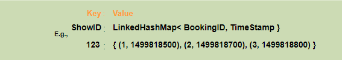

Designing Facebook's Newsfeed


Let's design Facebook's Newsfeed, which would contain posts, photos, videos and status updates from all the people and pages a user follows. Similar Services: Twitter Newsfeed, Instagram Newsfeed, Quora Newsfeed Difficulty Level: Hard


1. What is Facebook's newsfeed?


Newsfeed is the constantly updating list of stories in the middle of Facebook's homepage. It includes status updates, photos, videos, links, app activity and 'likes' from people, pages, and groups that a user follows on Facebook. In other words, it is a compilation of a complete scrollable version of your and your friends' life story from photos, videos, locations, status updates and other activities.


Any social media site you design - Twitter, Instagram or Facebook, you will need some newsfeed system to display updates from friends and followers.


1. Requirements and Goals of the System


Let's design a newsfeed for Facebook with the following requirements:


Functional requirements:


1. Newsfeed will be generated based on the posts from the people, pages, and groups that a user follows.
2. A user may have many friends and follow a large number of pages/groups.
3. Feeds may contain images, videos or just text.
4. Our service should support appending new posts, as they arrive, to the newsfeed for all active users.


Non-functional requirements:


1. Our system should be able to generate any user's newsfeed in real-time - maximum latency seen by the end user could be 2s.
2. A post shouldn't take more than 5s to make it to a user's feed assuming a new newsfeed request comes in.


3. Capacity Estimation and Constraints


Let's assume on average a user has 300 friends and follows 200 pages.


Traffic estimates: Let's assume 300M daily active users, with each user fetching their timeline an average of five times a day. This will result in 1.5B newsfeed requests per day or approximately 17,500 requests per second.


Storage estimates: On average, let's assume, we would need to have around 500 posts in every user's feed that we want to keep in memory for a quick fetch. Let's also assume that on average each post would be 1KB in size. This would mean that we need to store roughly 500KB of data per user. To store all this data for all the active users, we would need 150TB of memory. If a server can hold 100GB, we would need around 1500 machines to keep the top 500 posts in memory for all active users.


1. System APIs


 Once we have finalized the requirements, it's always a good idea to define the system APIs. This should explicitly state what is expected from the system.


We can have SOAP or REST APIs to expose the functionality of our service. Following could be the definition of the API for getting the newsfeed:


```
getUserFeed(api\_dev\_key, user\_id, since\_id, count, max\_id, exclude\_replies)

```

Parameters:\
api\_dev\_key (string): The API developer key of a registered account. This can be used to, among other things, throttle users based on their allocated quota.\
user\_id (number): The ID of the user for whom the system will generate the newsfeed.\
since\_id (number): Optional; returns results with an ID higher than (that is, more recent than) the specified ID.\
count (number): Optional; specifies the number of feed items to try and retrieve, up to a maximum of 200 per distinct request.\
max\_id (number): Optional; returns results with an ID less than (that is, older than) or equal to the specified ID.\
exclude\_replies(boolean): Optional; this parameter will prevent replies from appearing in the returned timeline.


Returns: (JSON) Returns a JSON object containing a list of feed items.


1. Database Design


There are three primary objects: User, Entity (e.g., page, group, etc.) and FeedItem (or Post). Here are some observations about the relationships between these entities:


* A User can follow other entities and can become friends with other users.
* Both users and entities can post FeedItems which can contain text, images or videos.
* Each FeedItem will have a UserID which would point to the User who created it. For simplicity, let's assume that only users can create feed items, although, on Facebook, Pages can post feed item too.
* Each FeedItem can optionally have an EntityID pointing to the page or the group where that post was created.


If we are using a relational database, we would need to model two relations: User-Entity relation and FeedItem-Media relation. Since each user can be friends with many people and follow a lot of entities, we can store this relation in a separate table. The "Type" column in "UserFollow" identifies if the entity being followed is a User or Entity. Similarly, we can have a table for FeedMedia relation.


[


5713144022302720.png693×506 67.6 KB


](<https://coursehunters.online/uploads/default/original/1X/85a327c4a95b565bd00274e11d38a3973aee069e.png> "5713144022302720.png")


1. High Level System Design


At a high level this problem can be divided into two parts:


Feed generation: Newsfeed is generated from the posts (or feed items) of users and entities (pages and groups) that a user follows. So, whenever our system receives a request to generate the feed for a user (say Jane), we will perform the following steps:


1. Retrieve IDs of all users and entities that Jane follows.
2. Retrieve latest, most popular and relevant posts for those IDs. These are the potential posts that we can show in Jane's newsfeed.
3. Rank these posts, based on the relevance to Jane. This represents Jane's current feed.
4. Store this feed in the cache and return top posts (say 20) to be rendered on Jane's feed.
5. On the front-end when Jane reaches the end of her current feed, she can fetch the next 20 posts from the server and so on.


One thing to notice here is that we generated the feed once and stored it in the cache. What about new incoming posts from people that Jane follows? If Jane is online, we should have a mechanism to rank and add those new posts to her feed. We can periodically (say every five minutes) perform the above steps to rank and add the newer posts to her feed. Jane can then be notified that there are newer items in her feed that she can fetch.


Feed publishing: Whenever Jane loads her newsfeed page, she has to request and pull feed items from the server. When she reaches the end of her current feed, she can pull more data from the server. For newer items either the server can notify Jane and then she can pull, or the server can push these new posts. We will discuss these options in detail later.


At a high level, we will need following components in our Newsfeed service:


1. Web servers: To maintain a connection with the user. This connection will be used to transfer data between the user and the server.
2. Application server: To execute the workflows of storing new posts in the database servers. We will also need some application servers to retrieve and push the newsfeed to the end user.
3. Metadata database and cache: To store the metadata about Users, Pages and Groups.
4. Posts database and cache: To store metadata about posts and their contents.
5. Video and photo storage, and cache: Blob storage, to store all the media included in the posts.
6. Newsfeed generation service: To gather and rank all the relevant posts for a user to generate newsfeed and store in the cache. This service will also receive live updates and will add these newer feed items to any user's timeline.
7. Feed notification service: To notify the user that there are newer items available for their newsfeed.


Following is the high-level architecture diagram of our system. User B and C are following User A.


[


5674248798470144.png999×599 55.4 KB


](<https://coursehunters.online/uploads/default/original/1X/1128844282b54fc103016fef4a0642bf41546fc7.png> "5674248798470144.png")


1. Detailed Component Design


Let's discuss different components of our system in detail.


a. Feed generation\
Let's take the simple case of the newsfeed generation service fetching most recent posts from all the users and entities that Jane follows; the query would look like this:


```
SELECT FeedItemID FROM FeedItem WHERE SourceID in (
    SELECT EntityOrFriendID FROM UserFollow WHERE UserID = <current\_user\_id>
)
ORDER BY CreationDate DESC
LIMIT 100

```

Here are issues with this design for the feed generation service:


1. Crazy slow for users with a lot of friends/follows as we have to perform sorting/merging/ranking of a huge number of posts.
2. We generate the timeline when a user loads their page. This would be quite slow and have a high latency.
3. For live updates, each status update will result in feed updates for all followers. This could result in high backlogs in our Newsfeed Generation Service.
4. For live updates, the server pushing (or notifying about) newer posts to users could lead to very heavy loads, especially for people or pages that have a lot of followers. To improve the efficiency, we can pre-generate the timeline and store it in a memory.


Offline generation for newsfeed: We can have dedicated servers that are continuously generating users' newsfeed and storing them in memory. So, whenever a user requests for the new posts for their feed, we can simply serve it from the pre-generated, stored location. Using this scheme user's newsfeed is not compiled on load, but rather on a regular basis and returned to users whenever they request for it.


Whenever these servers need to generate the feed for a user, they will first query to see what was the last time the feed was generated for that user. Then, new feed data would be generated from that time onwards. We can store this data in a hash table, where the "key" would be UserID and "value" would be a STRUCT like this:


```
Struct {
    LinkedHashMap<FeedItemID> feedItems;
    DateTime lastGenerated;
}

```

We can store FeedItemIDs in a [Linked HashMap 34](https://docs.oracle.com/javase/7/docs/api/java/util/LinkedHashMap.html) kind of data structure, which will allow us to not only jump to any feed item but also iterate through the map easily. Whenever users want to fetch more feed items, they can send the last FeedItemID they currently see in their newsfeed, we can then jump to that FeedItemID in our linked hash map and return next batch/page of feed items from there.


How many feed items should we store in memory for a user's feed? Initially, we can decide to store 500 feed items per user, but this number can be adjusted later based on the usage pattern. For example, if we assume that one page of user's feed has 20 posts and most of the users never browse more than ten pages of their feed, we can decide to store only 200 posts per user. For any user, who wants to see more posts (more than what is stored in memory) we can always query backend servers.


Should we generate (and keep in memory) newsfeed for all users? There will be a lot of users that don't login frequently. Here are a few things we can do to handle this. A more straightforward approach could be to use an LRU based cache that can remove users from memory that haven't accessed their newsfeed for a long time. A smarter solution can figure out the login pattern of users to pre-generate their newsfeed, e.g., At what time of the day a user is active? Which days of the week a user accesses their newsfeed? etc.


Let's now discuss some solutions to our "live updates" problems in the following section.


b. Feed publishing\
The process of pushing a post to all the followers is called a fanout. By analogy, the push approach is called fanout-on-write, while the pull approach is called fanout-on-load. Let's discuss different options for publishing feed data to users.


1. "Pull" model or Fan-out-on-load: This method involves keeping all the recent feed data in memory so that users can pull it from the server whenever they need it. Clients can pull the feed data on a regular basis or manually whenever they need it. Possible problems with this approach are a) New data might not be shown to the users until they issue a pull request, b) It's hard to find the right pull cadence, as most of the time pull requests will result in an empty response if there is no new data, causing waste of resources.
2. "Push" model or Fan-out-on-write: For a push system, once a user has published a post, we can immediately push this post to all the followers. The advantage is that when fetching feed, you don't need to go through your friend's list and get feeds for each of them. It significantly reduces read operations. To efficiently handle this, users have to maintain a [Long Poll 14](https://en.wikipedia.org/wiki/Push_technology#Long_polling) request with the server for receiving the updates. A possible problem with this approach is that when a user has millions of followers (a celebrity-user), the server has to push updates to a lot of people.
3. Hybrid: An alternate method to handle feed data could be to use a hybrid approach, i.e., to do a combination of fan-out-on-write and fan-out-on-load. Specifically, we can stop pushing posts from users with a high number of followers (a celebrity user) and only push data for those users who have a few hundred (or thousand) followers. For celebrity users, we can let the followers pull the updates. Since the push operation can be extremely costly for users who have a lot of friends or followers, therefore, by disabling fanout for them, we can save a huge number of resources. Another alternate approach could be that once a user publishes a post; we can limit the fanout to only her online friends. Also, to get benefits from both the approaches, a combination of push to notify and pull for serving end users is a great way to go. Purely push or pull model is less versatile.


How many feed items can we return to the client in each request? We should have a maximum limit for the number of items a user can fetch in one request (say 20). But we should let clients choose to specify how many feed items they want with each request, as the user may like to fetch a different number of posts depending on the device (mobile vs. desktop).


Should we always notify users if there are new posts available for their newsfeed? It could be useful for users to get notified whenever new data is available. However, on mobile devices, where data usage is relatively expensive, it can consume unnecessary bandwidth. Hence, at least for mobile devices, we can choose not to push data, instead, let users "Pull to Refresh" to get new posts.


1. Feed Ranking


The most straightforward way to rank posts in a newsfeed is by the creation time of the posts. But today's ranking algorithms are doing a lot more than that to ensure "important" posts are ranked higher. The high-level idea of ranking is first to select key "signals" that make a post important and then find out how to combine them to calculate a final ranking score.


More specifically, we can select features that are relevant to the importance of any feed item, e.g., number of likes, comments, shares, time of the update, whether the post has images/videos, etc., and then, a score can be calculated using these features. This is generally enough for a simple ranking system. A better ranking system can significantly improve itself by constantly evaluating if we are making progress in user stickiness, retention, ads revenue, etc.


1. Data Partitioning


a. Sharding posts and metadata\
Since we have a huge number of new posts every day and our read load is extremely high too, we need to distribute our data onto multiple machines such that we can read/write it efficiently. For sharding our databases that are storing posts and their metadata, we can have a similar design as discussed under [Designing Twitter 31](https://www.educative.io/collection/page/5668639101419520/5649050225344512/5741031244955648/).


b. Sharding feed data\
For feed data, which is being stored in memory, we can partition it based on UserID. We can try storing all the data of a user on one server. When storing, we can pass the UserID to our hash function that will map the user to a cache server where we will store the user's feed objects. Also, for any given user, since we don't expect to store more than 500 FeedItmeIDs, we will not run into a scenario where feed data for a user doesn't fit on a single server. To get the feed of a user, we would always have to query only one server. For future growth and replication, we must use [Consistent Hashing 11](https://www.educative.io/collection/page/5668639101419520/5649050225344512/5709068098338816).


Designing Yelp or Nearby Friends


Let's design a Yelp like service, where users can search for nearby places like restaurants, theaters or shopping malls, etc., and can also add/view reviews of places. Similar Services: Proximity server. Difficulty Level: Hard


1. Why Yelp or Proximity Server?


Proximity servers are used to discover nearby attractions like places, events, etc. If you haven't used [yelp.com 20](http://yelp.com/) before, please try it before proceeding. You can search for nearby restaurants, theaters, etc., and spend some time understanding different options the website offers. This will help you a lot in understanding this chapter better.


1. Requirements and Goals of the System


What do we wish to achieve from a Yelp like service? Our service will be storing information about different places so that users can perform a search on them. Upon querying, our service will return a list of places around the user.


Our Yelp-like service should meet the following requirements:


Functional Requirements:


1. Users should be able to add/delete/update Places.
2. Given their location (longitude/latitude), users should be able to find all nearby places within a given radius.
3. Users should be able to add feedback/review about a place. The feedback can have pictures, text, and a rating.


Non-functional Requirements:


1. Users should have real-time search experience with minimum latency.
2. Our service should support a heavy search load. There will be a lot of search requests compared to adding a new place.


3. Scale Estimation


Let's build our system assuming that we have 500M places and 100K queries per second (QPS). Let's also assume a 20% growth in the number of places and QPS each year.


1. Database Schema


Each location can have the following fields:


1. LocationID (8 bytes): Uniquely identifies a location.
2. Name (256 bytes)
3. Latitude (8 bytes)
4. Longitude (8 bytes)
5. Description (512 bytes)
6. Category (1 byte): E.g., coffee shop, restaurant, theater, etc.


Although a four bytes number can uniquely identify 500M locations, with future growth in mind, we will go with 8 bytes for LocationID.


Total size: 8 + 256 + 8 + 8 + 512 + 1 => 793 bytes


We also need to store reviews, photos, and ratings of a Place. We can have a separate table to store reviews for Places:


1. LocationID (8 bytes)
2. ReviewID (4 bytes): Uniquely identifies a review, assuming any location will not have more than 2^32 reviews.
3. ReviewText (512 bytes)
4. Rating (1 byte): how many stars a place gets out of ten.


Similarly, we can have a separate table to store photos for Places and Reviews.


1. System APIs


We can have SOAP or REST APIs to expose the functionality of our service. Following could be the definition of the API for searching:


```
search(api\_dev\_key, search\_terms, user\_location, radius\_filter, maximum\_results\_to\_return,
    category\_filter, sort, page\_token)

```

Parameters:\
api\_dev\_key (string): The API developer key of a registered account. This will be used to, among other things, throttle users based on their allocated quota.\
search\_terms (string): A string containing the search terms.\
user\_location (string): Location of the user performing the search.\
radius\_filter (number): Optional search radius in meters.\
maximum\_results\_to\_return (number): Number of business results to return.\
category\_filter (string): Optional category to filter search results, e.g., Restaurants, Shopping Centers, etc.\
sort (number): Optional sort mode: Best matched (0 - default), Minimum distance (1), Highest rated (2).\
page\_token (string): This token will specify a page in the result set that should be returned.


Returns: (JSON)\
A JSON containing information about a list of businesses matching the search query. Each result entry will have the business name, address, category, rating, and thumbnail.


1. Basic System Design and Algorithm


At a high level, we need to store and index each dataset described above (places, reviews, etc.). For users to query this massive database, the indexing should be read efficient, since while searching for nearby places users expect to see the results in real-time.


Given that the location of a place doesn't change that often, we don't need to worry about frequent updates of the data. As a contrast, if we intend to build a service where objects do change their location frequently, e.g., people or taxis, then we might come up with a very different design.


Let's see what are different ways to store this data and also find out which method will suit best for our use cases:


### a. SQL solution


One simple solution could be to store all the data in a database like MySQL. Each place will be stored in a separate row, uniquely identified by LocationID. Each place will have its longitude and latitude stored separately in two different columns, and to perform a fast search; we should have indexes on both these fields.


To find all the nearby places of a given location (X, Y) within a radius 'D', we can query like this:


Select * from Places where Latitude between X-D and X+D and Longitude between Y-D and Y+D


How efficient this query would be? We have estimated 500M places to be stored in our service. Since we have two separate indexes, each index can return a huge list of places, and performing an intersection on those two lists won't be efficient. Another way to look at this problem is that there could be too many locations between 'X-D' and 'X+D', and similarly between 'Y-D' and 'Y+D'. If we can somehow shorten these lists, it can improve the performance of our query.


### b. Grids


We can divide the whole map into smaller grids to group locations into smaller sets. Each grid will store all the Places residing within a specific range of longitude and latitude. This scheme would enable us to query only a few grids to find nearby places. Based on a given location and radius, we can find all the neighboring grids and then query these grids to find nearby places.


[


завантаження (35).jpg999×498 97.5 KB


](<https://coursehunters.online/uploads/default/original/1X/cec7c39470b448cc38e02710156e40a16c6b18ef.jpeg> "завантаження (35).jpg")


Let's assume that GridID (a four bytes number) would uniquely identify grids in our system.


What could be a reasonable grid size? Grid size could be equal to the distance we would like to query since we also want to reduce the number of grids. If the grid size is equal to the distance we want to query, then we only need to search within the grid which contains the given location and neighboring eight grids. Since our grids would be statically defined (from the fixed grid size), we can easily find the grid number of any location (lat, long) and its neighboring grids.


In the database, we can store the GridID with each location and have an index on it too for faster searching. Now, our query will look like:


Select * from Places where Latitude between X-D and X+D and Longitude between Y-D and Y+D and GridID in (GridID, GridID1, GridID2, ..., GridID8)


This will undoubtedly improve the runtime of our query.


Should we keep our index in memory? Maintaining the index in memory will improve the performance of our service. We can keep our index in a hash table, where 'key' would be the grid number and 'value' would be the list of places contained in that grid.


How much memory will we need to store the index? Let's assume our search radius is 10 miles, given that total area of the earth is around 200 million square miles; we will have 20 million grids. We would need a four bytes number to uniquely identify each grid, and since LocationID is 8 bytes, therefore we would need 4GB of memory (ignoring hash table overhead) to store the index.


(4  *20M) + (8*  500M) ~= 4 GB


This solution can still run slow for those grids that have a lot of places since our places are not uniformly distributed among grids. We can have a thickly dense area with a lot of places, and on the other hand, we can have areas which are sparsely populated.


This problem can be solved if we can dynamically adjust our grid size, such that whenever we have a grid with a lot of places we break it down to create smaller grids. One challenge with this approach could be, how would we map these grids to locations? Also, how can we find all the neighboring grids of a grid?


### c. Dynamic size grids


Let's assume we don't want to have more than 500 places in a grid so that we can have a faster searching. So, whenever a grid reaches this limit, we break it down into four grids of equal size and distribute places among them. This means thickly populated areas like downtown San Francisco will have a lot of grids, and sparsely populated area like the Pacific Ocean will have large grids with places only around the coastal lines.


What data-structure can hold this information? A tree in which each node has four children can serve our purpose. Each node will represent a grid and will contain information about all the places in that grid. If a node reaches our limit of 500 places, we will break it down to create four child nodes under it and distribute places among them. In this way, all the leaf nodes will represent the grids that cannot be further broken down. So leaf nodes will keep a list of places with them. This tree structure in which each node can have four children is called a [QuadTree 16](https://en.wikipedia.org/wiki/Quadtree)


[


завантаження (36).png800×378 67.9 KB


](<https://coursehunters.online/uploads/default/original/1X/8d6d780b725455aa15aaff81152dade41426ca2e.png> "завантаження (36).png")


How will we build QuadTree? We will start with one node that would represent the whole world in one grid. Since it will have more than 500 locations, we will break it down into four nodes and distribute locations among them. We will keep repeating this process with each child node until there are no nodes left with more than 500 locations.


How will we find the grid for a given location? We will start with the root node and search downward to find our required node/grid. At each step, we will see if the current node we are visiting has children. If it has, we will move to the child node that contains our desired location and repeat this process. If the node does not have any children, then that is our desired node.


How will we find neighboring grids of a given grid? Since only leaf nodes contain a list of locations, we can connect all leaf nodes with a doubly linked list. This way we can iterate forward or backward among the neighboring leaf nodes to find out our desired locations. Another approach for finding adjacent grids would be through parent nodes. We can keep a pointer in each node to access its parent, and since each parent node has pointers to all of its children, we can easily find siblings of a node. We can keep expanding our search for neighboring grids by going up through the parent pointers.


Once we have nearby LocationIDs, we can query the backend database to find details about those places.


What will be the search workflow? We will first find the node that contains the user's location. If that node has enough desired places, we can return them to the user. If not, we will keep expanding to the neighboring nodes (either through the parent pointers or doubly linked list), until either we find the required number of places or exhaust our search based on the maximum radius.


How much memory will be needed to store the QuadTree? For each Place, if we cache only LocationID and Lat/Long, we would need 12GB to store all places.


24 * 500M => 12 GB


Since each grid can have maximum 500 places and we have 500M locations, how many total grids we will have?


500M / 500 => 1M grids


Which means we will have 1M leaf nodes and they will be holding 12GB of location data. A QuadTree with 1M leaf nodes will have approximately 1/3rd internal nodes, and each internal node will have 4 pointers (for its children). If each pointer is 8 bytes, then the memory we need to store all internal nodes would be:


1M  *1/3*  4 * 8 = 10 MB


So, total memory required to hold the whole QuadTree would be 12.01GB. This can easily fit into a modern-day server.


How would we insert a new Place into our system? Whenever a new Place is added by a user, we need to insert it into the databases, as well as, in the QuadTree. If our tree resides on one server, it is easy to add a new Place, but if the QuadTree is distributed among different servers, first we need to find the grid/server of the new Place and then add it there (discussed in the next section).


1. Data Partitioning


What if we have a huge number of places such that, our index does not fit into a single machine's memory? With 20% growth, each year, we will reach the memory limit of the server in the future. Also, what if one server cannot serve the desired read traffic? To resolve these issues, we must partition our QuadTree!


We will explore two solutions here (both of these partitioning schemes can be applied to databases too):


a. Sharding based on regions: We can divide our places into regions (like zip codes), such that all places belonging to a region will be stored on a fixed node. While storing, we will find the region of each place to find the server and store the place there. Similarly, while querying for nearby places, we can ask the region server that contains user's location. This approach has a couple of issues:


1. What if a region becomes hot? There would be a lot of queries on the server holding that region, making it perform slow. This will affect the performance of our service.
2. Over time some regions can end up storing a lot of places compared to others. Hence maintaining a uniform distribution of places, while regions are growing, is quite difficult.


To recover from these situations either we have to repartition our data or use consistent hashing.


b. Sharding based on LocationID: Our hash function will map each LocationID to a server where we will store that place. While building our QuadTree, we will iterate through all the places and calculate the hash of each LocationID to find a server where it would be stored. To find nearby places of a location we have to query all servers, and each server will return a set of nearby places. A centralized server will aggregate these results to return them to the user.


Will we have different QuadTree structure on different partitions? Yes, this can happen, since it is not guaranteed that we will have an equal number of places in any given grid on all partitions. Though, we do make sure that all servers have approximately equal number of Places. This different tree structure on different servers will not cause any issue though, as we will be searching all the neighboring grids within the given radius on all partitions.


Remaining part of this chapter assumes that we have partitioned our data based on LocationID.


[


завантаження (37).png999×398 30.3 KB


](<https://coursehunters.online/uploads/default/original/1X/9db872c92436ad524ae9074a34e8a83d0dba38cf.png> "завантаження (37).png")


1. Replication and Fault Tolerance


Having replicas of QuadTree servers can provide an alternate to data partitioning. To distribute read traffic, we can have replicas of each QuadTree server. We can have a master-slave configuration, where replicas (slaves) will only serve read traffic and all write traffic will first go the master and then applied to slaves. Slaves might not have some recently inserted places (a few milliseconds delay will be there), but this could be acceptable.


What will happen when a QuadTree server dies? We can have a secondary replica of each server, and if primary dies, it can take control after the failover. Both primary and secondary servers will have the same QuadTree structure.


What if both primary and secondary servers die at the same time? We have to allocate a new server and rebuild the same QuadTree on it. How can we do that, since we don't know what places were kept on this server? The brute-force solution would be to iterate through the whole database and filter LocationIDs using our hash function to figure out all the required places that will be stored on this server. This would be inefficient and slow, also during the time when the server is being rebuilt; we will not be able to serve any query from it, thus missing some places that should have been seen by users.


How can we efficiently retrieve a mapping between Places and QuadTree server? We have to build a reverse index that will map all the Places to their QuadTree server. We can have a separate QuadTree Index server that will hold this information. We will need to build a HashMap, where the 'key' would be the QuadTree server number and the 'value' would be a HashSet containing all the Places being kept on that QuadTree server. We need to store LocationID and Lat/Long with each place because through this information servers can build their QuadTrees. Notice that we are keeping Places' data in a HashSet, this will enable us to add/remove Places from our index quickly. So now whenever a QuadTree server needs to rebuild itself, it can simply ask the QuadTree Index server for all the Places it needs to store. This approach will surely be quite fast. We should also have a replica of QuadTree Index server for fault tolerance. If a QuadTree Index server dies, it can always rebuild its index from iterating through the database.


1. Cache


To deal with hot Places, we can introduce a cache in front of our database. We can use an off-the-shelf solution like Memcache, which can store all data about hot places. Application servers before hitting backend database can quickly check if the cache has that Place. Based on clients' usage pattern, we can adjust how many cache servers we need. For cache eviction policy, Least Recently Used (LRU) seems suitable for our system.


1. Load Balancing (LB)


We can add LB layer at two places in our system 1) Between Clients and Application servers and 2) Between Application servers and Backend server. Initially, a simple Round Robin approach can be adopted; that will distribute all incoming requests equally among backend servers. This LB is simple to implement and does not introduce any overhead. Another benefit of this approach is if a server is dead, the load balancer will take it out of the rotation and will stop sending any traffic to it.


A problem with Round Robin LB is, it won't take server load into consideration. If a server is overloaded or slow, the load balancer will not stop sending new requests to that server. To handle this, a more intelligent LB solution would be needed that periodically queries backend server about their load and adjusts traffic based on that.


1. Ranking


How about if we want to rank the search results not just by proximity but also by popularity or relevance?


How can we return most popular places within a given radius? Let's assume we keep track of the overall popularity of each place. An aggregated number can represent this popularity in our system, e.g., how many stars a place gets out of ten (this would be an average of different rankings given by users)? We will store this number in the database, as well as, in the QuadTree. While searching for top 100 places within a given radius, we can ask each partition of the QuadTree to return top 100 places having maximum popularity. Then the aggregator server can determine top 100 places among all the places returned by different partitions.


Remember that we didn't build our system to update place's data frequently. With this design, how can we modify popularity of a place in our QuadTree? Although we can search a place and update its popularity in the QuadTree, it would take a lot of resources and can affect search requests and system throughput. Assuming popularity of a place is not expected to reflect in the system within a few hours, we can decide to update it once or twice a day, especially when the load on the system is minimum.


Our next problem [Designing Uber backend 25](https://www.educative.io/collection/page/5668639101419520/5649050225344512/5717271485874176) discusses dynamic updates of the QuadTree in detail.


Designing Uber backend


Let's design a ride-sharing service like Uber, which connects passengers who need a ride with drivers who have a car. Similar Services: Lyft, Didi, Via, Sidecar etc. Difficulty level: Hard Prerequisite: Designing Yelp


1. What is Uber?


Uber enables its customers to book drivers for taxi rides. Uber drivers use their personal cars to drive customers around. Both customers and drivers communicate with each other through their smartphones using Uber app.


1. Requirements and Goals of the System


Let's start with building a simpler version of Uber.


There are two kinds of users in our system 1) Drivers 2) Customers.


* Drivers need to regularly notify the service about their current location and their availability to pick passengers.
* Passengers get to see all the nearby available drivers.
* Customer can request a ride; nearby drivers are notified that a customer is ready to be picked up.
* Once a driver and customer accept a ride, they can constantly see each other's current location, until the trip finishes.
* Upon reaching the destination, the driver marks the journey complete to become available for the next ride.


1. Capacity Estimation and Constraints


* Let's assume we have 300M customers and 1M drivers, with 1M daily active customers and 500K daily active drivers.
* Let's assume 1M daily rides.
* Let's assume that all active drivers notify their current location every three seconds.
* Once a customer puts a request for a ride, the system should be able to contact drivers in real-time.


1. Basic System Design and Algorithm


We will take the solution discussed in [Designing Yelp 21](https://www.educative.io/collection/page/5668639101419520/5649050225344512/5639274879778816) and modify it to make it work for the above-mentioned "Uber" use cases. The biggest difference we have is that our QuadTree was not built keeping in mind that there will be frequent updates to it. So, we have two issues with our Dynamic Grid solution:


* Since all active drivers are reporting their locations every three seconds, we need to update our data structures to reflect that. If we have to update the QuadTree for every change in the driver's position, it will take a lot of time and resources. To update a driver to its new location, we must find the right grid based on the driver's previous location. If the new position does not belong to the current grid, we have to remove the driver from the current grid and move/reinsert the user to the correct grid. After this move, if the new grid reaches the maximum limit of drivers, we have to repartition it.
* We need to have a quick mechanism to propagate the current location of all the nearby drivers to any active customer in that area. Also, when a ride is in progress, our system needs to notify both the driver and passenger about the current location of the car.


Although our QuadTree helps us find nearby drivers quickly, a fast update in the tree is not guaranteed.


Do we need to modify our QuadTree every time a driver reports their location? If we don't update our QuadTree with every update from the driver, it will have some old data and will not reflect the current location of drivers correctly. If you recall, our purpose of building the QuadTree was to find nearby drivers (or places) efficiently. Since all active drivers report their location every three seconds, therefore there will be a lot more updates happening to our tree than querying for nearby drivers. So, what if we keep the latest position reported by all drivers in a hash table and update our QuadTree a little less frequent? Let's assume we guarantee that a driver's current location will be reflected in the QuadTree within 15 seconds. Meanwhile, we will maintain a hash table that will store the current location reported by drivers; let's call this DriverLocationHT.


How much memory we need for DriverLocationHT? We need to store DriveID, their present and old location in the hash table. So we need total 35 bytes to store one record:


1. DriverID (3 bytes - 1 million drivers)
2. Old latitude (8 bytes)
3. Old longitude (8 bytes)
4. New latitude (8 bytes)
5. New longitude (8 bytes) Total = 35 bytes


If we have 1 million total drivers, we need the following memory (ignoring hash table overhead):


1 million * 35 bytes => 35 MB


How much bandwidth will our service consume to receive location updates from all drivers? If we get DriverID and their location, it will be (3+16 => 19 bytes). If we receive this information every three seconds from one million drivers, we will be getting 19MB per three seconds.


Do we need to distribute DriverLocationHT onto multiple servers? Although our memory and bandwidth requirements do not dictate that, since all this information can easily fit on one server, but for scalability, performance, and fault tolerance we should distribute the hash table onto multiple servers. We can distribute based on the DriverID to make the distribution completely random. Let's call the machines holding DriverLocationHT, Driver Location server. Other than storing driver's location, each of these servers will do two things:


1. As soon as the server receives an update for a driver's location, they will broadcast that information to all the interested customers.
2. The server needs to notify respective QuadTree server to refresh the driver's location. As discussed above, this can happen every 10 seconds.


How can we efficiently broadcast driver's location to customers? We can have a Push Model , where the server will push the positions to all the relevant users. We can have a dedicated Notification Service that can broadcast the current location of drivers to all the interested customers. We can build our Notification service on publisher/subscriber model. When a customer opens the Uber app on their cell phone, they query the server to find nearby drivers. On the server side, before returning the list of drivers to the customer, we will subscribe the customer for all the updates from those drivers. We can maintain a list of customers (subscribers) interested in knowing the location of a driver and whenever we have an update in DriverLocationHT for that driver, we can broadcast the current location of the driver to all subscribed customers. This way our system makes sure that we always show the driver's current position to the customer.


How much memory will we need to store all these subscriptions? As we have estimated above we will have 1M daily active customers and 500K daily active drivers. On the average let's assume that five customers subscribe to one driver. Let's assume we store all this information in a hash table so that we can update it efficiently. We need to store driver and customer IDs to maintain the subscriptions. Assuming we will need 3 bytes for DriverID and 8 bytes for CustomerID, we will need 21MB of memory.


(500K  *3) + (500K*  5 * 8 ) ~= 21 MB


How much bandwidth will we need to broadcast the driver's location to customers? For every active driver we have five subscribers, so total subscribers we have:


5 * 500K => 2.5M


To all these customers we need to send DriverID (3 bytes) and their location (16 bytes) every second, so we need the following bandwidth:


2.5M * 19 bytes => 47.5 MB/s


How can we efficiently implement Notification service? We can either use HTTP long polling or push notifications.


How will the new publishers/drivers get added for a current customer? As we have proposed above that customers will be subscribed to nearby drivers when they open the Uber app for the first time, what will happen when a new driver enters the area the customer is looking at? To add a new customer/driver subscription dynamically, we need to keep track of the area the customer is watching. This will make our solution complicated, what if instead of pushing this information, clients pull it from the server?


How about if clients pull information about nearby drivers from the server? Clients can send their current location, and the server will find all the nearby drivers from the QuadTree to return them to the client. Upon receiving this information, the client can update their screen to reflect current positions of the drivers. Clients can query every five seconds to limit the number of round trips to the server. This solution looks quite simpler compared to the push model described above.


Do we need to repartition a grid as soon as it reaches the maximum limit? We can have a cushion to let each grid grow a little bigger beyond the limit before we decide to partition it. Let's say our grids can grow/shrink extra 10% before we partition/merge them. This should decrease the load for grid partition or merge on high traffic grids.


[


завантаження (38).png999×448 39.4 KB


](<https://coursehunters.online/uploads/default/original/1X/9edc8567f19fb71484624343c653cf957720a4ca.png> "завантаження (38).png")


How would "Request Ride" use case work?


1. The customer will put a request for a ride.
2. One of the Aggregator servers will take the request and asks QuadTree servers to return nearby drivers.
3. The Aggregator server collects all the results and sorts them by ratings.
4. The Aggregator server will send a notification to the top (say three) drivers simultaneously, whichever driver accepts the request first will be assigned the ride. The other drivers will receive a cancellation request. If none of the three drivers respond, the Aggregator will request a ride from the next three drivers from the list.
5. Once a driver accepts a request, the customer is notified.


6. Fault Tolerance and Replication


What if a Driver Location server or Notification server dies? We would need replicas of these servers, so that if the primary dies the secondary can take control. Also, we can store this data in some persistent storage like SSDs that can provide fast IOs; this will ensure that if both primary and secondary servers die we can recover the data from the persistent storage.


1. Ranking


How about if we want to rank the search results not just by proximity but also by popularity or relevance?


How can we return top rated drivers within a given radius? Let's assume we keep track of the overall ratings of each driver in our database and QuadTree. An aggregated number can represent this popularity in our system, e.g., how many stars a driver gets out of ten? While searching for top 10 drivers within a given radius, we can ask each partition of the QuadTree to return top 10 drivers with maximum rating. The aggregator server can then determine top 10 drivers among all the drivers returned by different partitions.


1. Advanced Issues


2. How to handle clients on slow and disconnecting networks?


3. What if a client gets disconnected when it was a part of a ride? How will we handle billing in such a scenario?


4. How about if clients pull all the information as compared to servers always pushing it?


Design Ticketmaster (*New*)


Let's design an online ticketing system that sells movie tickets like Ticketmastr or BookMyShow. Similar Services: [bookmyshow.com 7](http://bookmyshow.com/), [ticketmaster.com 5](http://ticketmaster.com/) Difficulty Level: Hard


1. What is an online movie ticket booking system?


A movie ticket booking system provides its customers the ability to purchase theatre seats online. E-ticketing systems allow the customers to browse through movies currently being played and to book seats, anywhere anytime.


1. Requirements and Goals of the System


Our ticket booking service should meet the following requirements:


Functional Requirements:


1. Our ticket booking service should be able to list down different cities where its affiliate cinemas are located.
2. Once the user selects the city, the service should display the movies released in that particular city.
3. Once the user selects a movie, the service should display the cinemas running that movie and its available shows.
4. The user should be able to choose a show at a particular cinema and book their tickets.
5. The service should be able to show the user the seating arrangement of the cinema hall. The user should be able to select multiple seats according to their preference.
6. The user should be able to distinguish available seats from the booked ones.
7. Users should be able to put a hold on the seats for five minutes before they make a payment to finalize the booking.
8. The user should be able to wait if there is a chance that the seats might become available -- e.g., when holds by other users expire.
9. Waiting customers should be serviced in a fair first come first serve manner.


Non-Functional Requirements:


1. The system would need to be highly concurrent. There will be multiple booking requests for the same seat at any particular point in time. The service should handle this gracefully and fairly.
2. The core thing of the service is ticket booking which means financial transactions. This means that the system should be secure and the database ACID compliant.


3. Some Design Considerations


4. For simplicity, let's assume our service does not require any user authentication.


5. The system will not handle partial ticket orders. Either user gets all the tickets they want, or they get nothing.


6. Fairness is mandatory for the system.


7. To stop system abuse, we can restrict users not to book more than ten seats at a time.


8. We can assume that traffic would spike on popular/much-awaited movie releases, and the seats fill up pretty fast. The system should be scalable, highly available to cope up with the surge in traffic.


9. Capacity Estimation


Traffic estimates: Let's assume that our service has 3 billion page views per month and sells 10 million tickets a month.


Storage estimates: Let's assume that we have 500 cities and on average each city has ten cinemas. If there are 2000 seats in each cinema and on average, there are two shows every day.


Let's assume each seat booking needs 50 bytes (IDs, NumberOfSeats, ShowID, MovieID, SeatNumbers, SeatStatus, Timestamp, etc.) to store in the database. We would also need to store information about movies and cinemas, let's assume it'll take 50 bytes. So, to store all the data about all shows of all cinemas of all cities for a day:


500 cities  *10 cinemas*  2000 seats  *2 shows*  (50+50) bytes = 2GB / day


To store five years of this data, we would need around 3.6TB.


1. System APIs


We can have SOAP or REST APIs to expose the functionality of our service. Following could be the definition of the APIs to search movie shows and reserve seats.


```
SearchMovies(api\_dev\_key, keyword, city, lat\_long, radius, start\_datetime, end\_datetime, postal\_code,
includeSpellcheck, results\_per\_page, sorting\_order)

```

Parameters:\
api\_dev\_key (string): The API developer key of a registered account. This will be used to, among other things, throttle users based on their allocated quota.\
keyword (string): Keyword to search on.\
city (string): City to filter movies by.\
lat\_long (string): Latitude and longitude to filter by. radius (number): Radius of the area in which we want to search for events.\
start\_datetime (string): Filter movies with a starting datetime.\
end\_datetime (string): Filter movies with an ending datetime.\
postal\_code (string): Filter movies by postal code / zipcode.\
includeSpellcheck (Enum: "yes" or " no"): Yes, to include spell check suggestions in the response.\
results\_per\_page (number): How many results to return per page. Maximum is 30.\
sorting\_order (string): Sorting order of the search result. Some allowable values : 'name,asc', 'name,desc', 'date,asc', 'date,desc', 'distance,asc', 'name,date,asc', 'name,date,desc', 'date,name,asc', 'date,name,desc'.


Returns: (JSON)\
Here is a sample list of movies and their shows:


```
[
  {
    "MovieID": 1,
    "ShowID": 1,
    "Title": "Cars 2",
    "Description": "About cars",
    "Duration": 120,
    "Genre": "Animation",
    "Language": "English",
    "ReleaseDate": "8th Oct. 2014",
    "Country": USA,
    "StartTime": "14:00",
    "EndTime": "16:00",
    "Seats":
    [
      {
        "Type": "Regular"
        "Price": 14.99
        "Status: "Almost Full"
      },
      {
        "Type": "Premium"
        "Price": 24.99
        "Status: "Available"
      }
    ]
  },
  {
    "MovieID": 1,
    "ShowID": 2,
    "Title": "Cars 2",
    "Description": "About cars",
    "Duration": 120,
    "Genre": "Animation",
    "Language": "English",
    "ReleaseDate": "8th Oct. 2014",
    "Country": USA,
    "StartTime": "16:30",
    "EndTime": "18:30",
    "Seats":
    [
        {
          "Type": "Regular"
          "Price": 14.99
          "Status: "Full"
      },
        {
          "Type": "Premium"
        "Price": 24.99
        "Status: "Almost Full"
      }
    ]
  },
 ]

```


```
ReserveSeats(api\_dev\_key, session\_id, movie\_id, show\_id, seats\_to\_reserve[])

```

Parameters:\
api\_dev\_key (string): same as above\
session\_id (string): User's session ID to track this reservation. Once the reservation time expires, user's reservation on the server will be removed using this ID.\
movie\_id (string): Movie to reserve.\
show\_id (string): Show to reserve.\
seats\_to\_reserve (number): An array containing seat IDs to reserve.


Returns: (JSON)\
Returns the status of the reservation, which would be one of the following: 1) "Reservation Successful" 2) "Reservation Failed - Show Full," 3) "Reservation Failed - Retry, as other users are holding reserved seats".


1. Database Design


Here are a few observations about the data we are going to store:


1. Each City can have multiple Cinemas.
2. Each Cinema will have multiple halls.
3. Each Movie will have many Shows, and each Show will have multiple Bookings.
4. A user can have multiple bookings.


[


завантаження (39).png1083×671 40 KB


](<https://coursehunters.online/uploads/default/original/1X/0ff56b19801906c5a06b85bb8fe504dbdbf377ac.png> "завантаження (39).png")


5. High Level Design


At a high-level, our web servers will manage users' sessions, and application servers will handle all the ticket management, storing data in the databases, as well as, work with the cache servers to process reservations.


[


завантаження (40).png996×536 34.7 KB


](<https://coursehunters.online/uploads/default/original/1X/7905e1637ec695e12e8be9371b0c46d2d210477d.png> "завантаження (40).png")


1. Detailed Component Design


First, let's try to build our service assuming if it is being served from a single server.


Ticket Booking Workflow: Following would be a typical ticket booking workflow:


1. User searches for a movie.
2. The user selects a movie.
3. The user is shown the available shows of the movie.
4. The user selects a show.
5. The user selects the number of seats to be reserved.
6. If the required number of seats are available, the user is shown a map of the theater to select seats. If not, the user is taken to 'step 8' below.
7. Once the user selects the seat, the system will try to reserve those selected seats.
8. If seats can't be reserved, we have the following options:


* Show is full; the user is shown the error message.
* The seats user wants to reserve are no longer available, but there are other seats available, so the user is taken back to the theater map to choose different seats.
* There are no seats available to reserve, but all the seats are not booked yet as there are some seats that other users are holding in reservation pool and have not booked yet. The user will be taken to a waiting page where they can wait until required seats get freed from the reservation pool. This waiting could result in following options:
	+ If the required number of seats become available, the user is taken to the theater map page where they can choose the seats.
	+ While waiting if all seats get booked, or there are fewer seats in the reservation pool than the user intend to book, the user is shown the error message.
	+ User cancels the waiting and is taken back to the movie search page.
	+ At maximum, a user can wait one hour, after that user's session gets expired and the user is taken back to the movie search page.


1. If seats are reserved successfully, the user has five minutes to pay for the reservation. After payment, booking is marked complete. If the user is not able to pay within five minutes, all their reserved seats are freed to become available to other users.


[


завантаження (48).png975×556 54.5 KB


](<https://coursehunters.online/uploads/default/original/1X/beeef8daae345271fb6927d4a3aaf64b9014f072.png> "завантаження (48).png")


[


завантаження (47).png982×548 44.7 KB


](<https://coursehunters.online/uploads/default/original/1X/7f7edce38436896316df002cd5e387153ea04258.png> "завантаження (47).png")


[


завантаження (46).png990×553 40.7 KB


](<https://coursehunters.online/uploads/default/original/1X/3bb23ad8fa571faecd49eb06b16d044b62277abb.png> "завантаження (46).png")


[


завантаження (45).png982×548 34.3 KB


](<https://coursehunters.online/uploads/default/original/1X/f6291c8a78aa123f6cf8e8c2e0615c9072e41727.png> "завантаження (45).png")


[


завантаження (44).png982×553 30.7 KB


](<https://coursehunters.online/uploads/default/original/1X/facce3c7de59650f4f617a6c679d03c6ec9d6357.png> "завантаження (44).png")


[


завантаження (43).png999×553 26.1 KB


](<https://coursehunters.online/uploads/default/original/1X/76bd859be63ea71d038cd1cbd6f3253fabf355e5.png> "завантаження (43).png")


[


завантаження (42).png967×555 15.8 KB


](<https://coursehunters.online/uploads/default/original/1X/afc8ed53312d8589147b11d29280e748e97346d5.png> "завантаження (42).png")


[


завантаження (41).png975×545 51.2 KB


](<https://coursehunters.online/uploads/default/original/1X/babca0d91b958579c6917414067d9200f014a6ba.png> "завантаження (41).png")


How would the server keep track of all the active reservation that haven't been booked yet? And how would the server keep track of all the waiting customers?\
We need two daemon services, one to keep track of all active reservations and to remove any expired reservation from the system, let's call it ActiveReservationService . The other service would be keeping track of all the waiting user requests, and as soon as the required number of seats become available, it will notify the (the longest waiting) user to choose the seats, let's call it WaitingUserService .


a. ActiveReservationsService


We can keep all the reservations of a 'show' in memory in a [Linked HashMap 34](https://docs.oracle.com/javase/7/docs/api/java/util/LinkedHashMap.html) in addition to keeping all the data in the database. We would need a Linked HashMap so that we can jump to any reservation to remove it when the booking is complete. Also, since we will have expiry time associated with each reservation, the head of the linked HashTable will always point to the oldest reservation record, so that the reservation can be expired when the timeout is reached.


To store every reservation for every show, we can have a HashTable where the 'key' would be 'ShowID' and the 'value' would be the Linked HashMap containing 'BookingID' and creation 'Timestamp'.


In the database, we will store the reservation in the 'Booking' table, and the expiry time will be in the Timestamp column. The 'Status' field will have a value of 'Reserved (1)' and as soon as a booking is complete, the system will update the 'Status' to 'Booked (2)' and remove the reservation record from the Linked HashMap of the relevant show. When the reservation is expired, we can either remove it from the Booking table or mark it 'Expired (3)' in addition to removing it from memory.


ActiveReservationsService will also work with the external financial service to process user payments. Whenever a booking is completed, or a reservation gets expired, WaitingUsersService will get a signal, so that any waiting customer can be served.





b. WaitingUsersService


Just like ActiveReservationsService, we can keep all the waiting users of a show in memory in a Linked HashMap. We need a Linked HashMap so that we can jump to any user to remove them from the HashMap when the user cancels their request. Also, since we are serving in a first-come-first-serve manner, the head of the Linked HashMap would always be pointing to the longest waiting user, so that whenever seats become available, we can serve users in a fair manner.


We will have a HashTable to store all the waiting users for every Show. The 'key' would be 'ShowID, and the 'value' would be a Linked HashMap containing 'UserIDs' and their wait-start-time.


Clients can use [Long Polling 14](https://en.wikipedia.org/wiki/Push_technology#Long_polling) for keeping themselves updated for their reservation status. Whenever seats become available, the server can use this request to notify the user.


Reservation Expiration\
On the server, ActiveReservationsService keeps track of expiry (based on reservation time) of active reservations. As the client will be shown a timer (for the expiration time) which could be a little out of sync with the server, we can add a buffer of five seconds on the server to safeguard from a broken experience - such that -- the client never times out after the server, preventing a successful purchase.


1. Concurrency


How to handle concurrency; such that no two users are able to book same seat? We can use transactions in SQL databases to avoid any clashes. For example, if we are using SQL server we can utilize [Transaction Isolation Levels 25](https://docs.microsoft.com/en-us/sql/odbc/reference/develop-app/transaction-isolation-levels) to lock the rows before we can update them. Here is the sample code:


```
SET TRANSACTION ISOLATION LEVEL SERIALIZABLE;

BEGIN TRANSACTION;

    -- Suppose we intend to reserve three seats (IDs: 54, 55, 56) for ShowID=99
    Select * From Show\_Seat where ShowID=99 && ShowSeatID in (54, 55, 56) && Status=0 -- free

    -- if the number of rows returned by the above statement is three, we can update to
    -- return success otherwise return failure to the user.
    update Show\_Seat ...
    update Booking ...

COMMIT TRANSACTION;

```

'Serializable' is the highest isolation level and guarantees safety from [Dirty 12](https://en.wikipedia.org/wiki/Isolation_(database_systems)#Dirty*reads), [Nonrepeatable 11](<https://en.wikipedia.org/wiki/Isolation>*(database\_systems)#Non-repeatable*reads) and [Phantoms 11](<https://en.wikipedia.org/wiki/Isolation>*(database\_systems)#Phantom\_reads) reads. One thing to note here, within a transaction if we read rows we get a write lock on them so that they can't be updated by anyone else.


Once the above database transaction is successful, we can start tracking the reservation in ActiveReservationService.


1. Fault Tolerance


What happens when ActiveReservationsService or WaitingUsersService crashes?\
Whenever ActiveReservationsService crashes, we can read all the active reservations from the 'Booking' table. Remember that we keep the 'Status' column as 'Reserved (1)' until a reservation gets booked. Another option is to have master-slave configuration so that when master crashes slave can take over. Since we are not storing the waiting users in the database, so when WaitingUsersService crashes, we don't have any means to recover that data unless we have a master-slave setup.


Similarly, we'll have a master-slave setup for databases to make them fault tolerant.


1. Data Partitioning


Database partitioning: If we partition by 'MovieID' then all the Shows of a movie will be on a single server. For a very hot movie, this could cause a lot of load on that server. A better approach would be to partition based on ShowID, this way the load gets distributed among different servers.


ActiveReservationService and WaitingUserService partitioning: Our web servers will manage all the active users' sessions and handle all the communication with the users. We can use Consistent Hashing to allocate application servers for both ActiveReservationService and WaitingUserService based upon the 'ShowID'. This way, all reservations and waiting users of a particular show will be handled by a certain set of servers. Let's assume for load balancing our [Consistent Hashing 11](https://www.educative.io/collection/page/5668639101419520/5649050225344512/5709068098338816)allocates three servers for any Show, so whenever a reservation is expired, the server holding that reservation will do following things:


1. Update database to remove the Booking (or mark it expired) and update the seats' Status in 'Show\_Seats' table.
2. Remove the reservation from the Linked HashMap.
3. Notify the user that their reservation has expired.
4. Broadcast a message to all WaitingUserService servers that are holding waiting users of that Show to figure out the longest waiting user. Consistent Hashing scheme will tell what servers are holding these users.
5. Send a message to the WaitingUserService server holding the longest waiting user to process their request if required seats have become available.


Whenever a reservation is successful, following things will happen:


1. The server holding that reservation sends a message to all servers holding waiting users of that Show so that they can expire all those waiting users that need more seats than the available seats.
2. Upon receiving the above message, all servers holding the waiting users will query the database to find how many free seats are available now. Database cache would greatly help here to run this query only once.
3. Expire all waiting users who want to reserve more seats than the available seats. For this, WaitingUserService has to iterate through the Linked HashMap of all the waiting users.


Here are some useful links for further reading:


1. [Dynamo 72](https://www.allthingsdistributed.com/files/amazon-dynamo-sosp2007.pdf) - Highly Available Key-value Store


2. [Kafka 56](http://notes.stephenholiday.com/Kafka.pdf) - A Distributed Messaging System for Log Processing


3. [Consistant Hashing 46](https://www.akamai.com/es/es/multimedia/documents/technical-publication/consistent-hashing-and-random-trees-distributed-caching-protocols-for-relieving-hot-spots-on-the-world-wide-web-technical-publication.pdf) - Orignal paper


4. [Paxos 27](https://www.microsoft.com/en-us/research/uploads/prod/2016/12/paxos-simple-Copy.pdf) - Protocol for distributed consensus


5. [Concurrency Controls 27](http://sites.fas.harvard.edu/~cs265/papers/kung-1981.pdf) - Optimistic methods for concurrency controls.


6. [Gossip protocol 29](http://highscalability.com/blog/2011/11/14/using-gossip-protocols-for-failure-detection-monitoring-mess.html) - For failure detection and more.


7. [Chubby 24](http://static.googleusercontent.com/media/research.google.com/en/us/archive/chubby-osdi06.pdf) - Lock service for loosely-coupled distributed systems


8. [ZooKeeper 34](https://www.usenix.org/legacy/event/usenix10/tech/full_papers/Hunt.pdf) - Wait-free coordination for Internet-scale systems


9. [MapReduce 18](https://static.googleusercontent.com/media/research.google.com/en//archive/mapreduce-osdi04.pdf) - Simplified Data Processing on Large Clusters


10. [Hadoop 23](http://storageconference.us/2010/Papers/MSST/Shvachko.pdf) - A Distributed File System


